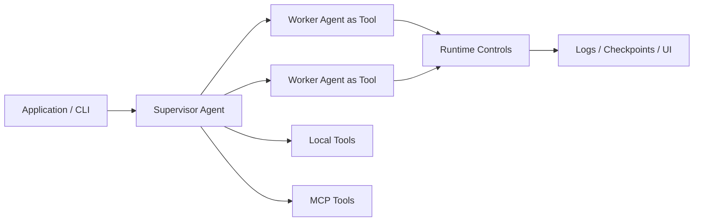

<div align="center"><sub>
English | <a href="docs/cn/README.md">简体中文</a>
</sub></div>


<h1 align="center">AgentLoom</h1>

<p align="center">
  <strong>Build complex multi-agent applications with simple configuration, minimal glue code, safe runtime controls, and first-class observability.</strong>
</p>

<p align="center">
  <strong>AgentLoom helps developers turn multi-agent workflows into runnable, observable, resumable, and controllable applications.</strong>
</p>

<p align="center">
  <a href="https://www.python.org/downloads/">=3.12" src="https://img.shields.io/badge/python-%3E%3D3.12-3776AB?logo=python&logoColor=white"></a>
  
</p>

---

## Quick Start

AgentLoom is designed to get you from repository clone to a real multi-agent application quickly.

```bash
git clone <repo-url> AgentLoom
cd AgentLoom

uv sync
cp config/llm.example.yaml config/llm.yaml
# Edit config/llm.yaml and add your model credentials.

uv run loom run applications/ai_quality_analysis/workflows/code_review_agent.yaml
```

After the first run, you should see:

- structured terminal logs with agent names, task IDs, step duration, and token usage;
- archived run files under `.logs/<agent>/<timestamp>/`;
- resumable task state when checkpointing is enabled;
- optional visualization through `uv run loom ui`;
- optional terminal monitoring through `uv run loom dashboard`.

## What AgentLoom Provides

AgentLoom already implements the runtime pieces needed to build and operate complex agent applications:

| Area | Implemented Capabilities |
|---|---|
| Multi-agent app assembly | Supervisor / Worker roles, YAML `workflow`, `worker_agents`, direct `loom run`, generated entry scripts with `loom create`, and Python embedding through `run_app()`. |
| Agent-as-Tool | Workers export as callable tools through `agent_function_schema`, with generated function signatures, required-input validation, docstrings, string results, and `.batch(tasks)`. |
| Execution modes | Structured `tool_call` mode for traceable orchestration and `code_act` mode for flexible code-execution tasks. |
| Python pre/post processing | Custom tool functions and wrappers for scanning, caching, loops, retries, validation, error isolation, progress persistence, and artifact writing. |
| Batch concurrency | Worker `concurrency: auto` or fixed concurrency, `tool.batch(tasks)`, back-pressure, circuit breaker, progress callbacks, and per-call state isolation. |
| Skills and Hooks | Reusable Skills, force-injected / on-demand / hidden modes, lifecycle Hooks for tools, tasks, sub-agents, sessions, compaction, setup, and config changes. |
| Model and context control | Per-agent `model_type`, multiple LLM endpoints, parameter inheritance, retry behavior, prompt customization, and multi-layer context compression. |
| Tool ecosystem | Built-in file, shell, search, code-edit, git, todo, skill-loading, and local Python tools, plus MCP client integration. |
| Code intelligence | LSP service management for definition, references, symbols, hover, and workspace symbols, with tree-sitter fallback. |
| Runtime safety | Path boundaries, include/exclude rules, per-agent policies, shell command/operator allowlists, shell security checks, sandbox wrapping, and `shell_audit.log`. |
| Long-task resilience | Checkpoint resume, heartbeat detection, conversation recovery, tool-call error recovery, file history, worker skip-on-resume, and task cleanup. |
| Observability | Rich terminal logs, plain text file logs, per-step duration, cumulative/incremental token usage, task/subtask/agent context, and run archiving under `.logs/`. |
| UI and monitoring | Web UI with SSE updates, topology graph, timeline replay, multi-run grouping, plus TUI dashboard for active and resumable tasks. |
| Reference applications | `ai_quality_analysis`, `unit_test_studio`, and `repo_map` demonstrate direct runs, custom Python entrypoints, strict pipelines, and concurrent Worker analysis. |

## Why AgentLoom

### Build Complex Agent Apps With Less Code

Many agent frameworks give you components. AgentLoom gives you an application shape.

Complex agent applications often grow the same glue code again and again: Worker registration, parameter adapters, runtime entrypoints, pre/post processing, batch execution, logging, tracing, and safety controls. That code is costly because it is rarely reusable when the next agent application has a different workflow.

Worker Agents are exported as callable tools, and Supervisor Agents load and schedule them automatically. That means a complex workflow can be assembled from focused agents, a small amount of business glue code, and a direct runtime entrypoint.

AgentLoom moves the reusable parts into YAML and the runtime. YAML describes the workflow, Worker list, tools, models, permissions, and skills; Workers become callable tools; Supervisors load them automatically; Python stays focused on the application-specific parts such as preprocessing, postprocessing, caching, loops, validation, and artifact writing. Skills and Hooks package lifecycle behavior so it can be reused across applications.

You can start with:

- `uv run loom run <workflow>` to run an application directly;
- `uv run loom create <workflow>` to generate a Python entry script;
- `run_app("<workflow>")` to embed an AgentLoom app inside your own Python pipeline;
- `tool.batch(tasks)` to call the same Worker Agent across many inputs in parallel.

This is the core development-cycle win: you spend less time building orchestration plumbing and more time shaping the actual agent roles, tools, and task flow.

## How AgentLoom Is Different

| Common Agent Framework Pattern | AgentLoom's Approach |
|---|---|
| Component-first: users assemble low-level primitives themselves. | Application-first: run, generate, embed, monitor, and resume multi-agent apps directly. |
| Each complex app tends to grow a new layer of glue code. | Reusable orchestration, runtime controls, observability, and lifecycle extensions live in AgentLoom; app code handles business-specific differences. |
| Safety, recovery, and observability are often added later. | Runtime guardrails, checkpoints, logs, audit trails, UI, and dashboard are built into the framework path. |
| Logs mostly describe model calls and final output. | Logs are designed to debug agent application structure: task, subtask, agent, step, token, checkpoint, and topology. |
| Good for quick demos, but production-like runs need extra infrastructure. | Built for long-running, unattended tasks that need progress, recovery, and post-run analysis. |

## Build A multi-agent App With Less Code

AgentLoom's core model is simple:



The important part is the boundary:

- a Worker Agent defines its purpose, tools, inputs, and output contract;
- AgentLoom turns that Worker into a callable Python tool with a real function signature;
- the Supervisor calls Workers like tools and coordinates the full task;
- business Python can still wrap the workflow for deterministic steps such as scanning, caching, validation, argument parsing, and artifact writing.

### Where The Glue Code Goes

| Work That Usually Becomes Glue Code | AgentLoom Placement |
|---|---|
| Reusable agent orchestration | YAML `workflow` and `worker_agents`. |
| Worker parameter adaptation | `agent_function_schema` and generated function signatures. |
| Project-specific pre/post processing | Python wrappers registered as tools. |
| Cross-application lifecycle behavior | Skills and Hooks. |

The `repo_map` application demonstrates this hybrid style: deterministic Python scans and ranks a repository, then AgentLoom calls Worker Agents to analyze directories and produce architecture documentation.

## Example Applications

The `applications/` directory contains working apps that show how AgentLoom is intended to be used.

| Application | What It Builds | What It Demonstrates |
|---|---|---|
| `ai_quality_analysis` | Multi-dimensional code review application. | 12 Worker Agents, staged review, direct `loom run`, long-running codebase analysis. |
| `unit_test_studio` | Python pytest generation workflow. | Strict multi-step pipeline, custom entry script, function intake, scenario planning, test generation, refinement, delivery report. |
| `repo_map` | Repository architecture map generator. | Deterministic Python preprocessing plus Agent-driven analysis, bottom-up directory processing, `tool.batch(tasks)`, progress persistence. |

Run the default code review example:

```bash
uv run loom run applications/ai_quality_analysis/workflows/code_review_agent.yaml
```

Run Repo Map with a custom Python entrypoint:

```bash
uv run python applications/repo_map/repo_map_app.py /path/to/project \
  --output_dir /tmp/repo-map-output \
  --exclude_dirs vendor \
  --exclude_dirs build
```

Generate pytest tests for selected functions:

```bash
uv run python applications/unit_test_studio/studio_runner.py \
  /path/to/your/project \
  "src/utils.py:parse_config,src/core.py:run_pipeline" \
  --output_dir tests/generated
```

## Core Concepts

### Agent As Tool

Worker Agents can be exported as callable tools. AgentLoom generates function signatures, validates required inputs, builds the task payload, and returns a string result. The same Worker can also expose `.batch(tasks)` for parallel execution.

### Supervisor / Worker

A Supervisor Agent coordinates the task. Worker Agents specialize in one part of the job. This keeps responsibilities explicit and makes the workflow easier to debug.

### Workflow

A workflow describes what an agent should accomplish and how the Supervisor should use its Workers. AgentLoom uses the workflow to build the runtime task specification and keep long-running runs aligned.

### Skills And Hooks

Skills add reusable knowledge or behavior. Hooks attach logic around task lifecycle, sub-agent lifecycle, tool calls, and other runtime events. They can be used for validation, memory, policy enforcement, result transformation, and visualization collection.

### Execution Modes

AgentLoom supports structured tool calling for controlled orchestration and code execution mode for more flexible programming tasks. Each agent can choose the mode that fits its role.

## CLI Reference

| Command | Purpose |
|---|---|
| `uv run loom run <workflow>` | Run an AgentLoom application. |
| `uv run loom create <workflow>` | Generate a Python entry script for an application. |
| `uv run loom ui` | Open the Web visualization panel. |
| `uv run loom dashboard` | Open the terminal task dashboard. |
| `uv run loom list-tasks` | List resumable checkpoint tasks. |
| `uv run loom clean-tasks` | Clean old checkpoint data. |

## Documentation

| Document | Description |
|---|---|
| [Configuration Overview](docs/en/config-overview.md) | Configuration layers, merge rules, and model configuration isolation. |
| [Agent Configuration](docs/en/agent_config.md) | Supervisor/Worker fields, tools, model selection, workflows, and skills. |
| [LLM Configuration](docs/en/llm_config.md) | Model types, provider settings, inheritance, retries, and prompt cache settings. |
| [System Configuration](docs/en/system_config.md) | Runtime settings, permissions, logging, execution environments, and tools. |
| [Skills Configuration](docs/en/skills_config.md) | Skill package format, loading, invocation controls, and built-in skills. |
| [Hooks Reference](docs/en/hooks.md) | Lifecycle events, hook types, matching, and execution behavior. |
| [Checkpoint Resume](docs/en/checkpoint.md) | Checkpoint layout, resume behavior, and long-task recovery. |

## Development Skills

The `tools/skills/` directory provides optional development skills for AI coding assistants working on AgentLoom applications:

| Skill | Purpose |
|---|---|
| `create-app` | Generate an AgentLoom application scaffold. |
| `create-skill` | Create a custom AgentLoom skill. |
| `workflow-review` | Review Agent/Tool boundaries, orchestration contracts, and resilience design. |
| `shell-security` | Configure shell execution safety policies. |
| `update-skills` | Keep development skills aligned with source and docs changes. |

These are development aids, not required runtime dependencies.

## Support & Contributing

AgentLoom is built as a practical framework for complex agent automation. Issues, feature ideas, docs improvements, and example applications are welcome.

- Open an issue: [GitHub Issues](https://github.com/linora-u/AgentLoom/issues)
- Contact: [raine_walker@163.com](mailto:raine_walker@163.com?subject=AgentLoom%20Collaboration)
- If the project helps you, a GitHub star makes it easier for others to find.
