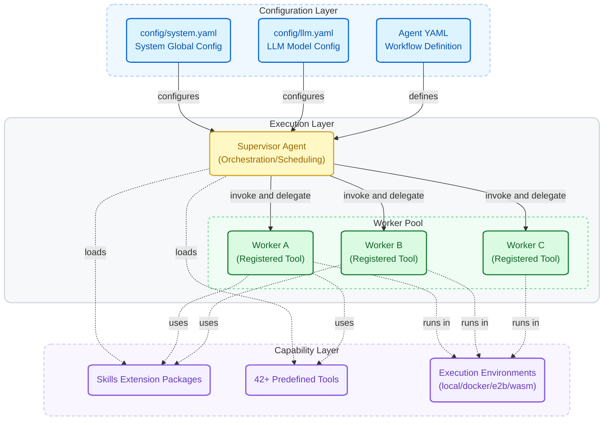

<div align="center"><sub>
English | <a href="docs/cn/README.md">简体中文</a>
</sub></div>

<h1 align="center">AgentLoom</h1>

<p align="center">
  <strong>YAML-Driven Multi-Agent Collaboration Framework</strong>
</p>

<p align="center">
  AgentLoom lets you declaratively orchestrate multiple AI Agents with YAML,<br>
  assembling them like building blocks for complex, deterministic, auditable long-running tasks.
</p>

---

## 🎯 Use Cases and Positioning

AgentLoom is designed for **complex, time-consuming automation tasks that require multi-step collaboration**. You define the execution plan in YAML upfront, and multiple Agents run through the process automatically without constant human supervision.

Typical scenarios include:

- **Code Quality Review** — Perform systematic concurrency safety analysis and risk identification across large codebases, automatically generating audit reports (for example, shared-variable race condition detection in embedded systems across 7 fully automated stages)
- **Batch Unit Test Generation** — Generate test cases function by function, compile → run → check coverage, and keep adding tests until coverage targets are met. Large projects can run for hours while keeping the process consistent
- **Bug Localization and Fixing** — Multiple Agents collaborate to reproduce issues, analyze root causes, generate patches, and verify regressions, forming a complete fix loop
- **Large-Scale Code Writing and Optimization** — Decompose large coding tasks into phases (architecture design → module implementation → integration → optimization), with expert Agents handling each phase to avoid context loss and quality degradation in single-model complex tasks
- **Repository Architecture Documentation** — Automatically scan project structure, analyze module responsibilities and dependencies directory by directory, and generate living documentation. New team members no longer need weeks to read code
- **AI Steps in CI/CD Pipelines** — Deploy as scheduled tasks or pipeline steps, running 24/7 automatically and producing auditable structured results

> **Interactive AI assistants (Cursor, Copilot, Claude Code, Codex) solve the problem of "sitting in front of a screen and chatting with AI to write code"; AgentLoom solves the problem of "defining a plan upfront and letting AI complete the entire complex task on its own."** The former is suited for real-time interaction; the latter is suited for deterministic, long-running automation scenarios.

Compared with ordinary vibe coding, AgentLoom emphasizes **configurability, control, and replayability**. Users can define Agent behavior, tools, workflow structure, permission boundaries, lifecycle Hooks, and execution environments. Every sub-agent or tool invocation can be surrounded by pre/post lifecycle processing for validation, logging, memory, policy enforcement, result transformation, or custom orchestration. The goal is not to let the model improvise freely, but to make Agents follow the process and constraints defined by the user.

---

## Quick Start

### Prerequisites

- **Python >= 3.12** (check with `python3 --version`)
- **[uv](https://docs.astral.sh/uv/)** — recommended Python package manager (install: `curl -LsSf https://astral.sh/uv/install.sh | sh`)

### Environment Setup

```bash
# Clone the project
git clone <repo-url> AgentLoom
cd AgentLoom

# Install dependencies (using uv, will auto-create .venv with Python 3.12)
uv sync

# Configure LLM (copy example config and fill in your API Key)
cp config/llm.example.yaml config/llm.yaml
# Edit config/llm.yaml and fill in your model configuration
```

### Run Your First Agent

```bash
loom run applications/ai_quality_analysis/workflows/code_review_agent.yaml
```

---

## How AgentLoom Works

### Design Philosophy

The core idea of AgentLoom is simple: **Every Agent is a Tool**.

Worker Agents export themselves as callable tools through `agent_function_schema`, then register into Supervisor Agents. Supervisors dispatch these Workers just like calling regular tools: no complex communication protocols, no message queues, one YAML file defines the entire orchestration logic.

This design brings several benefits:

- **Divide and Conquer**: Each Worker focuses on one thing; the Supervisor handles overall coordination
- **Declarative Orchestration**: Workflows are written in YAML; change configuration to adjust the process without changing framework code
- **Flexible Composition**: The same Worker can be reused by different Supervisors and assembled like a component
- **Process Control**: Tools, permissions, Hooks, models, and execution environments can be configured per Agent

### Architecture Overview



### Execution Modes

AgentLoom supports three execution modes for different scenarios:

| Mode | Best For | Command |
|------|----------|---------|
| Direct `loom run` | Standard YAML workflows | `loom run applications/<your-app>/workflows/<agent>.yaml` |
| Generate with `loom create` | A runnable Python entry file | `loom create applications/<your-app>/workflows/<agent>.yaml` |
| Custom hand-written Python script | Custom argument parsing, multi-step pipelines, incremental caching, pre/post processing | `.venv/bin/python applications/my_app/my_app.py` |

Custom scripts can import the framework's `run_app()` function and add any business logic before or after the call:

```python
from src.runner import run_app

# Your preprocessing...
result = run_app("applications/my_app/workflows/my_agent.yaml")
# Your postprocessing...
```

Place custom entry scripts under `applications/<your-app>/`:

```
applications/my_app/
├── my_app.py              ← Your custom entry script
├── agent_tools/           ← Custom tools
├── workflows/
│   ├── my_agent.yaml      ← Agent workflow definition
│   └── worker_agents/
└── config/                ← Optional application-level config override
    └── system.yaml
```

---

## Core Features

- 🤖 **Multi-Agent Orchestration** — Supervisor registers Workers as tools for unified scheduling
- ⚡ **Dual Execution Modes** — `tool_call` for structured orchestration; `code_act` for flexible code execution tasks
- 🛡️ **Resilient Tool Call Parsing** — Multi-strategy parsing with native tool_calls detection, compatible with JSON / XML / bracket-style outputs
- 📝 **YAML-Driven Configuration** — Three-layer configuration system (System / LLM / Agent), declare and activate
- 🔁 **Sequential Workflow Lists** — Use `workflow: |` for one run, or `workflow: list[str]` to execute multiple YAML-authored workflow items sequentially with shared Agent memory
- 🧩 **Skills Extension System** — Reusable capability packages + lifecycle Hooks, no framework code changes needed
- 🔀 **LLM Intelligent Routing** — Customize multiple LLM endpoints and let each Agent call different model types on demand
- 🔄 **Batch Parallel Execution** — Configure `concurrency: auto` for Worker Agents and run batch tasks in parallel with one `tool.batch(tasks)` call
- 🔌 **MCP Client Integration** — Connect external MCP servers via Claude Code compatible `.mcp.json` config, dynamically discovering and loading MCP ecosystem tools
- 🔒 **Safe and Controllable** — Code whitelists, path boundaries, Shell policies, sandbox isolation, and audit logs jointly constrain execution
- 🎨 **Visualization and Monitoring** — Web UI displays Agent execution topology, while TUI Dashboard monitors long-running tasks
- 📊 **Human-Friendly Logging** — Rich colored terminal + file dual-write, tracking time and token usage per step

---

## Feature Details

### 🧠 Intelligent Orchestration

**Multi-Agent Orchestration**

Supervisor Agents register multiple Worker Agents as tools and schedule them according to the workflow. Each Worker defines its input/output interface (`agent_function_schema`), and the Supervisor can use it like calling a function.

> See [Agent Configuration Reference](docs/en/agent_config.md)

**Planning Interval**

Set `planning_interval: N` to force the Agent to reflect and re-plan every N steps, preventing goal drift in long tasks.

> See [Agent Configuration — Planning Interval](docs/en/agent_config.md#310-planning_interval--planning-interval)

**Prompt Customization**

Supports Global → Application → Agent three-layer System Prompt overrides. Global configuration sets base behavior, application-level prompts adjust for specific scenarios, and Agent-level prompts provide final customization.

> See [Agent Configuration — Custom Prompt](docs/en/agent_config.md#39-prompt--custom-prompt)

### 🔀 Model and Context

**LLM Intelligent Routing**

Define multiple LLM endpoints and model types (`powerful`, `fast`, `summary`, etc.) in `config/llm.yaml`, and each Agent can select what it needs by declaring `model_type`. The framework has a built-in parameter inheritance chain (specified model → common shared → code defaults) and exponential backoff retry mechanism.

> See [LLM Configuration Reference](docs/en/llm_config.md)

**Multi-Layer Context Compression**

When conversation history exceeds the token limit, the framework automatically executes a 4-layer compression pipeline:

1. **File Read Deduplication** — Repeated reads of the same file are replaced with placeholders
2. **Tool Output Truncation** — Overly long tool responses are truncated using a head-tail strategy (configurable per tool via `tool_metadata.max_result_chars`; oversized results are automatically persisted to disk with a preview + file path sent to the LLM)
3. **Old Response Masking** — Earliest tool responses are hidden while call records are preserved
4. **LLM Smart Summary** — When `smart_summary: true` is enabled, a summary model compresses history

If still over the limit, sliding-window truncation serves as the final fallback.

> See [System Configuration — Context Compression Strategy](docs/en/system_config.md#2-smart_summary--context-compression-strategy)

**LSP Code Intelligence Service**

Built-in LSP (Language Server Protocol) service management framework. Language servers are pre-warmed at agent startup, providing cross-language code intelligence:

- **go-to-definition** — Jump to symbol definition
- **find-references** — Find all usages of a symbol across the project
- **document-symbols** — Extract all classes/functions/variables from a file
- **hover** — Get type signatures and documentation
- **workspace-symbols** — Search symbols across the entire project

Supports Python, Go, TypeScript, Rust, Java, and 40+ more languages. All dependencies are auto-installed by `uv sync`. Unsupported languages automatically fall back to tree-sitter AST analysis (46+ languages).

> See [System Configuration — LSP Language Server Configuration](docs/en/system_config.md#5-lsp_servers--lsp-language-server-configuration)

### 🧩 Skills, Hooks, and Memory

**Custom Skills**

Skills are reusable Agent capability extension packages. Through Skills, you can inject domain knowledge, mount lifecycle Hooks, and extend behavior without modifying framework code.

- **Three-layer loading**: Global Skills → `skills/` directory auto-discovery → Agent private Skills
- **Three invocation types**: Force-inject (always active), On-demand (LLM decides), Hidden (Hook-only)
- **16 Hook events**: Cover tool lifecycle, session, task, sub-agent, compaction, setup, config changes, and more
- **4 Hook types**: command (Shell), prompt (LLM), http (REST), agent (multi-turn verifier)
- **Execution controls**: Timeout enforcement, permission precedence, once-flag, deduplication, global enable/disable

> See [Skills Configuration Reference](docs/en/skills_config.md)

**Built-in Skill: Cross-Session Memory**

The system includes the `agent-recall-with-files` memory Skill, which maintains three runtime files for each Agent under `.runtime/<agent_name>/`:

| File | Lifecycle | Purpose |
|------|----------|------|
| `context.md` | Reset each task | Records current task objectives and status |
| `trace.md` | Reset each task | Records action logs and key decisions |
| `insights.md` | **Permanently preserved** | Cross-task accumulated experience and lessons |

`insights.md` is never automatically cleared. Agents read and reuse previous experience in subsequent tasks, enabling true cross-session learning.

> ⚠️ **Weak-LLM Compatibility Note**: This Skill is **disabled by default**. Its mechanism appends recall content (full `context.md`, tail 20 lines of `trace.md`, tail 30 lines of `insights.md`) to tool result messages via `PreToolUse`/`PostToolUse` lifecycle hooks. All hook outputs are wrapped in `<system-reminder>` tags by the framework-level `HookManager`. Weaker LLMs may ignore appended instructions or let them interfere with subsequent content parsing. **Enable it manually only when using strong LLMs**.

> See [Skills Configuration — Built-in Skills](docs/en/skills_config.md#10-built-in-skills)

**Built-in Skill: Visualization Collection**

The system includes the `agent-visualization` Skill, running as a hidden passive observer. The LLM does not know it exists, but it automatically collects Agent lifecycle events and outputs them to a JSON file for the Web UI to display.

### ⚡ Batch Parallel Execution

**Concurrent Worker Agent Invocation**

Worker Agents support a `concurrency` field in their YAML configuration. After loading via `create_agent_as_tool()`, the returned tool automatically has a `.batch()` method for one-line parallel execution:

```yaml
# Worker Agent YAML
name: "code_analyzer"
concurrency: auto          # auto-calculate concurrency = min(RPM, 10)
# or: concurrency: 6      # fixed 6 concurrent instances
```

```python
# Application layer: one line to run batch tasks in parallel
results = tool.batch(tasks)

# Override YAML concurrency at call time
results = tool.batch(tasks, concurrency=3)

# With progress callback
results = tool.batch(tasks, on_progress=lambda done, total, r: print(f"{done}/{total}"))
```

- **`concurrency: auto`** — Automatically calculates `min(RPM, 10)`; no manual tuning needed
- **`concurrency: N`** — Fixed number of concurrent instances
- **Priority chain**: `tool.batch(concurrency=N)` param > YAML field > `auto`
- **Resilience built in**: Back-pressure control, circuit breaker (stops after 5 consecutive failures), per-instance state isolation
- **Applicable scenarios**: Same Worker called with many different inputs, such as analyzing 100 directories or processing 50 files in parallel

> See [Agent Configuration — Concurrency Configuration](docs/en/agent_config.md#311-concurrency--concurrency-configuration)

### 🔌 MCP Client Integration

AgentLoom can connect to external MCP servers via Claude Code compatible `.mcp.json` configuration, dynamically discovering and loading MCP tools at Agent initialization. MCP tools enter the Agent's tool list alongside local tools, making it suitable for connecting internal services, databases, browser automation, retrieval systems, or other ecosystem tools.

### 🔄 Checkpoint Resume and Task Monitoring

**Checkpoint Resume**

Long-running tasks are resilient to interruption. The framework auto-saves after every Agent Step, and you can resume with a single command:

- **Auto-save** — Incremental checkpoint written to the per-run log directory (`.logs/{agent}/{timestamp}/checkpoints/`) after each step
- **Heartbeat Detection** — Background heartbeat every 5 seconds; automatically detects crashed tasks (dead PID / stale heartbeat)
- **One-command Resume** — `loom run <yaml> --resume <task_id>` continues from the last completed step
- **Conversation Recovery** — Filters unresolved tool calls, orphaned thinking steps, and empty steps before resume to reduce recovery failures
- **Tool Call Error Recovery** — Provides progressive 4-level guidance for LLM tool call failures: format reminders → enhanced diagnosis → approach switch → minimal template
- **File History** — File-modifying tools such as `edit_file` and `write_file` automatically create pre-edit backups and support step-level rewind
- **Worker Skip-on-Resume** — Already-completed workers are automatically skipped via input hash matching
- **Multi-task Isolation** — Each Application has independent checkpoints
- **Auto-cleanup** — Successfully completed tasks automatically remove their checkpoints (`cleanup_on_success: true` by default in `config/system.yaml`). Set to `false` to keep completed tasks visible in Dashboard

**TUI Task Monitoring Dashboard**

Launch `loom dashboard` for a terminal-based interactive monitoring panel:

- **Auto-refresh** — Polls every 2 seconds for latest status
- **Status at a Glance** — 🟢 running / 🔴 crashed / 🔴 failed / 🟡 paused / ⚪ done
- **Keyboard Interactive** — Navigate, sort, delete tasks; built on Textual TUI framework
- **Multi-task Overview** — Cross-application aggregated view with step count, PID, and heartbeat

### 📊 Visualization and Logging

**Web UI Real-Time Visualization**

Launch the Web visualization panel with `loom ui` to monitor Agent execution in real time in the browser:

- **SSE Real-Time Push** — Execution events stream to the browser in real time
- **Timeline Replay** — Step-by-step replay of historical execution, navigate to any step
- **Agent Topology Graph** — Visualize call relationships between Supervisors and Workers
- **Multi-Run Grouping** — Historical run records are grouped and collapsed, expandable on demand
- **Bilingual Support** — Interface language switching between Chinese and English

**Human-Friendly Logging System**

- **Rich colored terminal + plain text file dual-write**: Terminal has colored highlighting (gray timestamps, gold Agent names, prominent level markers); log files remain plain text for easy searching
- **Per-step tracking**: Records duration and cumulative/incremental token usage for each step, e.g. `[Step 3] Duration 2.45s | Input: 5,234 (+234) | Output: 1,023 (+123)`
- **Auto-archiving**: Defaults to archiving in `.logs/`; each run creates a timestamp subdirectory such as `.logs/my_agent/20260324_143205/my_agent.log`
- **Multi-Agent context prefix**: Each log entry automatically includes `task_id` / `agent_name`, making it easy to identify sources in multi-Agent parallel scenarios

---

## Security and Sandbox

AgentLoom's security model has several layers: code execution permissions, execution environment isolation, tool path boundaries, Shell command policy, optional OS-level sandboxing, and audit logs.

### Code Execution Permissions (`code_act` mode only)

Control the boundaries of Agent-generated code through `code_agent` configuration (only effective when `tool_call_type: "code_act"`; silently ignored in `tool_call` mode):

- **Import whitelist**: Precisely control which Python modules can be imported
- **Function whitelist**: Precisely control which built-in functions can be called
- Set to `"*"` for full access in development; switch to explicit whitelists in production

> See [System Configuration — Code Execution Permissions](docs/en/system_config.md#6-code_agent--codeagent-code-execution-permissions)

### Multiple Execution Environments (`code_act` mode only)

`execution_env` only controls the executor used by CodeAgent-generated Python code in `code_act` mode. `tool_call` mode does not use a Python executor, so `local` / `docker` / `e2b` / `wasm` do not provide execution isolation for structured tool calls; each tool still runs according to its own implementation. For example, `shell_tool` is controlled by `shell_settings` and the optional `shell_settings.sandbox`.

| Environment | Isolation Level | Use Case |
|------|----------|----------|
| `local` | ⚠️ Low | Development/debugging, trusted environments |
| `docker` | ✅ High | Production, untrusted code |
| `e2b` | ✅ High | Cloud deployment, SaaS products |
| `wasm` | ✅ High | Lightweight local isolation |

> See [System Configuration — Execution Environment](docs/en/system_config.md#5-execution_env--execution-environment-configuration)

### Tool Access Control

The framework includes multi-layer tool invocation security:

- **Path Boundary Control** — Tools can only access the workspace or explicitly allowed paths, preventing unauthorized reads/writes
- **Per-Agent Path Policies** — `tool_access_control.path_validation` is evaluated per Agent. Worker Agents do not automatically inherit a Supervisor's external path allowlist, so repeat the rule in the Worker YAML when the Worker itself reads or searches those paths
- **Search Exclusion Sync** — `grep_search`/`glob_search` automatically respect `tool_access_control.exclude_paths` configuration
- **UNC / Windows Special Path Interception** — Blocks network paths and NTFS canonicalization bypasses
- **Symlink Chain Tracking** — Validates every intermediate path in the symlink chain
- **Empty Result Protection** — Automatically injects a marker when tools return empty content, preventing LLM stop sequence crashes
- **LLM Parameter Type Tolerance** — Automatically corrects string-typed parameters from LLM (e.g. `"true"` → `True`)

> See [Tool Access Control](docs/en/system_config.md#9-tool_access_control--tool-access-control)

### Shell Command Control

`shell_tool` does not run raw commands directly. Commands pass through security validation, path validation, and optional sandbox wrapping:

- **Command whitelist**: `shell_settings.allowed_commands` can restrict execution to commands such as `ls`, `cat`, `rg`, or `pytest`; `"*"` means all command names are allowed
- **Operator whitelist**: `shell_settings.allowed_operators` can restrict Shell operators such as `|`, `&&`, `>`, and `;`
- **10 security checks**: Blocks `$()` / backtick command substitution, `<()` process substitution, dangerous environment variables, IFS injection, control characters, incomplete commands, dangerous prefixes such as `sudo` / `bash -c` / `env`, Zsh dangerous builtins, `${}` parameter expansion, and destructive patterns such as `rm -rf /` / `git reset --hard`
- **Dangerous path blocking**: `dangerous_paths` and `block_destructive` prevent destructive operations on system-critical paths
- **Foreground stall detection**: Commands stuck at interactive prompts are automatically terminated so long-running tasks do not hang indefinitely

> See [System Configuration — Shell Tool Security Configuration](docs/en/system_config.md#8-shell--shell-tool-security-configuration) and [Agent Configuration — Per-Agent Shell Security Override](docs/en/agent_config.md#97-per-agent-shell-security-override)

### OS-Level Sandbox (Optional)

Shell sandboxing is disabled by default. Enable it with `shell_settings.sandbox` when needed:

- **Backends**: `bwrap` (bubblewrap) or `docker`
- **Write boundaries**: `allow_write` declares writable paths inside the sandbox, while `deny_write` declares paths that must stay read-only
- **Network isolation**: `network_isolation: true` disables network access inside the sandbox
- **Excluded commands**: `excluded_commands` lets specific commands bypass the sandbox, such as Docker itself or build commands that need the host environment

```yaml
shell_settings:
  sandbox:
    enabled: false
    mode: "bwrap"          # bwrap | docker | none
    allow_write: [".", "/tmp"]
    deny_write: ["/etc", "/usr"]
    network_isolation: false
    excluded_commands: []
```

> See [System Configuration — sandbox Mode](docs/en/system_config.md#sandbox--sandbox-mode)

### Shell Security Audit Log

Shell security events for each run are recorded alongside the Agent log:

```text
.logs/{agent_name}/{timestamp}/shell_audit.log
```

The audit log records command blocks, path violations, timeouts, foreground stalls, sandbox wrapping, and related events, with actionable YAML suggestions for diagnosing permission issues and replaying long-running tasks.

---

## CLI Toolchain

AgentLoom provides six core commands:

| Command | Description |
|------|------|
| `loom run <yaml>` | Directly run an Agent workflow defined in YAML |
| `loom create <yaml>` | Auto-generate a runnable Python script from YAML |
| `loom ui` | Launch the Web visualization panel for real-time Agent monitoring |
| `loom dashboard` | Launch the terminal TUI task monitoring dashboard |
| `loom list-tasks` | List all resumable checkpoint tasks |
| `loom clean-tasks` | Clean up expired checkpoint data |

### loom run

Start an Agent workflow with a single command:

```bash
loom run applications/<your-app>/workflows/<agent>.yaml
```

The framework automatically loads configuration, initializes the Agent, executes the task, and outputs results.

### loom create

Auto-generate a runnable Python entry script:

```bash
# Generate the script
loom create applications/<your-app>/workflows/<agent>.yaml

# Run the generated script
.venv/bin/python applications/<your-app>/<agent_name>_app.py
```

Suitable for scenarios requiring a standalone entry file; the generated script can be modified as needed.

### loom ui

Launch the interactive Web visualization panel:

```bash
loom ui
```

After launch, it guides you through selecting a port, whether to auto-open the browser, and which log file to monitor. You can also specify parameters directly:

```bash
loom ui --port 9090 --no-browser
```

### loom dashboard

Launch the terminal interactive task monitoring dashboard (built on Textual TUI framework):

```bash
loom dashboard
```

Auto-refreshes every 2 seconds showing all task statuses. Keyboard shortcuts: `q` quit, `r` refresh, `e` expand/collapse Worker details, `c` copy Task ID to clipboard, `d` delete selected task.

### loom list-tasks

List all tasks with saved checkpoints:

```bash
loom list-tasks           # Brief listing
loom list-tasks --detail  # Show Worker-level details
```

### loom clean-tasks

Clean up expired checkpoint data:

```bash
# Clean tasks older than 7 days (default)
loom clean-tasks

# Clean tasks older than 3 days
loom clean-tasks --before 3

# Clean all
loom clean-tasks --all
```

---

## 📦 Example Applications

The `applications/` directory contains ready-to-run examples that demonstrate different ways to use the framework. Each one is a real working application that you can run directly or use as a blueprint for your own.

| Application | Description | Workers | Mode |
|---|---|---|---|
| `ai_quality_analysis` | Multi-dimensional code quality review | 12 Workers · 4 phases | `code_act` · `loom run` |
| `unit_test_studio` | Auto-generate pytest test cases for Python functions | 5 Workers · strict pipeline | `code_act` · custom script |
| `repo_map` | Scan a repo and generate architecture documentation | 2 Workers · concurrent | `code_act` · custom script |

### Example 1: Code Quality Review (`ai_quality_analysis`)

**The simplest way to get started**: one command, no extra arguments.

`ai_quality_analysis` orchestrates **12 Worker Agents across 4 phases** to review any codebase across 12 dimensions: coding standards, error handling, concurrency safety, security, performance, architecture, test coverage, documentation, and more. Each phase feeds its findings into the next, and a final Worker synthesizes everything into a structured report.

**Framework features demonstrated:**

- `loom run` direct execution, no Python script needed
- `code_act` mode with 12 Workers registered as tools

```bash
loom run applications/ai_quality_analysis/workflows/code_review_agent.yaml
```

### Example 2: Python Unit Test Generator (`unit_test_studio`)

`unit_test_studio` takes a list of target functions and generates ready-to-run pytest test cases for each one. It runs a **strict 5-step ordered pipeline**: intake → scenario planning → code generation → refinement → delivery report. Each step passes a validated JSON payload to the next, preventing silent failures mid-pipeline.

**Framework features demonstrated:**

- `planning_interval: 4` to force re-planning and prevent goal drift in long runs
- Custom hand-written entry script with flexible CLI arguments
- `code_act` mode with strict inter-step JSON contracts

```bash
# Generate tests for specific functions
.venv/bin/python applications/unit_test_studio/studio_runner.py \
  /path/to/your/project \
  "src/utils.py:parse_config,src/core.py:run_pipeline"

# Specify custom output directory
.venv/bin/python applications/unit_test_studio/studio_runner.py \
  /path/to/your/project \
  "src/utils.py:parse_config" \
  --output_dir tests/generated
```

### Example 3: Repo Map (`repo_map`)

**Repo Map** is a code repository mapping tool that automatically scans any project's code structure and uses LLM to generate architecture analysis documentation. It is a typical custom hand-written script application, demonstrating how to build complex multi-step pipelines on top of the framework.

| Step | Method | Description |
|------|------|------|
| **Step 1: Scan & Symbol Extraction** | Pure Python | Recursively scan source files, extract code symbols via tree-sitter, run PageRank to rank importance |
| **Step 2: Markdown Rendering** | Pure Python | Render scan results into directory-mirrored Markdown files (function/class definitions + importance stars + cross-file references) |
| **Step 3: LLM Architecture Analysis** | Agent Workflow | Call Worker Agents directory by directory for architecture analysis (core functions, design patterns, dependencies, potential issues) |

Why hand-written scripts:

- **Custom CLI arguments**: Needs to accept project path, output directory, exclude directories, etc.
- **Incremental caching**: Cache strategy based on Git SHA + file modification time to avoid redundant scanning
- **Hybrid architecture**: First two steps are deterministic pure Python (no LLM needed); only the third step is delegated to Agents
- **Checkpoint resume**: Step 3 supports checkpoint-resume; single directory failure does not affect other directories

```bash
.venv/bin/python applications/repo_map/repo_map_app.py /path/to/your/project

# Custom output directory and exclusions
.venv/bin/python applications/repo_map/repo_map_app.py /path/to/project \
  --output_dir /tmp/mymap \
  --exclude_dirs vendor \
  --exclude_dirs build
```

> This example embodies the framework's design philosophy: **Use Python for deterministic work, delegate intelligent work to Agents**.

---

## 📚 Configuration Documentation

AgentLoom uses a three-layer configuration system. The following documents provide complete descriptions of every configuration parameter:

| Document | Description |
|------|------|
| [Configuration System Overview](docs/en/config-overview.md) | Configuration file classification, loading hierarchy, merge rules, LLM configuration isolation mechanism |
| [Agent Configuration Reference](docs/en/agent_config.md) | Agent YAML complete reference: Supervisor / Worker roles, workflows, tools, model selection, Skills reference |
| [LLM Configuration Reference](docs/en/llm_config.md) | LLM model configuration: model type definitions, parameter inheritance chain, retry strategies, Prompt caching |
| [System Configuration Reference](docs/en/system_config.md) | System global configuration: execution environments, code permissions, logging, tool system, tool access control |
| [Skills Configuration Reference](docs/en/skills_config.md) | Skills complete reference: directory structure, SKILL.md format, Hook system, built-in Skills, hands-on tutorials |
| [Hooks System Reference](docs/en/hooks.md) | Hooks lifecycle system: 16 events, 4 hook types (command/prompt/http/agent), YAML configuration, pattern matching, parallel execution |

---

## 🛠️ Vibe Coding Development Skills

The `tools/skills/` directory provides a set of development Skills prepared for **Vibe Coding**. Whether you use GitHub Copilot, Codex, Claude Code, Cursor, or another AI programming assistant, install the corresponding Skill and enter the AgentLoom project directory to give your AI domain knowledge about AgentLoom for efficient development.

### Available Skills

| Skill | Description | Use Case |
|-------|------|----------|
| **create-app** | Auto-generate AgentLoom Application scaffolding (workflow YAML, Worker configs, entry scripts, custom tools) | Creating new applications from scratch |
| **create-skill** | Create an AgentLoom Skill from scratch (SKILL.md, Hook scripts, registration config) | Developing custom Skill extensions |
| **update-skills** | Detect and sync Skills content when docs or source code change | Keeping Skills consistent after docs/code changes |
| **workflow-review** | Review Application workflow architecture quality (Agent/Tool boundaries, orchestration contracts, resilience design) | Pre-launch workflow quality checks |
| **shell-security** | Guide and configure Shell execution security policies (command blocking, risk assessment, permission levels) | Adjusting or hardening Agent Shell execution permissions |

### Usage

```bash
# 1. Enter the AgentLoom project directory
cd AgentLoom

# 2. Install Skills from tools/skills/ in your AI programming tool
#    - Copilot / Codex: Add the Skill directory as a workspace skill
#    - Claude Code: Load via SKILL.md as context
#    - Cursor: Reference the corresponding Skill in project rules

# 3. Use the appropriate Skill based on your needs
#    Create a new app → create-app
#    Develop a new Skill → create-skill
#    Review workflows → workflow-review
#    Configure security policies → shell-security
```

### 💡 Not Sure About Configuration? Let AI Help

When writing or modifying YAML configurations and unsure about parameters, you do not need to dig through documentation yourself. Select the `docs/en/` directory as context in your AI programming tool, then describe your needs using this Prompt template:

> **Prompt Template**
>
> Please help me complete an AgentLoom configuration adjustment following these steps:
>
> **Step 1: Understand the Configuration System**
> Read the configuration documents under `docs/en/` (focusing on `config-overview.md`, `agent_config.md`, `llm_config.md`, `system_config.md`) to understand AgentLoom's three-layer configuration system and parameter meanings.
>
> **Step 2: Clarify My Requirements**
> I need to modify the configuration for `applications/___（app name）___/workflows/___（YAML filename）___`.
> Specific requirements: ___（describe the desired effect, e.g. "switch to powerful model", "add two Worker Agents", "enable smart summary", etc.）___
>
> **Step 3: Execute Changes**
> Modify the configuration according to documentation specifications. If my requirements are ambiguous or there are configuration conflicts, please ask me first before making changes.
>
> **Step 4: Explain Changes**
> After completion, explain each change: what was changed, why, and which documentation rule it corresponds to.

This way, the AI first builds a global understanding of the configuration system, then makes accurate modifications for your specific scenario with well-documented reasoning. That is much more efficient than flipping through documentation page by page.

---

## Project Structure

```
AgentLoom/
├── config/                    # Global configuration
│   ├── system.yaml            #   System configuration
│   └── llm.yaml               #   LLM model configuration
├── src/                       # Framework core
│   ├── framework/             #   Tools, workflows, UI, tracing
│   ├── services/              #   Application services (LSP language server management)
│   └── lib/                   #   Configuration management, logging, Agent factory
├── applications/              # Applications directory
│   ├── ai_quality_analysis/   #   Universal code review (code_review_agent)
│   ├── repo_map/              #   Repository map generation application
│   └── unit_test_studio/      #   Python unit test generator
├── skills/                    # Built-in Skills
│   ├── agent-recall-with-files/  # Cross-session memory (disabled by default, see docs)
│   └── agent-visualization/      # Visualization collection
├── tools/                     # Development tools
│   ├── skills/                #   Vibe Coding Skills (English)
│   └── skills-cn/             #   Vibe Coding Skills (Chinese)
├── docs/                      # Documentation
│   ├── cn/                    #   Chinese documentation
│   └── en/                    #   English documentation
└── .logs/                     # Runtime logs (auto-generated)
```

---

## Final Notes

This project is entirely developed by a single developer, from framework design and core implementation to documentation. As such, there may inevitably be unknown bugs or design shortcomings.

If you encounter any issues while using it, please feel free to [open an Issue](https://github.com/linora-u/AgentLoom/issues) describing your situation. I will address it as soon as possible.

All functional validation for this project is currently funded out of pocket. If you are willing to **provide API tokens or model access** for AgentLoom testing and development, please [contact me by email](mailto:raine_walker@163.com?subject=AgentLoom%20Collaboration).

If you find this project helpful, please give it a ⭐ **Star** to show your support. It means a lot to me.

Contributions are also welcome: whether proposing good ideas, improving existing features, or building new multi-Agent applications based on the framework, I look forward to your participation. One person's effort is limited, but a group can make it much better.

---
