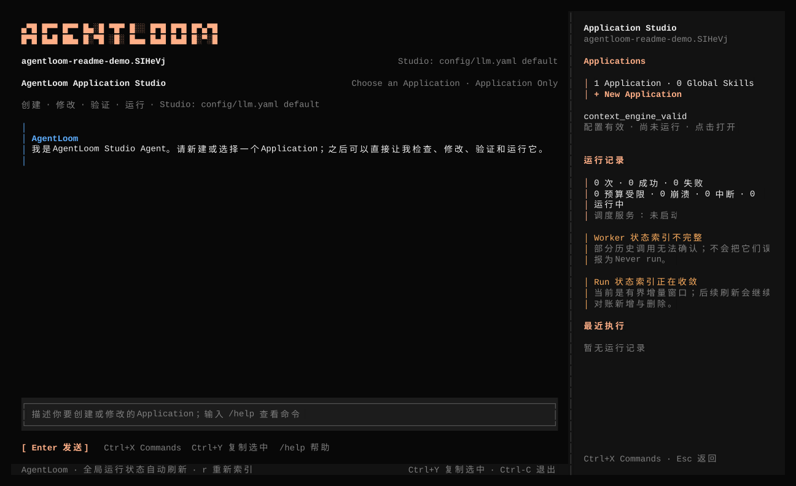

# AgentLoom Application Studio

`agentloom` is an Applications-first terminal control plane. A dedicated Studio
Agent can inspect and edit an Application, while AgentLoom's Python runtime
remains authoritative for Effective Config, topology, validation, Run lifecycle,
Goal state, and evidence.



The image above comes from a real reduced-motion terminal session. The Studio
indexed the checkout and rendered its Applications, global Skills, validation
state, Runs, and command input. It is not a static product mockup.

## Install and open

```bash
cd /path/to/AgentLoom
./install
cp config/llm.example.yaml config/llm.yaml
# Edit config/llm.yaml with at least one working model profile.
agentloom --project /path/to/AgentLoom
```

The installer creates one compatible unit under `~/.agentloom`: the
TypeScript/OpenTUI binary, bundled Studio runtime, and locked Python environment.
Use the non-interactive commands to verify that unit without opening the UI:

```bash
agentloom --version
agentloom --snapshot --project /path/to/AgentLoom
```

Rerun `./install` to update from the current source checkout. After installation,
`agentloom update` rebuilds from the recorded trusted checkout. The TUI checks
that checkout after first render; when relevant source files are newer, `Ctrl+X`
offers an explicit whole-product update and safe restart. It does not fetch Git
or replace an active Session silently.

## Read the workspace

The main screen has three working areas:

1. **Conversation and Agent Loop** occupy the left pane. Tool calls, Diffs,
   permissions, questions, sub-Agent progress, and the final response remain in
   the same task history.
2. **Workspace index** occupies the right pane. It lists Applications, global
   Skills, Run counts, schedule service state, and recent executions.
3. **Composer and status footer** show current model, permission scope, loop
   state, copy/interrupt actions, and discoverable commands.

Selecting an Application opens details sourced from Effective Config:

- Supervisor and Worker topology;
- model type and configuration source;
- Tools and Skills with their loading source;
- permissions, Hooks, and MCP configuration;
- workflow source files and validation errors;
- Working Revision and Running Revision;
- recent Runs and available recovery actions.

The homepage counts directories under `applications/`, not every expanded Agent
YAML. Main Supervisors are searchable through `Ctrl+X`; Workers stay nested in
Application and Supervisor details so one large Application does not flood the
global index.

## Studio Agent Loop

The normal workflow does not use a separate draft command:

```text
inspect project and Effective Config
  → edit the selected Application
  → show the Diff
  → validate YAML and references
  → request permission for a real Run
  → inspect structured Run evidence
  → repair until acceptance criteria pass
```

Studio must distinguish static validation from execution. If Run permission is
rejected, the result is “configuration validated, not run.” A process exit or a
plausible final answer is also insufficient proof; Studio reads the manifest,
terminal state, Goal projection, and available audit evidence.

Tool and Diff cards are visible in the parent conversation. Task sub-Agent text
remains visible until the next turn and can be selected and copied with
`Ctrl+Y`. Quiet provider latency does not count as cancellation. `Esc` is the
explicit interrupt.

An interrupted unfinished turn is removed from future model context. File
changes already completed by tools remain on disk, so the next message starts a
new task against the actual project state instead of silently resuming cancelled
reasoning.

## Permissions

`Application Only` is the default:

- reads may inspect the project;
- direct writes inside the selected Application are allowed;
- Shell, global files, other Applications, and unknown new-Application paths
  require a permission card.

Permission cards offer `1` once, `2` for this Session, and `3` reject. `Full
Access` is one explicit toggle under `Ctrl+X`. It can be set before selecting an
Application, remains active when switching targets, and resets when the TUI
exits.

Agent question requests use decision cards. Select a visible choice or type a
custom answer. Separate answers to multiple questions with `|`; `Esc` rejects
the request.

## Sessions and models

Choosing another Application retargets the current Studio Session and preserves
conversation memory. A switch is blocked while the Agent Loop is active so an
old turn cannot finish against a new target.

- `/new` starts a blank conversation while retaining durable Application
  history for later Agent retrieval.
- `/compact` compresses current context in place, preserving Session identity,
  durable history, and completed file changes.
- Runtime-initiated context compaction appears in the TUI and follows the same
  continuity contract.

Studio and Application Agents share project-root `config/llm.yaml` as their only
model catalog, Provider configuration, and authentication source. `/models`
changes the Studio model for the current Session; it never changes an
Application Agent's YAML `model_type`. Missing or invalid configuration is an
explicit startup error, not a fallback to ambient credentials.

## Revisions, Runs, and Goals

Every Run pins the Application content hash in `manifest.json`. Editing YAML
changes the Working Revision; an active Run continues using its Running Revision.
A restart or new Run is required to execute new configuration.

Recent Runs are secondary navigation. Their default view is a bounded,
decision-ready summary rather than a raw event dump. Problem Runs expose an
`a` action that asks Studio to diagnose the stored evidence.

Goal-aware Run details display:

- `active`, `complete`, or `budget_limited` state;
- objective and completion evidence;
- cumulative and remaining token budget;
- resume eligibility and the current task identifier.

While a Run is active, the bridge reads canonical checkpoint `goal.json`.
Terminal Runs use the manifest and audit copy. This keeps the TUI aligned with
CLI JSON/JSONL and Python `ApplicationRunResult` instead of deriving state from
terminal output.

## Navigation

| Action | Key / command |
|---|---|
| Send a Studio message | `Enter` |
| Start a blank conversation | `/new` |
| Compact the current Session | `/compact` |
| Search commands and global entities | `Ctrl+X` |
| Select a Studio model | `/models` or `Ctrl+X` |
| Re-index the project | `/refresh` |
| Scroll focused chat or detail | `PgUp` / `PgDn` or mouse wheel |
| Copy selected text through OSC52 | `Ctrl+Y` |
| Diagnose a selected problem Run | `a` |
| Close detail, reject a decision, or interrupt the loop | `Esc` |
| Exit | `Ctrl+C` |

There is no global `?` binding. The footer, `/help`, and `Ctrl+X` descriptions
carry command discovery.

Set `AGENTLOOM_REDUCED_MOTION=1` for static status symbols. Dumb and CI terminals
select reduced motion automatically.

## Schedules

The TUI creates and manages durable schedules. Automatic firing is a separate
foreground service:

```bash
agentloom schedules --project /path/to/project serve
```

Closing the TUI therefore does not leave a hidden scheduler daemon. The workspace
shows whether the service is running, while scheduled Runs use the same Run,
Goal, checkpoint, and evidence contracts as manually started Runs.

## Architecture

```text
OpenTUI / SolidJS
  ├─ Studio SDK + fixed Studio runtime
  │    ├─ Session / Agent Loop / LLM / Tool / Diff / Permission
  │    └─ agentloom_domain Tool
  └─ long-lived Python NDJSON bridge
       └─ AgentLoom Effective Config / catalog / Run evidence

agentloom_domain
  └─ python -I -m src.tui_bridge.domain_cli
       ├─ application.detail / validate / impact
       └─ run.start / stop / resume / restart / detail
```

The TypeScript layer owns presentation and the Studio Session. The Python bridge
owns AgentLoom domain truth. Model-facing Application detail is deduplicated and
paginated rather than placing a complete large topology in one Tool result.

Third-party provenance and license notices for presentation and runtime
adaptations live under [`upstream/`](upstream/README.md).

## Development

```bash
bun install --frozen-lockfile
bun test
bun run typecheck
bun run build

cd ..
.venv/bin/pytest -q tests/tui_bridge_test
```
