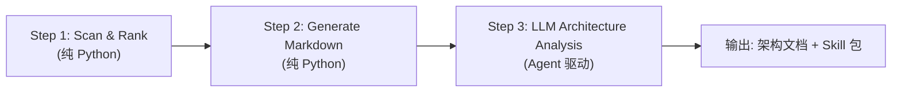

# Repo Map — AI 驱动的代码仓库架构分析

## 概述

Repo Map 是一个 AI 驱动的代码仓库架构分析工具。它自动扫描代码仓库的目录结构，为每个目录生成 Markdown 索引，然后调用 LLM 进行逐目录的架构分析，最终生成完整的架构文档和可复用的 Skill 包。

## 三步流水线



| 步骤 | 类型 | 说明 |
|------|------|------|
| **Step 1: Scan & Rank** | 纯 Python，零 LLM | tree-sitter 提取代码符号 + PageRank 排序 |
| **Step 2: Generate Markdown** | 纯 Python，零 LLM | 生成目录镜像的 `index.md` 文件 |
| **Step 3: LLM Analysis** | Agent 驱动 | 逐目录调用 `dir_architecture_analysis` Worker Agent，Bottom-Up 分层分析 |

Step 1 和 Step 2 由 `repo_map_app.py` 直接执行；Step 3 由 Supervisor Agent (`repo_map_agent.yaml`) 编排。

## Bottom-Up 分层并行架构

Step 3 采用 **Bottom-Up 分层并行** 策略：子目录先分析，父目录复用子目录的分析结果。

```
目录树:                          执行顺序:
(root)                           depth=3  ──→ [src/a/x, src/a/y, src/b/x] 并行
├── src/                         depth=2  ──→ [src/a, src/b, tests/]       并行 (等 depth=3 完成)
│   ├── a/                       depth=1  ──→ [src, docs]                   并行 (等 depth=2 完成)
│   │   ├── x/                   depth=0  ──→ [(root)]                      串行 (等 depth=1 完成)
│   │   └── y/
│   └── b/
│       └── x/
├── tests/
└── docs/
```

**并行控制**：Worker Agent `dir_architecture_analysis.yaml` 配置 `concurrency: auto`，框架基于 Little's Law 自动计算最优并发度。

**核心特性**：
- **断点续传**：每个目录分析后立即持久化到 `progress.json`，崩溃重启自动恢复
- **增量检测**：`children_hash` 检测子目录分析结果变化，自动触发父目录重新分析
- **错误隔离**：单个目录失败不影响其他目录

## 目录结构

```
applications/repo_map/
├── repo_map_app.py              # 入口脚本（协调三步流水线）
├── agent_tools/                 # Python 工具函数
│   ├── pipeline_agent_tools.py  # 核心：run_analysis_loop + skill 工具
│   ├── scan_rank_tool.py        # Step 1: 扫描排序（增量 + Git 支持）
│   ├── markdown_tool.py         # Step 2: Markdown 生成
│   ├── repomap.py               # tree-sitter 符号提取
│   └── renderer.py              # Markdown 渲染
├── workflows/
│   ├── repo_map_agent.yaml      # Supervisor Agent
│   └── worker_agents/
│       ├── dir_architecture_analysis.yaml  # Worker: 单目录 LLM 分析
│       └── repo_map_skill_writer.yaml      # Worker: Skill 文档生成
├── skills/                      # 生成的私有 Skill
└── tests/                       # 测试用例（纯 Python mock，不依赖 LLM）
```

## 并发配置

Worker Agent `dir_architecture_analysis.yaml` 的 `concurrency` 配置：

```yaml
name: "dir_architecture_analysis"
model_type: "powerful"
concurrency: auto          # 自动计算并发度（基于 RPM 和 Little's Law）

workflow: |
  ...
```

应用层通过 `tool.batch(tasks)` 自动并行执行：

```python
from src.lib.smolagents.agent.yaml_agent_factory import YamlAgentFactory

tool = YamlAgentFactory.create_agent_as_tool("path/to/worker.yaml", logger=logger)

# 同深度目录并行分析
tasks = [{"dir_path": d, "index_content": "...", "children_analyses": "..."} for d in depth_group]
results = tool.batch(tasks)  # 自动读取 YAML concurrency，并行执行
```

## 运行方式

```bash
cd AgentLoom/

# 方式 1: 直接运行入口脚本（推荐开发调试）
REPO_MAP_TARGET_DIR=/path/to/target/repo \
REPO_MAP_OUTPUT_DIR=/path/to/output \
.venv/bin/python applications/repo_map/repo_map_app.py

# 方式 2: 通过 AgentLoom CLI 运行（生产环境）
.venv/bin/loom run applications/repo_map/workflows/repo_map_agent.yaml
```

## 测试

```bash
cd AgentLoom/

# 运行 repo_map 测试
.venv/bin/python -m pytest applications/repo_map/tests/ -v

# 运行全量测试
./run_tests.sh
```
