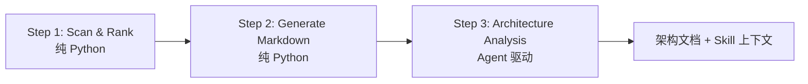

# Repo Map — AI 驱动的代码仓库架构地图

## 项目简介

Repo Map 是 AgentLoom 中的代码仓库架构分析应用，面向陌生仓库、大型仓库和长期演进项目的快速理解场景。它解决的核心问题是：开发者或 AI 编程助手在修改代码前，如何快速知道“这个仓库有哪些模块、关键入口在哪里、依赖关系怎么流动、架构意图是什么”。

传统做法通常依赖人工阅读 README、搜索入口文件、追踪调用链，再手写架构说明。Repo Map 将这个过程拆成确定性计算和 Agent 理解两部分：先由 Python 扫描仓库、提取代码符号、排序关键文件并生成目录镜像的 Markdown 索引；再由 Worker Agent 按目录进行架构分析，最终产出可复用的架构文档和私有 Skill 上下文。

它的目标不是让 LLM 从零猜仓库结构，而是先把代码事实整理成稳定、可检索、可复用的上下文，再让 LLM 负责归纳职责、识别模式和解释架构。这样既降低幻觉，也让后续 AI 读码、Code Review、跨模块影响分析和代码修改更有依据。

## 技术亮点

### 1. 确定性扫描与 LLM 分析解耦

Repo Map 的流水线分为三步：



Step 1 和 Step 2 不调用 LLM，只做可验证的代码事实整理；Step 3 才让 Agent 处理需要理解和归纳的工作。这个边界的好处很直接：扫描、排序、索引生成稳定可复现，LLM 只在最需要语义判断的地方介入。

### 2. tree-sitter 符号提取 + PageRank 关键文件排序

扫描阶段基于 tree-sitter 提取类、函数、方法、类型、常量等代码符号，并根据定义和引用关系构建代码图。随后使用 PageRank 对文件和符号的重要性排序，为每个目录生成带重要性星级的 `index.md`。

输出不仅包含“有哪些文件”，还包含：

- 关键定义及行号；
- 符号被哪些文件引用；
- PageRank 重要性星级；
- 跨文件依赖关系；
- 全局 `dependencies.md` 依赖视图。

这让 Agent 分析不是凭空总结，而是基于明确的结构信号。

### 3. 目录镜像式 Markdown 代码地图

Repo Map 会在输出目录中生成与源码目录结构一致的文档树：

```text
<output_dir>/
├── data/
│   ├── tags.json
│   ├── ranked.json
│   ├── tags_cache.json
│   ├── scan_meta.json
│   └── analysis_progress.json
└── repo_map/
    ├── index.md
    ├── analysis.md
    ├── dependencies.md
    └── <dir>/
        ├── index.md
        └── analysis.md
```

`index.md` 负责记录代码事实，`analysis.md` 负责记录架构理解。目录与文档一一对应后，AI 助手可以根据源码路径精确路由到对应上下文；没有精确命中时，也可以回退到父目录或根目录。

### 4. Bottom-Up 分层架构分析

LLM 分析阶段采用 Bottom-Up 策略：先分析叶子目录，再分析父目录，最后生成根目录的全局架构总结。

```text
执行顺序：
depth=3  -> 深层子目录并行分析
depth=2  -> 父级目录复用子目录 analysis.md
depth=1  -> 更高层目录整合下层结论
root     -> 生成全局架构地图
```

父目录分析时会读取直接子目录的 `analysis.md`，重点推断子模块之间的协作关系、依赖方向和职责边界。这比“逐目录孤立分析”更稳定，因为上层结论建立在下层已完成的结构理解之上。

### 5. 自动并发与进度持久化

同一深度的目录彼此独立，可以通过 `tool.batch(tasks)` 并行调用 Worker Agent。Worker 的 `concurrency: auto` 交给 AgentLoom 自动计算并发度，应用层不需要手写线程池。

每个目录分析完成后都会立即写入 `analysis_progress.json`，记录状态、错误信息和 hash。进程中断后再次运行，可以从已有进度恢复，不需要重跑所有目录。

### 6. 增量更新机制

Repo Map 同时在扫描层和分析层做增量判断：

- 扫描层：Git 仓库优先基于 commit diff、dirty files 和 untracked files 判断变更；非 Git 仓库回退到 mtime；
- 符号层：`tags_cache.json` 缓存文件级解析结果，未变化文件直接复用；
- 文档层：`index_md_hash` 判断当前目录索引是否变化；
- 架构层：`children_hash` 判断子目录分析结果是否变化，自动触发父目录重新分析。

因此，小范围代码变更不会导致整个仓库重新分析；只有受影响的目录及其父级会被重新计算。

### 7. 自动生成可复用 Skill

分析完成后，Repo Map 会把 `repo_map/` 文档树打包成私有 Skill，生成：

- `SKILL.md`：告诉 AI 助手何时查阅代码地图；
- `manifest.jsonl`：记录目录到文档的路由关系；
- `resolve_repo_map_docs.py`：根据源码路径解析对应文档；
- `assets/examples/`：提供路径定位和跨模块分析示例。

这让一次分析可以长期复用。后续 AI 在阅读或修改项目源码前，可以先加载对应 Skill，直接获得目录结构、模块职责和架构设计上下文。

## 适用场景

- 新成员接手陌生仓库，需要快速建立整体理解；
- AI 编程助手修改代码前，需要减少上下文缺失带来的幻觉；
- Code Review 时，需要快速判断改动影响哪些模块；
- 大型仓库需要沉淀可持续更新的架构文档；
- 多 Agent 工作流需要把代码结构上下文封装成可复用 Skill。

## 目录结构

```text
applications/repo_map/
├── repo_map_app.py              # 入口脚本，协调三步流水线
├── agent_tools/
│   ├── pipeline_agent_tools.py  # Bottom-Up 分析循环、进度恢复、Skill 打包
│   ├── scan_rank_tool.py        # Step 1: 扫描排序，支持增量和 Git 变更检测
│   ├── markdown_tool.py         # Step 2: 生成目录镜像 Markdown
│   ├── repomap.py               # tree-sitter 符号提取与代码图构建
│   └── renderer.py              # Markdown 渲染
├── workflows/
│   ├── repo_map_agent.yaml      # Supervisor Agent
│   └── worker_agents/
│       ├── dir_architecture_analysis.yaml
│       └── repo_map_skill_writer.yaml
├── skills/                      # 生成的私有 Skill
└── tests/                       # 测试用例
```

## 运行方式

```bash
cd AgentLoom/

# 默认输出到 <project_path>/.repo_map/
uv run python applications/repo_map/repo_map_app.py /path/to/project

# 指定输出目录并排除目录
uv run python applications/repo_map/repo_map_app.py /path/to/project \
  --output_dir /tmp/repo-map-output \
  --exclude_dirs vendor \
  --exclude_dirs build

# 从 AgentLoom checkpoint 恢复 LLM 分析阶段
uv run python applications/repo_map/repo_map_app.py /path/to/project \
  --output_dir /tmp/repo-map-output \
  --resume <task_id>
```

## 测试

```bash
cd AgentLoom/

# 运行 repo_map 测试
uv run python -m pytest applications/repo_map/tests/ -v

# 运行全量测试
./run_tests.sh
```
