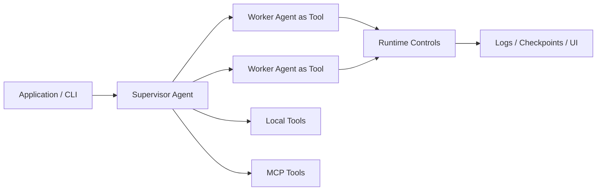

<div align="center"><sub>
<a href="../../README.md">English</a> | 简体中文
</sub></div>

<h1 align="center">AgentLoom</h1>

<p align="center">
  <strong>用简单配置和少量代码搭建复杂 multi-agent 应用，并获得安全运行边界与人性化日志追踪系统。</strong>
</p>

<p align="center">
  <strong>AgentLoom 帮开发者把 multi-agent 工作流变成可运行、可观测、可恢复、可控的应用。</strong>
</p>

<p align="center">
  <a href="https://github.com/linora-u/AgentLoom/actions/workflows/tests.yml"></a>
  <a href="https://www.python.org/downloads/">=3.12" src="https://img.shields.io/badge/python-%3E%3D3.12-3776AB?logo=python&logoColor=white"></a>
  
</p>

---

## 快速开始

AgentLoom 的目标是让你尽快从仓库克隆进入一个真实可运行的 multi-agent 应用。

```bash
git clone <repo-url> AgentLoom
cd AgentLoom

uv sync
# 如果 PyPI 在你的网络环境中较慢或不可用：
# UV_DEFAULT_INDEX=https://mirrors.aliyun.com/pypi/simple uv sync

cp config/llm.example.yaml config/llm.yaml
# 编辑 config/llm.yaml，填入你的模型配置。

uv run loom run applications/ai_quality_analysis/workflows/code_review_agent.yaml
```

第一次运行后，你应该能看到：

- 带 Agent 名称、Task ID、Step 耗时和 Token 统计的结构化终端日志；
- `.logs/<agent>/<timestamp>/` 下归档的运行文件；
- 开启 checkpoint 后可恢复的任务状态；
- 可通过 `uv run loom ui` 打开的 Web 可视化面板；
- 可通过 `uv run loom dashboard` 打开的终端任务监控面板。

## AgentLoom 提供什么能力

AgentLoom 已经实现了一套构建和运行复杂 Agent 应用所需的运行时能力：

| 能力领域 | 已实现功能 |
|---|---|
| Multi-agent 应用组装 | Supervisor / Worker 角色、YAML `workflow`、`worker_agents`、`loom run` 直接运行、`loom create` 生成入口脚本、`run_app()` 嵌入 Python。 |
| Agent-as-Tool | Worker 通过 `agent_function_schema` 导出为可调用工具，自动生成函数签名、必填参数校验、docstring、字符串结果和 `.batch(tasks)`。 |
| 执行模式 | `tool_call` 用于结构化、可追踪编排，`code_act` 用于更灵活的代码执行任务。 |
| Python 前后置处理 | 支持自定义工具函数和 wrapper，用于扫描、缓存、循环、重试、校验、错误隔离、进度持久化和产物落盘。 |
| 批量并发 | Worker 支持 `concurrency: auto` 或固定并发，支持 `tool.batch(tasks)`、反压控制、熔断、进度回调和单次调用状态隔离。 |
| Skills 与 Hooks | 可复用 Skills、强制注入 / 按需加载 / 隐藏模式，以及工具、任务、子 Agent、会话、压缩、安装、配置变更等生命周期 Hooks。 |
| 模型与上下文控制 | 按 Agent 配置 `model_type`、多 LLM 端点、参数继承、重试机制、Prompt 定制和多层上下文压缩。 |
| 工具体系 | 内置文件、Shell、搜索、代码编辑、Git、Todo、Skill 加载、本地 Python 工具和本地 Codex Exec 工具，并支持 MCP Client 集成。 |
| 本地 Codex 集成 | 可把本机 `codex exec` 注册为普通 function tool，支持多个别名、`fixed_args` 固定参数、`sandbox` / `search` 透传，并遵循本机 Codex 登录和权限配置。 |
| 代码智能 | LSP 服务管理，支持 definition、references、symbols、hover、workspace symbols，并提供 tree-sitter fallback。 |
| 运行时安全 | 路径边界、include/exclude、按 Agent 生效的权限策略、Shell 命令/操作符白名单、安全检查、沙盒包装和 `shell_audit.log`。 |
| 长任务韧性 | checkpoint resume、心跳检测、对话恢复、工具调用错误恢复、文件历史、worker skip-on-resume 和任务清理。 |
| 可观测性 | Rich 终端日志、纯文本文件日志、每步耗时、累计/增量 Token、task/subtask/agent 上下文，以及 `.logs/` 运行归档。 |
| UI 与监控 | Web UI 支持 SSE 实时更新、拓扑图、时间线回放、多运行分组；TUI dashboard 支持活跃任务和可恢复任务监控。 |
| 示例应用 | `ai_quality_analysis`、`unit_test_studio`、`repo_map` 展示直接运行、自定义 Python 入口、严格流水线和并发 Worker 分析。 |

## 为什么选择 AgentLoom

### 用更少代码搭建复杂 Agent 应用

很多 Agent 框架提供的是组件。AgentLoom 提供的是应用形态。

复杂 Agent 应用通常会反复长出同一批胶水代码：Worker 注册、参数适配、运行入口、前后置处理、批量并发、日志追踪和安全控制。更麻烦的是，这些代码在下一个 Agent 应用里往往又要重新写一遍。

Worker Agent 可以被导出为可调用工具，Supervisor Agent 会自动加载并调度这些 Worker。复杂流程可以由多个专职 Agent、少量业务胶水代码和直接可运行的入口组成。

AgentLoom 把可复用部分沉到 YAML 和运行时里。YAML 描述 workflow、Worker 列表、工具、模型、权限和 Skills；Worker 自动变成可调用工具；Supervisor 自动加载 Worker；Python 只保留项目特有的前处理、后处理、缓存、循环、校验和产物落盘逻辑。Skills 与 Hooks 则把生命周期能力打包成可跨应用复用的模块。

你可以从这些入口开始：

- `uv run loom run <workflow>` 直接运行一个应用；
- `uv run loom create <workflow>` 生成 Python 入口脚本；
- `run_app("<workflow>")` 把 AgentLoom 应用嵌入自己的 Python 流水线；
- `tool.batch(tasks)` 用同一个 Worker Agent 并发处理大量输入。

这就是开发周期上的核心收益：少写编排胶水，多花时间设计 Agent 分工、工具边界和任务流程。

## AgentLoom 的不同之处

| 普通 Agent 框架常见模式 | AgentLoom 的方式 |
|---|---|
| 组件优先，用户自己组装底层抽象。 | 应用优先：直接运行、生成入口、嵌入业务代码、监控和恢复 multi-agent 应用。 |
| 每个复杂应用都容易重新长出一层胶水代码。 | 可复用编排、运行边界、观测和生命周期扩展沉到 AgentLoom，应用层只保留业务差异。 |
| 安全、恢复、观测能力经常后置。 | 运行边界、checkpoint、日志、审计、Web UI、dashboard 是框架路径的一部分。 |
| 日志主要围绕模型调用和最终输出。 | 日志服务于 Agent 应用调试：task、subtask、agent、step、token、checkpoint、拓扑都能追踪。 |
| 快速 demo 容易，长期无人值守任务需要额外基础设施。 | 面向多阶段、长时间、可恢复、可复盘的 Agent 自动化任务。 |

## 用更少代码构建 multi-agent 应用

AgentLoom 的核心模型很直接：



关键边界是：

- Worker Agent 定义自己的职责、工具、输入和输出契约；
- AgentLoom 把 Worker 转成带真实函数签名的可调用工具；
- Supervisor 像调用工具一样调度 Worker，完成完整任务；
- 业务 Python 仍然可以包在外层，处理扫描、缓存、参数解析、校验、落盘等确定性逻辑。

### 胶水代码放在哪里

| 通常会变成胶水代码的部分 | AgentLoom 中的位置 |
|---|---|
| 可复用 Agent 编排 | YAML `workflow` 和 `worker_agents`。 |
| Worker 参数适配 | `agent_function_schema` 和生成的函数签名。 |
| 项目特有前后置处理 | 注册为工具的 Python wrapper。 |
| 跨应用生命周期行为 | Skills 与 Hooks。 |

`repo_map` 应用展示了这种混合模式：Python 负责确定性的仓库扫描和排序，AgentLoom 负责调用 Worker Agent 逐目录分析并生成架构文档。

## 示例应用

`applications/` 目录包含多个可运行示例，展示 AgentLoom 的推荐使用方式。

| 应用 | 构建内容 | 证明的框架能力 |
|---|---|---|
| `ai_quality_analysis` | 多维度代码审查应用。 | 12 个 Worker Agent、分阶段审查、直接 `loom run`、长时间代码库分析。 |
| `unit_test_studio` | Python pytest 生成工作流。 | 严格多步骤流水线、自定义入口脚本、函数接收、场景规划、测试生成、精炼、交付报告。 |
| `repo_map` | 仓库架构地图生成器。 | 确定性 Python 预处理 + Agent 架构分析、Bottom-Up 目录处理、`tool.batch(tasks)`、进度持久化。 |
| `codex_exec_demo` | 本地 Codex Exec 工具调用示例。 | 直接 `loom run`、普通 function tool 注册、`fixed_args` 固定 Codex 参数、结构化 `tool_call` 顺序调用。 |

运行默认代码审查示例：

```bash
uv run loom run applications/ai_quality_analysis/workflows/code_review_agent.yaml
```

用自定义 Python 入口运行 Repo Map：

```bash
uv run python applications/repo_map/repo_map_app.py /path/to/project \
  --output_dir /tmp/repo-map-output \
  --exclude_dirs vendor \
  --exclude_dirs build
```

为指定函数生成 pytest 测试：

```bash
uv run python applications/unit_test_studio/studio_runner.py \
  /path/to/your/project \
  "src/utils.py:parse_config,src/core.py:run_pipeline" \
  --output_dir tests/generated
```

运行本地 Codex Exec 工具示例：

```bash
uv run loom run applications/codex_exec_demo/workflows/use_codex_exec_demo.yaml
```

## 核心概念

### Agent 即工具

Worker Agent 可以导出为可调用工具。AgentLoom 会生成函数签名、校验必填输入、构造任务载荷并返回字符串结果。同一个 Worker 还可以暴露 `.batch(tasks)` 用于并发执行。

### Supervisor / Worker

Supervisor Agent 负责协调任务。Worker Agent 专注其中一个部分。这样的拆分让职责更明确，也更容易调试。

### Workflow

Workflow 描述 Agent 要完成什么，以及 Supervisor 应如何使用 Worker。AgentLoom 会基于 Workflow 构造运行时任务说明，让长任务更容易保持方向。

### Skills 与 Hooks

Skills 提供可复用知识或行为。Hooks 可以挂载在任务生命周期、子 Agent 生命周期、工具调用等运行时事件上，用于校验、记忆、策略约束、结果转换和可视化采集。

### 执行模式

AgentLoom 支持结构化工具调用，也支持更灵活的代码执行模式。每个 Agent 可以根据自己的职责选择更合适的模式。

### 本地 Codex 工具

AgentLoom 内置 `src.tools.codex.codex_tool.codex`，用于把本机 `codex exec`
作为普通 function tool 暴露给 Agent。它不需要额外的 `system.yaml` 专用配置；
在 Agent YAML 的 `tools` 中通过 `module/function` 注册即可。

如果希望锁定 Codex 的 `prompt`、`cwd`、`sandbox`、`search` 等输入，使用
`fixed_args`。被固定的参数会由框架绑定，不会出现在 LLM 可传入的 tool schema
中；未固定的参数仍会暴露给 LLM。`sandbox: ""` 表示不传 `--sandbox`，由本机
Codex 配置和默认规则决定权限；`search: "true"` 会透传 `--search`，默认不启用
网络搜索。使用前需要确保 `codex` 在 `PATH` 中，并且 `codex login status` 成功。

## CLI 命令

| 命令 | 用途 |
|---|---|
| `uv run loom run <workflow>` | 运行一个 AgentLoom 应用。 |
| `uv run loom create <workflow>` | 为应用生成 Python 入口脚本。 |
| `uv run loom ui` | 打开 Web 可视化面板。 |
| `uv run loom dashboard` | 打开终端任务监控面板。 |
| `uv run loom list-tasks` | 列出可恢复的 checkpoint 任务。 |
| `uv run loom clean-tasks` | 清理旧 checkpoint 数据。 |

## 文档

| 文档 | 说明 |
|---|---|
| [配置体系总览](config-overview.md) | 配置层级、合并规则和模型配置隔离机制。 |
| [Agent 配置](agent_config.md) | Supervisor/Worker 字段、工具、模型选择、工作流和 Skills。 |
| [LLM 配置](llm_config.md) | 模型类型、Provider 设置、继承、重试和 Prompt 缓存。 |
| [系统配置](system_config.md) | 运行时设置、权限、日志、执行环境和工具系统。 |
| [Skills 配置](skills_config.md) | Skill 包格式、加载方式、调用控制和内置 Skills。 |
| [Hooks 参考](hooks.md) | 生命周期事件、Hook 类型、匹配规则和执行行为。 |
| [Checkpoint 断点恢复](checkpoint.md) | Checkpoint 布局、恢复行为和长任务恢复机制。 |

## 开发辅助 Skills

`tools/skills-cn/` 目录提供了一组可选的开发辅助 Skills，供 AI 编程助手在开发 AgentLoom 应用时使用：

| Skill | 用途 |
|---|---|
| `create-app` | 生成 AgentLoom 应用脚手架。 |
| `create-skill` | 创建自定义 AgentLoom Skill。 |
| `workflow-review` | 审核 Agent/Tool 边界、编排合约和韧性设计。 |
| `shell-security` | 配置 Shell 执行安全策略。 |
| `update-skills` | 在源码或文档变化后同步开发辅助 Skills。 |

这些 Skills 是开发辅助，不是运行 AgentLoom 应用的必需依赖。

## 支持与参与

AgentLoom 是面向复杂 Agent 自动化任务的实用框架。欢迎提交 Issue、功能建议、文档改进和新的示例应用。

- 提 Issue：[GitHub Issues](https://github.com/linora-u/AgentLoom/issues)
- 联系方式：[raine_walker@163.com](mailto:raine_walker@163.com?subject=AgentLoom%20Collaboration)
- 如果这个项目对你有帮助，欢迎给一个 GitHub Star，让更多人看到它。
