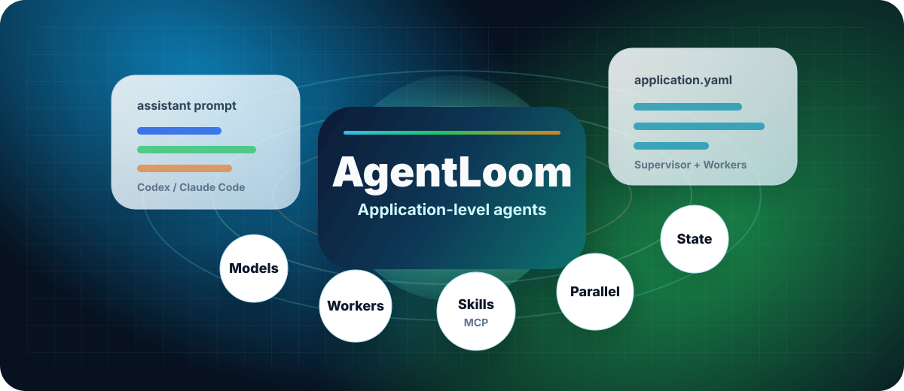
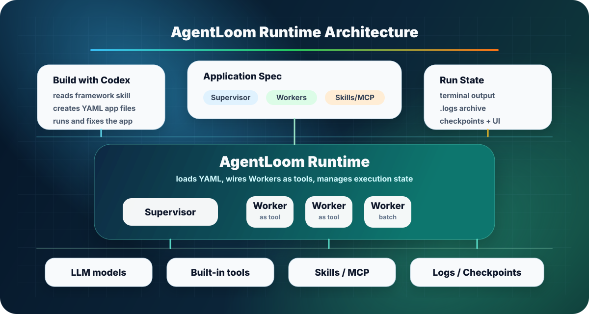

<div align="center"><sub>
<a href="../../README.md">English</a> | 简体中文
</sub></div>

<h1 align="center">AgentLoom</h1>

<p align="center">
  <strong>创建、运行并查看由 YAML 定义的多 Agent 应用。</strong>
</p>

<p align="center">
  使用 Application Studio 创建、修改、校验、运行并查看 AgentLoom Application。
</p>

<p align="center">
  <a href="https://github.com/linora-u/AgentLoom/actions/workflows/tests.yml"></a>
  <a href="https://www.python.org/downloads/">=3.12" src="https://img.shields.io/badge/python-%3E%3D3.12-3776AB?logo=python&logoColor=white"></a>
  <a href="https://github.com/linora-u/AgentLoom/releases/tag/v1.0.1"></a>
</p>

<p align="center">
  
</p>

## 安装

推荐从源码安装脚本开始。它会同时准备 TUI、Python Runtime 和所需依赖，不需要手工搭建多套环境。

```bash
git clone https://github.com/linora-u/AgentLoom.git
cd AgentLoom
./install
```

安装完成后打开一个新终端，在仓库根目录验证命令：

```bash
agentloom --version
agentloom --snapshot
```

安装脚本会：

- 通过官方安装器补齐缺少的 `uv` 和 Bun；
- 在 `~/.agentloom/venv` 创建锁定的 Python 环境；
- 构建当前平台的 TypeScript/OpenTUI 原生程序；
- 将 `agentloom` 和 `agentloom-tui` 安装到 `~/.agentloom/bin`；
- 在存在可写 Shell 配置时，把该目录加入 `PATH`。

源码安装脚本目前面向 macOS 和 Linux Shell。它需要 Git 和 Bash；仅在缺少 `uv` 或 Bun 时需要 `curl`。

源码更新只需在仓库中重新运行 `./install`。首次安装后也可执行
`agentloom update`，它会从安装时记录的可信源码目录重新构建。参数
`--no-modify-path` 仅表示“不修改 Shell PATH 配置”，不是更新必需参数。

安装版 TUI 会在后台检查这个可信源码目录。如果与产品相关的源码比当前安装
更新，`Ctrl+X` 会提供“整体更新并安全重启”。它不会擅自执行 Git 拉取，也不
会在活跃 Session 中静默替换程序。

需要自定义安装目录或不修改 `PATH` 时，可以使用：

```bash
AGENTLOOM_INSTALL_DIR="$HOME/tools/agentloom" ./install
./install --no-modify-path
```

### 配置 Application 模型

使用 TUI 对话或运行 Agent 前，先复制模型配置模板：

```bash
cp config/llm.example.yaml config/llm.yaml
```

编辑 `config/llm.yaml` 并替换占位内容。不要提交这个文件；它包含凭证，已经被 Git 忽略。

```yaml
model:
  default_model_type: powerful
  powerful:
    model: "openai/<model-id>"
    api_key: "<api-key>"
    base_url: "https://<openai-compatible-endpoint>"  # OpenAI 官方端点可省略
    tool_choice: "auto"
```

这份文件是 Studio 与 Application Agent 唯一共享的模型配置源。
Application Agent 由 Python Runtime 按 YAML `model_type` 解析；TypeScript
Studio 适配器把同一批 Profile、端点、凭证和兼容请求参数安全映射给内置
Studio Runtime。`/models` 或 `Ctrl+X` 只切换当前 Studio Session 使用的
`llm.yaml` 模型类型，不修改任何 Application YAML 的 `model_type`。配置缺失
或无效时 Studio 会明确启动失败，不会回退到未配置的环境默认模型。

## 从 TUI 开始

在需要查看的项目中运行 `agentloom`，也可以显式指定项目：

```bash
cd /path/to/AgentLoom
agentloom

# 查看另一个 AgentLoom 项目
agentloom --project /path/to/project
```

TUI 是 Applications-first 控制面。独立的 Studio Agent 可以读取项目、
直接修改当前 Application、展示 Tool 与 Diff、校验配置、请求
真实运行授权、读取结构化 Run 证据，并在失败后继续修复。

### 1. 新建或选择 Application

按 `Enter` 发送需求。一个有效的初始描述应写清应用、角色、输入、输出和验收标准：

```text
创建一个名为 release_review 的应用。
使用一个 Supervisor 和两个 Worker，分别负责 API 审查和测试审查。
模型类型从 config/llm.yaml 中选择。
校验完成后，在首次真实运行前向我申请权限。
```

Studio 在授权范围内直接改文件，并显示产生的 Diff。自治 Loop 会检查
Effective Config、YAML/引用、Tools、Skills、权限、拓扑与相关测试；行为
变化还会在获准后真实冒烟运行。未获运行授权时只能报告“配置已验证，
尚未运行”，不能宣称完全完成。

大型 Application 的模型侧详情会去重并按每页最多 10 个 Agent 返回，避免
把完整配置塞进一次 Tool 输出。Studio 会持久化 Session 的状态、重试、
权限、问题和 Task 子会话事件；模型安静思考不会被误判成需要自动中止。需要立即
中止时按 `Esc`。

### 2. 首页数字与详情

首页只统计 `applications/` 下的 Application 数量，不统计展开后的
Supervisor/Worker YAML 数量。`Global Skills` 只统计根目录运行时全局
Skills；Application 私有 Skills 在对应 Application 和 Agent 详情中查看。
Studio 使用的框架 Skill 不计入业务 Application Skills。

`Ctrl+X` 搜索命令、权限、Application、主 Supervisor Agent、Skill、
Schedule 和 Run。Worker 子 Agent 只在所属 Application 和主 Agent 详情中
展示，不作为独立的全局搜索条目。Application 详情展示带来源的 Effective Config，包括
模型、Tools、Skills、子 Agent、权限、Hooks、MCP、配置文件、校验、
Working Revision 和 Running Revision。Run 默认只展示可行动摘要，不铺开
原始 Events 和完整日志。

### 3. 权限与 Revision

默认 `Application Only`：可读整个项目，可直接写当前 Application；Shell、
全局文件、其他 Application 和新建时未知目录由 Studio 弹出权限卡。
按 `1` 仅本次、`2` 本次会话、`3` 拒绝。`Ctrl+X` 中的 Full Access 是同一个
开关：未选择 Application 时也可预设，切换 Application 后继续生效，退出 TUI
后恢复默认。切换 Application 会保留当前 Studio 对话记忆，只有 `/new` 才开始
不带旧记忆的新 Session；`/compact` 使用当前 Studio 模型压缩当前 Session，保留
任务连续性、持久历史和已经完成的文件修改。上下文接近上限时，Runtime 的自动压缩
也会在 TUI 中显示。Agent Loop 运行时不能切换目标；等待完成或先按 `Esc`
中止，避免旧回合污染新 Application。子 Agent 执行文本会保留到下一回合，选中
TUI 文本后按 `Ctrl+Y` 可复制。
Studio Agent 需要业务决定时，可点击选项或在输入框回答；一次出现多个问题时
用 `|` 分隔答案。

Run 启动时把 Application 内容哈希写入 manifest。之后继续修改只会改变
Working Revision，不会热切换正在运行的 Agent；新配置需新 Run 或重启。

| 操作 | 命令 / 按键 |
|---|---|
| 发送对话 | `Enter` |
| 开始新的 Studio 对话 | `/new` |
| 不开新会话，压缩当前对话上下文 | `/compact` |
| 复制选中的 TUI 文本 | `Ctrl+Y` |
| 搜索命令和全局实体 | `Ctrl+X` |
| 从 `config/llm.yaml` 选择 Studio 模型 | `/models` 或 `Ctrl+X` |
| 刷新完整索引 | `/refresh` 或在详情页按 `r` |
| 分析选中的失败 Run | `a` |
| 关闭详情、拒绝权限/问题或中止当前 Loop | `Esc` |

TUI 架构与开发说明见 [agentloom-tui/README.md](../../agentloom-tui/README.md)。

### 5. 显式运行调度服务

TUI 可以创建和管理持久化 Schedule。自动触发由独立的前台服务负责，因此关闭 TUI 后不会留下隐藏 daemon。

```bash
agentloom schedules --project /path/to/project serve
```

## 运行已有 Agent

如果想先验证框架而不创建新应用，可以运行仓库自带的代码审查示例：

```bash
uv run loom run applications/ai_quality_analysis/workflows/code_review_agent.yaml
```

一次运行会在 `.agentloom/runs/<application_id>/<run_id>/` 下生成 receipt。开启 checkpoint 后，可恢复状态位于 `.agentloom/checkpoints/<application_id>/<task_id>/`。

`run_id` 标识一次 attempt，resume 后会改变；`task_id` 标识逻辑任务，resume 时保持不变。

## AgentLoom 如何工作

AgentLoom 把多 Agent 系统视为一个应用，而不是一组松散的 Prompt。

| 概念 | 职责 |
|---|---|
| Supervisor | 拆解应用任务，并协调 Worker 和工具。 |
| Worker | 负责一个专门角色，并暴露 typed callable contract。 |
| Agent YAML | 定义角色、工作流、模型类型、工具、Skill、Worker 和运行策略。 |
| Python Runtime | 负责模型路由、Worker 工具生成、并发、日志、checkpoint 和产物。 |

编排逻辑可以复用，确定性的前处理、校验、缓存和结果写入仍然由普通 Python 代码完成。

### 核心能力

| 需求 | AgentLoom 提供 |
|---|---|
| 从配置构建应用 | 使用 `loom run` 直接执行 YAML，并可生成 Python 入口。 |
| 为不同角色选择模型 | 每个 Agent 设置 `model_type`，凭证隔离在 `config/llm.yaml`。 |
| 像工具一样调用 Agent | Worker 的 `agent_function_schema` 会转换成带校验的 callable function。 |
| 处理重复输入 | 固定或自动 Worker 并发，并支持 `.batch(tasks)`。 |
| 扩展 Agent | 内置工具、本地 Python 函数、MCP Server、Claude-style Skill 和显式 Hook。 |
| 跟踪复杂执行 | Agent 私有的 Todo 快照，支持自主 `auto`、强提示 `on` 和权威关闭 `off`。 |
| 恢复并检查任务 | Run receipt、有界日志、Shell audit、checkpoint resume、结构化事件、Web UI、dashboard 和 TUI。 |

### 当前任务 Todo 跟踪

Todo 是当前 task、当前 Agent 的执行状态，不是长期项目管理器。它可以在全局、
Application 或 Agent 层配置，更具体的层级优先：

```yaml
todo:
  mode: "auto"  # auto | on | off
```

- `auto` 是默认值：工具可用，由模型自主判断有意义的多步骤任务是否值得跟踪。
- `on` 强提示非简单 Agent 在实质执行前建立完整 Todo 快照；Runtime 不插入隐藏的
  planning 轮次，也不阻止最终回答。
- `off` 完全移除工具、策略与上下文状态；即使通用工具列表包含 `todo_write` 也以
  `off` 为准。

每次 `todo_write` 都会原子替换完整有序列表。开启 checkpoint 时，按 Agent path
隔离的权威快照位于当前 task checkpoint 的 `todos.json`，共用 resume、锁、保留
与清理生命周期；关闭 checkpoint 时只存在于本次 run 的内存中。
`planning_interval` 仍可控制周期 replanning，但不再控制 Todo。完整说明见
[Agent 配置参考](agent_config.md#311-todomode--任务跟踪)。

## 手工创建应用

一个应用把 Supervisor、Worker、Prompt、可选工具和输出放在一起：

```text
applications/release_review/
├── workflows/
│   ├── release_review_agent.yaml
│   └── worker_agents/
│       ├── api_reviewer.yaml
│       └── test_reviewer.yaml
├── config/system.yaml          # 可选的应用级覆盖
├── sysprompt/                  # 可选 Prompt 模板
└── README.md
```

最小 Supervisor 会引用 Worker YAML：

```yaml
name: "release_review"
description: "Review an API release and its test evidence."
model_type: "powerful"
tool_call_type: "tool_call"

worker_agents:
  - path: "applications/release_review/workflows/worker_agents/api_reviewer.yaml"
  - path: "applications/release_review/workflows/worker_agents/test_reviewer.yaml"

workflow: |
  Ask both Workers for evidence, reconcile conflicts, and return one release decision.

tools: []
skills: []
max_steps: 12
```

每个 Worker 定义 Supervisor 可见的调用契约：

```yaml
name: "api_reviewer"
description: "Review API compatibility risks."
model_type: "fast"
tool_call_type: "tool_call"

agent_function_schema:
  description: "Review one release request."
  inputs:
    request:
      description: "Release scope and API diff."
      required: true
  output:
    description: "Evidence-backed compatibility findings."

workflow: |
  Review the request, cite evidence, and return prioritized findings.

tools: []
worker_agents: []
skills: []
max_steps: 8
```

确认真实 `model_type` 存在于 `config/llm.yaml`，然后运行 Supervisor：

```bash
uv run loom run applications/release_review/workflows/release_review_agent.yaml
```

完整字段见 [Agent 配置参考](agent_config.md)。

## 使用编程助手创建应用

仓库提供 `agentloom-framework-skill/`，供 Codex、Claude Code 和其他支持 Skill 的编程助手使用。

创建文件前，先要求助手读取该 Skill：

```text
先读取 agentloom-framework-skill/SKILL.md。

为下面目标创建一个名为 <app_name> 的 AgentLoom 应用：
<任务、输入、输出和验收标准>

在 applications/<app_name>/ 下创建一个 Supervisor 和必要的 Worker。
只使用 config/llm.yaml 中存在的模型类型。
用 agent_function_schema 定义每个 Worker 的输入和输出。
校验 YAML、运行应用、检查 .agentloom 证据，
并报告通过、失败和仍有限制的内容。
```

Framework Skill 是提供给编程助手的开发说明。它不是 Runtime Skill，也不会被 Agent 应用自动加载。

## 架构

<p align="center">
  
</p>

Worker Agent 会转换成生成的工具。Supervisor 可以同时调用 Worker，以及普通 Python、MCP、文件、Shell、搜索、Git、Codex 或 Skill 工具。

Runtime 负责执行身份和证据。TUI 与其他观察端读取这套标准状态，而不是根据进程输出猜测结果。

## 示例应用

| 应用 | 展示能力 |
|---|---|
| `ai_quality_analysis` | 十二个专门 Worker 协作完成分阶段代码审查。 |
| `unit_test_studio` | 使用自定义 Python 入口的严格 pytest 生成流水线。 |
| `repo_map` | 确定性前处理、Bottom-Up Agent 分析、批处理和进度持久化。 |
| `codex_exec_demo` | 将本地 `codex exec` 注册为带固定参数的普通 Agent 工具。 |

```bash
# 生成仓库架构地图
uv run python applications/repo_map/repo_map_app.py /path/to/project \
  --output_dir /tmp/repo-map-output

# 为指定函数生成 pytest
uv run python applications/unit_test_studio/studio_runner.py \
  /path/to/project "src/utils.py:parse_config" \
  --output_dir tests/generated

# 本地 Codex 工具示例
uv run loom run applications/codex_exec_demo/workflows/use_codex_exec_demo.yaml
```

## CLI 参考

| 命令 | 用途 |
|---|---|
| `uv run loom run <workflow>` | 运行应用。 |
| `uv run loom run <workflow> --output-format jsonl` | 输出带版本的生命周期事件流。 |
| `uv run loom create <workflow>` | 生成 Python 入口。 |
| `uv run loom list-tasks` | 列出可恢复任务。 |
| `uv run loom dashboard` | 打开终端任务 dashboard。 |
| `uv run loom ui` | 打开 Web 可视化面板。 |
| `uv run loom schedules ...` | 管理持久化 Schedule。 |
| `uv run loom sessions ...` | 搜索和维护执行历史。 |
| `uv run loom learn review ...` | 触发 Application 或 Project review。 |
| `uv run loom reviews ...` | 查看、应用或回滚 review decision。 |
| `uv run loom memory ...` | 管理 Curated Memory。 |
| `uv run loom feedback submit <run_id> ...` | 为 Run 添加结果反馈。 |
| `uv run loom clean-tasks` | 删除保留的 checkpoint 任务。 |
| `uv run loom clean-runtime` | 执行已配置的 Run 和 artifact retention。 |
| `uv run loom migrate-runtime --dry-run\|--apply` | 预览或执行旧 Runtime 迁移。 |

使用 `uv run loom <command> --help` 查看完整命令契约。

## 文档

| 文档 | 内容 |
|---|---|
| [配置体系总览](config-overview.md) | 配置层级、合并和隔离。 |
| [Agent 配置](agent_config.md) | Supervisor 和 Worker YAML 字段。 |
| [LLM 配置](llm_config.md) | 模型类型、Provider、重试和缓存。 |
| [系统配置](system_config.md) | Runtime、权限、执行环境和工具。 |
| [Skill 配置](skills_config.md) | Skill 包、加载方式和策略。 |
| [Hook 参考](hooks.md) | 直接 Hook、Bundle、事件和执行方式。 |
| [Checkpoint 恢复](checkpoint.md) | Run 证据、checkpoint 布局和恢复。 |
| [Self-learning v6](self_learning.md) | History、candidate、review、审批和 promotion。 |
| [结构化 Run API](run_observability.md) | Python receipt、typed error、event sink 和 JSONL。 |

## 开发与支持

```bash
# Framework 测试
uv run pytest tests -q

# TUI 测试
cd agentloom-tui
bun test
bun run typecheck
```

- Issue：[github.com/linora-u/AgentLoom/issues](https://github.com/linora-u/AgentLoom/issues)
- 联系方式：[raine_walker@163.com](mailto:raine_walker@163.com?subject=AgentLoom%20Collaboration)
- TUI 上游来源与许可证：[agentloom-tui/upstream/README.md](../../agentloom-tui/upstream/README.md)

如果 AgentLoom 对你的项目有帮助，欢迎 Star 仓库，或贡献一个范围明确的示例、修复或文档改进。
