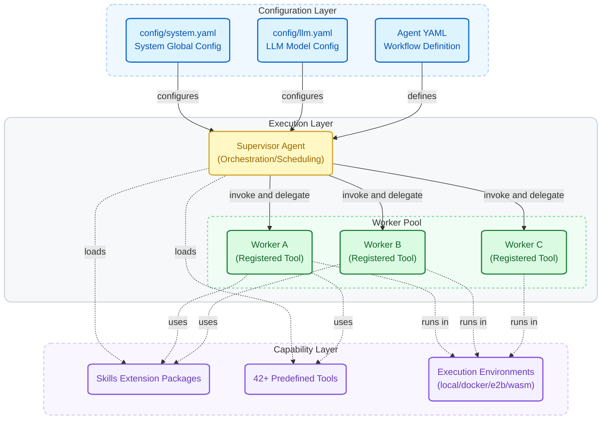

<div align="center"><sub>
<a href="../../README.md">English</a> | 简体中文
</sub></div>

<h1 align="center">AgentLoom</h1>

<p align="center">
  <strong>YAML 驱动的多智能体协作框架</strong>
</p>

<p align="center">
  AgentLoom 让你用 YAML 声明式地编排多个 AI Agent，<br>
  像搭积木一样组合它们完成复杂、确定性、可审计的长期任务。
</p>

---

## 🎯 适用场景与项目定位

AgentLoom 适用于那些**复杂、耗时、需要多步骤协作**的自动化任务。你提前把执行计划写在 YAML 里，多个 Agent 按流程自动跑完，不需要人一直盯着。

典型场景包括：

- **代码质量审查** — 对大型代码仓库做系统性的并发安全分析、风险识别，自动生成审计报告（如嵌入式系统的共享变量竞态检测，7 个阶段全自动完成）
- **批量单元测试生成** — 逐函数自动生成测试用例，编译 → 运行 → 检查覆盖率，覆盖率不够就继续补，直到达标。一个大项目可以跑几个小时并保持流程一致
- **Bug 定位与修复** — 多个 Agent 协作完成问题复现、根因分析、补丁生成与回归验证，形成完整的修复闭环
- **大型复杂代码编写与优化** — 将大规模编码任务拆成多个阶段（架构设计 → 模块实现 → 集成 → 优化），各阶段由专家 Agent 分工完成，避免单一模型处理复杂任务时的上下文丢失和质量劣化
- **仓库架构文档生成** — 自动扫描项目结构，逐目录分析模块职责和依赖关系，生成活文档。新人入职不用再花几周读代码
- **CI/CD 流水线中的 AI 环节** — 作为定时任务或流水线的一环持久化部署，7×24 自动运行，产出可审计的结构化结果

> **交互式 AI 助手（Cursor、Copilot、Claude Code、Codex）解决的是"坐在屏幕前和 AI 对话写代码"的问题；AgentLoom 解决的是"提前定好方案，让 AI 自己跑完整个复杂任务"的问题。** 前者适合即时交互，后者适合确定性的、长时间运行的自动化场景。

相比普通的 vibe coding，AgentLoom 更强调**可配置、可控、可复盘**。用户可以定义 Agent 的行为、工具、工作流结构、权限边界、生命周期 Hook 和执行环境；每个子 Agent 或工具调用前后都可以挂载前置/后置处理，用于校验、日志、记忆、策略约束、结果转换或自定义编排。它的目标不是让模型临场自由发挥，而是让 Agent 严格沿着用户定义的流程和约束工作。

---

## 快速开始

### 前置条件

- **Python >= 3.12**（通过 `python3 --version` 检查）
- **[uv](https://docs.astral.sh/uv/)** — 推荐的 Python 包管理器（安装：`curl -LsSf https://astral.sh/uv/install.sh | sh`）

### 环境准备

```bash
# 克隆项目
git clone <repo-url> AgentLoom
cd AgentLoom

# 安装依赖（使用 uv，会自动创建 Python 3.12 的 .venv 环境）
uv sync

# 配置 LLM（复制示例配置并填入你的 API Key）
cp config/llm.example.yaml config/llm.yaml
# 编辑 config/llm.yaml，填入你的模型配置
```

### 运行你的第一个 Agent

```bash
loom run applications/ai_quality_analysis/workflows/code_review_agent.yaml
```

---

## AgentLoom 如何工作

### 设计理念

AgentLoom 的核心思想很简单：**每个 Agent 都是一个工具**。

Worker Agent 通过 `agent_function_schema` 将自己导出为一个可调用工具，然后注册进 Supervisor Agent。Supervisor 像调度普通工具一样调度这些 Worker：不需要复杂通信协议，不需要消息队列，一个 YAML 文件就能定义整个编排逻辑。

这种设计带来几个好处：

- **分而治之**：每个 Worker 专注一件事，Supervisor 负责串联全局
- **声明式编排**：工作流写在 YAML 里，改配置就能调整流程，不用动框架代码
- **灵活组合**：同一个 Worker 可以被不同 Supervisor 复用，像组件一样拼装
- **过程可控**：工具、权限、Hook、模型和执行环境都能按 Agent 单独配置

### 架构概览



### 运行方式

AgentLoom 支持三种运行方式，适用于不同场景：

| 方式 | 适用场景 | 命令 |
|------|----------|------|
| `loom run` 直接运行 | 标准 YAML 工作流 | `loom run applications/<你的应用>/workflows/<agent>.yaml` |
| `loom create` 生成脚本 | 需要一个可执行 Python 入口文件 | `loom create applications/<你的应用>/workflows/<agent>.yaml` |
| 自定义手写 Python 脚本 | 需要自定义参数解析、多步流水线、增量缓存、前后置处理 | `.venv/bin/python applications/my_app/my_app.py` |

自定义脚本可以引入框架的 `run_app()` 函数，在调用前后加入任意业务逻辑：

```python
from src.runner import run_app

# 你的前置处理...
result = run_app("applications/my_app/workflows/my_agent.yaml")
# 你的后置处理...
```

建议把自定义入口放在 `applications/<你的应用>/` 目录下：

```
applications/my_app/
├── my_app.py              ← 你的自定义入口脚本
├── agent_tools/           ← 自定义工具
├── workflows/
│   ├── my_agent.yaml      ← Agent 工作流定义
│   └── worker_agents/
└── config/                ← 可选的应用级配置覆盖
    └── system.yaml
```

---

## 核心特性

- 🤖 **多 Agent 编排** — Supervisor 将 Worker 注册为工具，统一调度
- ⚡ **双执行模式** — `tool_call` 用于结构化编排调度，`code_act` 用于更灵活的代码执行任务
- 🛡️ **弹性工具调用解析** — 多策略解析 + 自动探测原生 tool_calls 支持，兼容 JSON / XML / bracket 等输出格式
- 📝 **YAML 驱动配置** — 三层配置体系（系统 / LLM / Agent），声明即生效
- 🔁 **顺序工作流列表** — `workflow: |` 表示单次运行，`workflow: list[str]` 可按顺序执行多个 YAML 编写的工作流项，并共享 Agent 记忆
- 🧩 **Skills 扩展系统** — 可复用的能力包 + 生命周期 Hook，无需改框架代码
- 🔀 **LLM 智能路由** — 可自定义多个 LLM 接口，每个 Agent 可按需调用不同模型类型
- 🔄 **Worker Agent 批量并发** — Worker 声明 `concurrency: auto`，应用层一行 `tool.batch(tasks)` 即可并行处理批量任务
- 🔌 **MCP Client 集成** — 通过 Claude Code 兼容的 `.mcp.json` 配置连接外部 MCP Server，动态发现并加载 MCP 生态工具
- 🔒 **安全可控** — 代码权限白名单、路径边界、Shell 策略、沙箱隔离和审计日志共同约束执行边界
- 🎨 **可视化与监控** — Web UI 展示 Agent 执行拓扑，TUI Dashboard 监控长期任务
- 📊 **人性化日志** — Rich 彩色终端 + 文件双写，每步追踪耗时与 Token 用量

---

## 功能细节

### 🧠 智能编排

**多 Agent 编排**

Supervisor Agent 将多个 Worker Agent 注册为工具，按工作流依次调度。每个 Worker 定义好输入输出接口（`agent_function_schema`），Supervisor 就能像调用函数一样使用它们。

> 详见 [Agent 配置文档](agent_config.md)

**规划间隔**

设置 `planning_interval: N`，让 Agent 每执行 N 步后强制进行反思和重新规划，防止长任务中目标漂移。

> 详见 [Agent 配置文档 - 规划间隔](agent_config.md#310-planning_interval--规划间隔)

**Prompt 定制**

支持全局 → 应用 → Agent 三层 System Prompt 覆盖。全局配置设定基础行为，应用级可针对特定场景调整，Agent 级做最终定制。

> 详见 [Agent 配置文档 - 自定义 Prompt](agent_config.md#39-prompt--自定义-prompt)

### 🔀 模型与上下文

**LLM 智能路由**

在 `config/llm.yaml` 中可自定义多个 LLM 接口与模型类型（`powerful`、`fast`、`summary` 等），每个 Agent 只需声明 `model_type` 即可按需选择。框架内置参数继承链（指定模型 → common 共享 → 代码默认值）和指数退避重试机制。

> 详见 [LLM 配置文档](llm_config.md)

**多层上下文压缩**

当对话历史超出 Token 限制时，框架自动执行 4 层压缩流水线：

1. **文件读取去重** — 相同文件的重复读取替换为占位符
2. **工具输出截断** — 按头尾策略裁剪过长的工具响应（可通过 `tool_metadata.max_result_chars` 配置阈值，超限结果自动持久化到磁盘并向 LLM 发送预览 + 文件路径）
3. **旧响应遮蔽** — 隐藏最早的工具响应，保留调用记录
4. **LLM 智能摘要** — 启用 `smart_summary: true` 时，用 summary 模型压缩历史

如果仍然超限，还有滑窗截断作为最终兜底。

> 详见 [系统配置文档 - 上下文压缩策略](system_config.md#2-smart_summary--上下文压缩策略)

**LSP 代码智能服务**

内置 LSP (Language Server Protocol) 服务管理框架，Agent 启动时自动预热语言服务器，提供跨语言的代码智能分析：

- **go-to-definition** — 精确跳转到符号定义位置
- **find-references** — 查找符号在项目中的所有引用
- **document-symbols** — 提取文件内所有类/函数/变量符号
- **hover** — 获取类型签名和文档注释
- **workspace-symbols** — 全项目符号搜索

支持 Python、Go、TypeScript、Rust、Java 等 40+ 语言。`uv sync` 后所有依赖自动就绪，无需额外安装。不支持的语言自动回退到 tree-sitter AST 分析（46+ 语言）。

> 详见 [系统配置文档 - LSP 语言服务器配置](system_config.md#5-lsp_servers--lsp-语言服务器配置)

### 🧩 Skills、Hooks 与记忆

**自定义 Skills**

Skill 是可复用的 Agent 能力扩展包。通过 Skill，你可以为 Agent 注入领域知识、挂载生命周期 Hook，在不修改框架代码的情况下扩展行为。

- **三层加载**：全局 Skills → `skills/` 目录自动发现 → Agent 私有 Skills
- **三种调用类型**：强制注入（始终生效）、按需加载（LLM 自行决定）、隐藏（仅 Hook 运行）
- **16 个 Hook 事件**：覆盖工具生命周期、会话、任务、子 Agent、压缩、安装、配置变更等场景
- **4 种 Hook 类型**：command（Shell）、prompt（LLM）、http（REST）、agent（多轮校验器）
- **执行控制**：支持超时、权限优先级、once 标记、去重、全局启停等机制

> 详见 [Skills 配置文档](skills_config.md)

**内置 Skill：跨会话记忆**

系统预设了 `agent-recall-with-files` 记忆 Skill，为每个 Agent 在 `.runtime/<agent_name>/` 下维护三个运行时文件：

| 文件 | 生命周期 | 用途 |
|------|----------|------|
| `context.md` | 每次任务清空 | 记录当前任务目标与状态 |
| `trace.md` | 每次任务清空 | 记录行动日志和关键决策 |
| `insights.md` | **永久保留** | 跨任务积累的经验和教训 |

`insights.md` 不会被自动清除，Agent 会在后续任务中读取并复用之前的经验，实现真正的跨会话学习。

> ⚠️ **弱 LLM 兼容性说明**：此 Skill **默认禁用**。其机制是通过 `PreToolUse`/`PostToolUse` 生命周期 Hook 在工具调用结果消息的末尾追加 recall 内容（context.md 全文、trace.md 尾部 20 行、insights.md 尾部 30 行）。所有 hook 输出经框架 `HookManager` 统一包裹 `<system-reminder>` 标签（这是框架级通用机制，非该 Skill 特有）。弱 LLM 在处理长上下文时存在**注意力稀疏**问题——末尾追加的指令往往被忽略，或干扰后续内容的解析。**仅在使用强 LLM 时手动启用**。

> 详见 [Skills 配置文档 - 内置 Skill 详解](skills_config.md#10-内置-skill-详解)

**内置 Skill：可视化采集**

系统预设了 `agent-visualization` Skill，作为隐藏式被动观察者运行。LLM 不知道它的存在，但它会自动采集 Agent 生命周期事件并输出到 JSON 文件，供 Web UI 读取展示。

### ⚡ 并发批量执行

**Worker Agent 并发调用**

Worker Agent 通过 YAML 中的 `concurrency` 字段支持并发批量调用。通过 `create_agent_as_tool()` 加载后，返回的 tool 自带 `.batch()` 方法，应用层一行代码即可并行执行：

```yaml
# Worker Agent YAML
name: "code_analyzer"
concurrency: auto          # 自动计算并发度，公式为 min(RPM, 10)
# 或： concurrency: 6      # 固定 6 并发实例
```

```python
# 应用层：一行代码并行执行批量任务
results = tool.batch(tasks)

# 调用时覆盖 YAML 并发度
results = tool.batch(tasks, concurrency=3)

# 带进度回调
results = tool.batch(tasks, on_progress=lambda done, total, r: print(f"{done}/{total}"))
```

- **`concurrency: auto`** — 自动计算 `min(RPM, 10)`，无需手动调优
- **`concurrency: N`** — 固定 N 个并发实例
- **优先级链**：`tool.batch(concurrency=N)` 参数 > YAML 字段 > `auto`
- **韧性内置**：反压控制、熔断机制（连续 5 次失败后停止）、实例间状态完全隔离
- **适用场景**：同一 Worker 被多次调用处理不同输入，如批量分析 100 个目录、并行处理 50 个文件

> 详见 [Agent 配置文档 - 并发度配置](agent_config.md#311-concurrency--并发度配置)

### 🔌 MCP Client 集成

AgentLoom 可以通过 Claude Code 兼容的 `.mcp.json` 配置连接外部 MCP Server，在 Agent 初始化时动态发现并加载 MCP 工具。MCP 工具会和本地工具一起进入 Agent 的工具列表，适合接入企业内部服务、数据库、浏览器自动化、检索系统或其他生态工具。

### 🔄 断点恢复与任务监控

**Checkpoint 断点恢复**

长时间运行的任务不必担心中断。框架在每个 Agent Step 完成后自动存档，意外中断时只需一行命令恢复：

- **自动存档** — 每步完成后增量写入运行时日志目录（`.logs/{agent}/{timestamp}/checkpoints/`）
- **心跳检测** — 后台每 5 秒写入心跳，自动识别崩溃任务（进程死亡 / 心跳超时）
- **一键恢复** — `loom run <yaml> --resume <task_id>` 从上次完成的步骤继续
- **对话恢复** — 恢复前过滤未闭合 tool calls、孤立 thinking steps 和空 step，降低恢复失败概率
- **工具调用错误恢复** — 对 LLM 工具调用失败提供 4 级递进引导：格式提醒 → 增强诊断 → 策略切换 → 最小模板
- **文件历史** — `edit_file`、`write_file` 等修改文件的工具会自动做修改前备份，支持按 step 回退
- **Worker 跳过恢复** — 已完成 Worker 通过输入 hash 自动跳过，避免重复执行
- **多任务隔离** — 每个 Application 独立存档，互不干扰
- **自动清理** — 成功完成的任务会自动删除 checkpoint（`config/system.yaml` 中 `cleanup_on_success: true` 为默认值）。如需在 Dashboard 中保留已完成任务，设为 `false`

**TUI 任务监控面板**

通过 `loom dashboard` 启动终端交互式监控面板，实时查看所有任务状态：

- **实时刷新** — 每 2 秒自动拉取最新状态
- **状态一目了然** — 🟢 running / 🔴 crashed / 🔴 failed / 🟡 paused / ⚪ done
- **键盘交互** — 上下导航、排序、删除任务，基于 Textual TUI 框架
- **多任务总览** — 跨 Application 聚合展示所有任务的步骤数、PID、心跳状态

### 📊 可视化与日志

**Web UI 实时可视化**

通过 `loom ui` 启动 Web 可视化面板，在浏览器中实时监控 Agent 执行过程：

- **SSE 实时推送** — 执行事件实时流式更新到浏览器
- **时间线回放** — 逐步回放历史执行过程，定位到任意步骤
- **Agent 拓扑图** — 可视化展示 Supervisor 与 Worker 之间的调用关系
- **多次运行分组** — 历史运行记录折叠分组，按需展开查看
- **中英文切换** — 支持界面语言切换

**人性化日志系统**

- **Rich 彩色终端 + 纯文本文件双写**：终端有彩色高亮（时间戳灰色、Agent 名金色、级别醒目标注），日志文件保持纯文本便于搜索
- **每步追踪**：记录每个 Step 的耗时和累计 / 增量 Token 用量，如 `[Step 3] Duration 2.45s | Input: 5,234 (+234) | Output: 1,023 (+123)`
- **自动归档**：默认归档到 `.logs/` 目录，每次运行自动创建时间戳子目录，如 `.logs/my_agent/20260324_143205/my_agent.log`
- **多 Agent 上下文前缀**：每条日志自动带上 `task_id` / `agent_name`，多 Agent 并行场景下一眼分辨来源

---

## 安全与沙箱

AgentLoom 的安全模型分为几层：代码执行权限、执行环境隔离、工具路径边界、Shell 命令策略、可选 OS 级沙箱，以及审计日志。

### 代码执行权限（仅 `code_act` 模式生效）

通过 `code_agent` 配置控制 Agent 生成代码的可用边界（仅在 `tool_call_type: "code_act"` 时生效；`tool_call` 模式下会被静默忽略）：

- **import 白名单**：精确控制哪些 Python 模块可以被导入
- **函数白名单**：精确控制哪些内置函数可以被调用
- 开发环境可设为 `"*"` 全放开，生产环境切换到显式白名单

> 详见 [系统配置文档 - 代码执行权限](system_config.md#6-code_agent--codeagent-代码执行权限)

### 多执行环境（仅 `code_act` 模式生效）

`execution_env` 只控制 `code_act` 模式下 CodeAgent 生成 Python 代码时使用的 executor。`tool_call` 模式不使用 Python executor，因此 `local` / `docker` / `e2b` / `wasm` 不会为结构化工具调用提供执行隔离；工具自身仍按各自实现运行，例如 `shell_tool` 通过 `shell_settings` 和可选 `shell_settings.sandbox` 控制命令执行。

| 环境 | 隔离级别 | 适用场景 |
|------|----------|----------|
| `local` | ⚠️ 低 | 开发调试、可信环境 |
| `docker` | ✅ 高 | 生产环境、不可信代码 |
| `e2b` | ✅ 高 | 云端部署、SaaS 产品 |
| `wasm` | ✅ 高 | 轻量级本地隔离 |

> 详见 [系统配置文档 - 执行环境配置](system_config.md#5-execution_env--执行环境配置)

### 工具访问控制

框架内置多层工具调用安全机制：

- **路径边界控制** — 工具只能访问 workspace 或显式允许的路径，防止越权读写
- **Per-Agent 路径策略** — `tool_access_control.path_validation` 按 Agent 独立生效。Worker 不会自动继承 Supervisor 的外部路径白名单；如果 Worker 自己要读取或搜索这些路径，必须在 Worker YAML 中重复声明规则
- **搜索排除同步** — `grep_search`/`glob_search` 自动遵守 `tool_access_control.exclude_paths` 配置
- **UNC / Windows 特殊路径拦截** — 阻止网络路径和 NTFS 规范化绕过
- **符号链接追踪** — 检查整条 symlink 链的每个中间路径
- **空结果保护** — 工具返回空内容时自动注入标记，防止 LLM stop sequence 崩溃
- **LLM 参数类型容错** — 自动修正 LLM 传入的字符串类型参数（如 `"true"` → `True`）

> 详见 [工具访问控制](system_config.md#9-tool_access_control--工具访问控制)

### Shell 命令管控

`shell_tool` 不是直接裸跑命令，而是经过安全校验、路径校验和可选沙箱包装：

- **命令白名单**：`shell_settings.allowed_commands` 可限制只允许 `ls`、`cat`、`rg`、`pytest` 等指定命令；`"*"` 表示允许所有命令名
- **操作符白名单**：`shell_settings.allowed_operators` 可限制 `|`、`&&`、`>`、`;` 等 Shell 操作符
- **10 项安全检查**：默认拦截 `$()` / 反引号命令替换、`<()` 进程替换、危险环境变量、IFS 注入、控制字符、不完整命令、`sudo` / `bash -c` / `env` 等危险前缀、Zsh 危险内建命令、`${}` 参数展开、`rm -rf /` / `git reset --hard` 等破坏性模式
- **危险路径拦截**：`dangerous_paths` 与 `block_destructive` 会阻止对系统关键路径执行破坏性操作
- **前台停滞检测**：命令卡在交互式提示时会自动终止，避免长期任务被挂住

> 详见 [系统配置文档 - Shell 工具安全配置](system_config.md#8-shell--shell-工具安全配置) 和 [Agent 配置 - Per-Agent Shell 安全配置覆盖](agent_config.md#97-per-agent-shell-安全配置覆盖)

### OS 级沙箱（可选）

Shell 沙箱默认不启用；需要时可通过 `shell_settings.sandbox` 打开：

- **后端**：`bwrap`（bubblewrap）或 `docker`
- **写入边界**：`allow_write` 声明沙箱内可写路径，`deny_write` 声明禁止写入路径
- **网络隔离**：`network_isolation: true` 可禁用沙箱内网络访问
- **例外命令**：`excluded_commands` 可让特定命令绕过沙箱，例如 Docker 自身或需要宿主环境的构建命令

```yaml
shell_settings:
  sandbox:
    enabled: false
    mode: "bwrap"          # bwrap | docker | none
    allow_write: [".", "/tmp"]
    deny_write: ["/etc", "/usr"]
    network_isolation: false
    excluded_commands: []
```

> 详见 [系统配置文档 - sandbox 沙箱模式](system_config.md#sandbox--沙箱模式)

### Shell 安全审计日志

每次运行的 Shell 安全事件会记录在 Agent 日志同目录：

```text
.logs/{agent_name}/{timestamp}/shell_audit.log
```

审计日志记录命令拦截、路径违规、超时、前台停滞、沙箱包装等事件，并附带可操作的 YAML 修复建议，便于定位权限问题和复盘长期任务。

---

## CLI 工具链

AgentLoom 提供六个核心命令：

| 命令 | 说明 |
|------|------|
| `loom run <yaml>` | 直接运行 YAML 定义的 Agent 工作流 |
| `loom create <yaml>` | 根据 YAML 自动生成可运行的 Python 脚本 |
| `loom ui` | 启动 Web 可视化面板，实时监控 Agent 执行 |
| `loom dashboard` | 启动终端 TUI 任务监控面板 |
| `loom list-tasks` | 列出所有可恢复的 checkpoint 任务 |
| `loom clean-tasks` | 清理过期的 checkpoint 数据 |

### loom run

一行命令启动 Agent 工作流：

```bash
loom run applications/<你的应用>/workflows/<agent>.yaml
```

框架会自动加载配置、初始化 Agent、执行任务并输出结果。

### loom create

自动生成一个可运行的 Python 入口脚本：

```bash
# 生成脚本
loom create applications/<你的应用>/workflows/<agent>.yaml

# 运行生成的脚本
.venv/bin/python applications/<你的应用>/<agent_name>_app.py
```

适合需要一个独立入口文件的场景，生成后可以根据需要修改。

### loom ui

启动交互式 Web 可视化面板：

```bash
loom ui
```

启动后会引导你选择端口、是否自动打开浏览器、以及要监控的日志文件。也可以通过参数直接指定：

```bash
loom ui --port 9090 --no-browser
```

### loom dashboard

启动终端交互式任务监控面板（基于 Textual TUI 框架）：

```bash
loom dashboard
```

面板每 2 秒自动刷新，展示所有任务的实时状态。快捷键：`q` 退出、`r` 手动刷新、`e` 展开/折叠 Worker 详情、`c` 复制 Task ID 到剪贴板、`d` 删除选中任务。

### loom list-tasks

列出所有保存了 checkpoint 的任务：

```bash
loom list-tasks           # 简要列表
loom list-tasks --detail  # 显示 Worker 级别详情
```

### loom clean-tasks

清理过期的 checkpoint 数据：

```bash
# 清理超过 7 天的（默认）
loom clean-tasks

# 清理超过 3 天的
loom clean-tasks --before 3

# 清理全部
loom clean-tasks --all
```

---

## 📦 示例应用

`applications/` 目录下提供了可直接运行的示例应用，每个都是真实可用的完整项目。你可以直接运行体验，也可以作为自己开发新应用时的参考蓝图。

| 应用 | 功能 | Worker 数量 | 运行方式 |
|---|---|---|---|
| `ai_quality_analysis` | 多维度代码质量审查 | 12 个 · 4 阶段 | `code_act` · `loom run` |
| `unit_test_studio` | 自动生成 Python pytest 测试用例 | 5 个 · 严格流水线 | `code_act` · 自定义脚本 |
| `repo_map` | 扫描仓库并生成架构分析文档 | 2 个 · 并发执行 | `code_act` · 自定义脚本 |

### 示例一：通用代码质量审查（`ai_quality_analysis`）

**最简单的上手方式**：一行命令，无需额外参数。

`ai_quality_analysis` 编排了 **4 个阶段共 12 个 Worker Agent**，覆盖编码规范、错误处理、并发安全、安全漏洞、性能分析、架构评审、测试覆盖率、文档质量等 12 个维度。每个阶段的分析结果会传递给下一阶段，最终由汇总 Worker 整合成结构化报告。

**体现的框架特性：**

- `loom run` 直接运行，无需手写 Python 脚本
- `code_act` 模式，12 个 Worker 注册为工具

```bash
loom run applications/ai_quality_analysis/workflows/code_review_agent.yaml
```

### 示例二：Python 单元测试生成器（`unit_test_studio`）

`unit_test_studio` 接收目标函数列表，为每个函数自动生成可直接运行的 pytest 测试用例。它运行一条**严格的 5 步有序流水线**：函数接收 → 场景规划 → 代码生成 → 精炼优化 → 交付报告。每一步都通过校验过的 JSON payload 向下一步传递结果，防止流水线中途出现静默失败。

**体现的框架特性：**

- `planning_interval: 4`，每 4 步强制重新规划，防止长任务中目标漂移
- 自定义手写入口脚本，支持灵活的 CLI 参数
- `code_act` 模式，步骤间严格 JSON 合约

```bash
# 为指定函数生成测试用例
.venv/bin/python applications/unit_test_studio/studio_runner.py \
  /path/to/your/project \
  "src/utils.py:parse_config,src/core.py:run_pipeline"

# 自定义输出目录
.venv/bin/python applications/unit_test_studio/studio_runner.py \
  /path/to/your/project \
  "src/utils.py:parse_config" \
  --output_dir tests/generated
```

### 示例三：仓库地图生成（`repo_map`）

**Repo Map** 是一个代码仓库地图生成工具，可以自动扫描任意项目的代码结构，并利用 LLM 生成架构分析文档。它是一个典型的自定义手写脚本应用，展示了如何在框架之上构建复杂的多步流水线。

| 步骤 | 方式 | 说明 |
|------|------|------|
| **Step 1：扫描 & 符号提取** | 纯 Python | 递归扫描源码文件，通过 tree-sitter 提取代码符号，运行 PageRank 排序重要性 |
| **Step 2：Markdown 渲染** | 纯 Python | 将扫描结果渲染为目录镜像的 Markdown 文件（函数/类定义 + 重要性星标 + 跨文件引用） |
| **Step 3：LLM 架构分析** | Agent 工作流 | 逐目录调用 Worker Agent 进行架构分析（核心功能、设计模式、依赖关系、潜在问题） |

为什么选择手写脚本：

- **自定义 CLI 参数**：需要接收项目路径、输出目录、排除目录等参数
- **增量缓存**：基于 Git SHA + 文件修改时间的缓存策略，避免重复扫描
- **混合架构**：前两步是确定性的纯 Python 计算（不需要 LLM），只有第三步才交给 Agent
- **断点续跑**：Step 3 支持 checkpoint-resume，单个目录失败不影响其他目录

```bash
.venv/bin/python applications/repo_map/repo_map_app.py /path/to/your/project

# 自定义输出目录和排除项
.venv/bin/python applications/repo_map/repo_map_app.py /path/to/project \
  --output_dir /tmp/mymap \
  --exclude_dirs vendor \
  --exclude_dirs build
```

> 这个示例体现了框架的设计哲学：**确定性的工作用 Python 做，需要智能的工作交给 Agent**。

---

## 📚 配置文档

AgentLoom 采用三层配置体系，以下文档提供了每个配置参数的完整说明：

| 文档 | 说明 |
|------|------|
| [配置体系总览](config-overview.md) | 配置文件分类、加载层级、合并规则、LLM 配置隔离机制 |
| [Agent 配置文档](agent_config.md) | Agent YAML 完整参考：Supervisor / Worker 角色、工作流、工具、模型选择、Skills 引用 |
| [LLM 配置文档](llm_config.md) | LLM 模型配置：模型类型定义、参数继承链、重试策略、Prompt 缓存 |
| [系统配置文档](system_config.md) | 系统全局配置：执行环境、代码权限、日志、工具系统、工作空间 |
| [Skills 配置文档](skills_config.md) | Skills 完整参考：目录结构、SKILL.md 格式、Hook 系统、内置 Skill、实战教程 |
| [Hooks 系统文档](hooks.md) | Hooks 生命周期系统：16 种事件、4 种 Hook 类型（command/prompt/http/agent）、YAML 配置、模式匹配、并行执行 |

---

## 🛠️ Vibe Coding 开发辅助 Skills

`tools/skills-cn/` 目录下提供了一组专为 **Vibe Coding** 准备的开发辅助 Skills（中文版）。无论你使用 GitHub Copilot、Codex、Claude Code、Cursor 还是其他 AI 编程助手，只需安装对应的 Skill 并进入 AgentLoom 项目目录，就能让 AI 获得 AgentLoom 的领域知识，根据不同开发需求进行高效开发。

### 可用 Skills

| Skill | 说明 | 适用场景 |
|-------|------|----------|
| **create-app** | 自动生成 AgentLoom Application 脚手架（工作流 YAML、Worker 配置、入口脚本、自定义工具） | 从零创建新应用 |
| **create-skill** | 从零创建 AgentLoom Skill（SKILL.md、Hook 脚本、注册配置） | 开发自定义 Skill 扩展 |
| **update-skills** | 当文档或源码变更后，自动检测并同步更新 Skills 内容 | 文档/代码变更后保持 Skills 一致性 |
| **workflow-review** | 审核 Application 的 workflow 架构质量（Agent/Tool 边界、编排合约、韧性设计） | 上线前的工作流质量检查 |
| **shell-security** | 指导并配置 Shell 执行安全策略（命令拦截、风险评估、权限级别配置） | 调整或加固 Agent 的 Shell 执行权限 |

### 使用方式

```bash
# 1. 进入 AgentLoom 项目目录
cd AgentLoom

# 2. 在你的 AI 编程工具中安装 tools/skills-cn/ 下的 Skill
#    - Copilot / Codex：将 Skill 目录添加为 workspace skill
#    - Claude Code：通过 SKILL.md 加载为上下文
#    - Cursor：在项目 rules 中引用对应 Skill

# 3. 根据需求使用对应 Skill
#    创建新应用 → create-app
#    开发新 Skill → create-skill
#    审核工作流 → workflow-review
#    配置安全策略 → shell-security
```

### 💡 配置不确定？让 AI 帮你调

编写或修改 YAML 配置时遇到参数拿不准的问题？不需要自己翻文档，直接在 AI 编程工具中选中 `docs/cn/` 目录作为上下文，然后用下面的 Prompt 模板描述你的需求：

> **Prompt 模板**
>
> 请按以下步骤帮我完成 AgentLoom 配置调整：
>
> **第一步：理解配置体系**
> 阅读 `docs/cn/` 目录下的配置文档（重点关注 `config-overview.md`、`agent_config.md`、`llm_config.md`、`system_config.md`），理解 AgentLoom 的三层配置体系和参数含义。
>
> **第二步：明确我的需求**
> 我需要对 `applications/___（应用名）___/workflows/___（YAML 文件名）___` 进行配置修改。
> 具体需求：___（描述你想要的效果，比如"切换为 powerful 模型"、"添加两个 Worker Agent"、"开启智能摘要"等）___
>
> **第三步：执行修改**
> 根据文档规范修改配置。如果我的需求有歧义或者存在配置冲突，请先询问我再动手。
>
> **第四步：说明改动**
> 修改完成后，逐项说明：改了什么、为什么这么改、对应文档中的哪条规则。

这样 AI 会先建立对配置体系的全局认知，再针对你的具体场景做出准确修改，并给出有据可查的理由，比自己逐页翻文档高效得多。

---

## 项目结构

```
AgentLoom/
├── config/                    # 全局配置
│   ├── system.yaml            #   系统配置
│   └── llm.yaml               #   LLM 模型配置
├── src/                       # 框架核心
│   ├── framework/             #   工具、工作流、UI、追踪
│   ├── services/              #   应用级服务（LSP 语言服务器管理等）
│   └── lib/                   #   配置管理、日志、Agent 工厂
├── applications/              # 应用目录
│   ├── ai_quality_analysis/   #   通用代码审查应用 (code_review_agent)
│   ├── repo_map/              #   仓库地图生成应用
│   └── unit_test_studio/      #   Python 单元测试生成器
├── skills/                    # 内置 Skills
│   ├── agent-recall-with-files/  # 跨会话记忆（默认禁用，详见文档）
│   └── agent-visualization/      # 可视化采集
├── tools/                     # 开发辅助工具
│   ├── skills/                #   Vibe Coding Skills（英文版）
│   └── skills-cn/             #   Vibe Coding Skills（中文版）
├── docs/                      # 文档
│   ├── cn/                    #   中文文档
│   └── en/                    #   英文文档
└── .logs/                     # 运行日志（自动生成）
```

---

## 写在最后

这个项目完全由我一个人独立研发，从框架设计、核心实现到文档编写，都是我一点点搭起来的。正因如此，项目中难免存在未知的 Bug 或设计上的不足。

如果你在使用过程中遇到了问题，欢迎 [提 Issue](https://github.com/linora-u/AgentLoom/issues) 描述你碰到的情况，看到后我一定会尽快处理。

目前这个项目的功能验证和模型调用成本都由我个人自费承担。如果你愿意为 AgentLoom 的测试和开发**提供 API token 或模型调用资源**，欢迎[通过邮件联系我](mailto:raine_walker@163.com?subject=AgentLoom%20Collaboration)，一起合作。

如果你觉得这个项目对你有帮助，请给个 ⭐ **Star** 支持一下，这对我来说是最大的鼓励。

当然，更欢迎你一起参与进来：无论是提出好的想法、完善现有功能、还是基于框架创作新的多 Agent 应用，都非常期待。一个人的力量有限，但一群人可以把事情做得更好。

---
