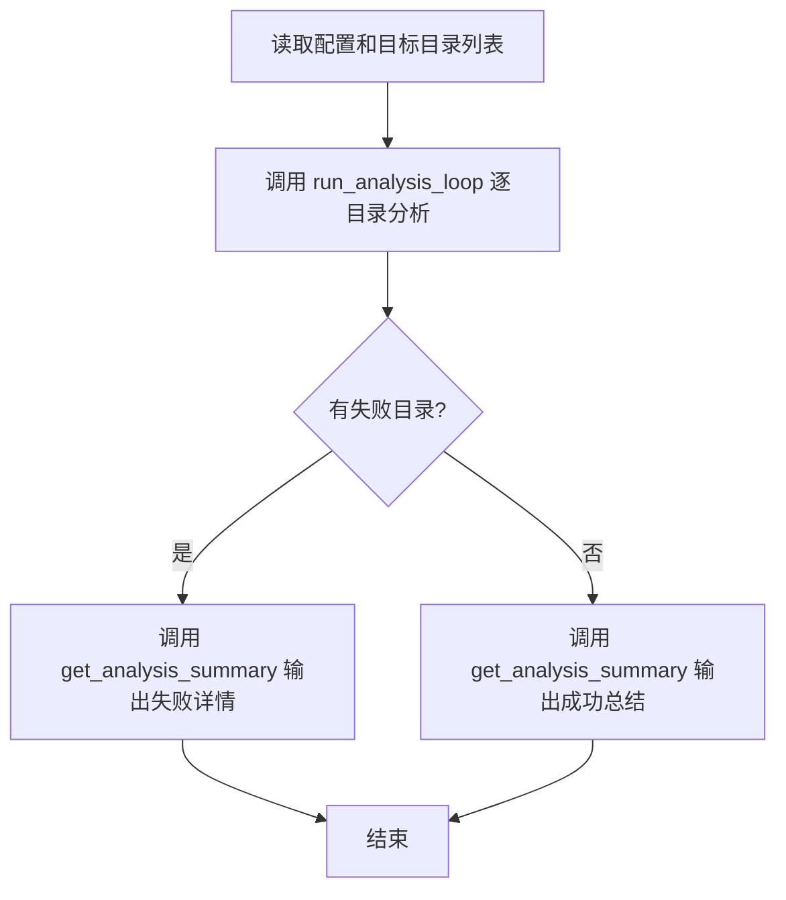

# AgentLoom Agent YAML 配置完整参考

> **文档定位**：本文档详细说明 Agent YAML 的**每一个**配置参数。
> 关于配置文件之间的覆盖关系，请参阅 [配置体系总览](config-overview.md)。
> 关于 `config/system.yaml`，请参阅 [系统配置文档](system_config.md)。
> 关于 `config/llm.yaml`，请参阅 [LLM 配置文档](llm_config.md)。

Agent YAML 是 AgentLoom 框架中**定义单个 Agent 行为**的配置文件，控制 Agent 的角色描述、工作流指令、可用工具、模型选择、执行环境、技能包等。Agent 分为 **Supervisor**（多 Agent 编排者）和 **Worker**（具体任务执行者）两种角色。

> ⚠️ **LLM 配置隔离**：Agent YAML 中的 `model`/`llm`/`langfuse` 会被自动过滤并输出 warning。LLM 参数只能在 `config/llm.yaml` 中定义，Agent 通过 `model_type` 字段选择使用哪个预定义模型类型。

---

## 目录

- [1. 两种 Agent 角色](#1-两种-agent-角色)
- [2. 快速参考：完整 YAML 模板](#2-快速参考完整-yaml-模板)
- [3. 字段参考手册](#3-字段参考手册)
  - [3.1 必填字段](#31-必填字段)
  - [3.2 可选通用字段](#32-可选通用字段)
  - [3.3 Supervisor 专属字段](#33-supervisor-专属字段)
  - [3.4 Worker 专属字段](#34-worker-专属字段)
  - [3.5 execution_env — 执行环境](#35-execution_env--执行环境)
  - [3.6 tool_call_type — 交互模式](#36-tool_call_type--交互模式)
  - [3.7 model_type — 模型选择](#37-model_type--模型选择)
  - [3.8 skills — 技能包配置](#38-skills--技能包配置)
  - [3.9 prompt — 自定义 Prompt](#39-prompt--自定义-prompt)
  - [3.10 planning_interval — 规划间隔](#310-planning_interval--规划间隔)
  - [3.11 concurrency — 并发度配置](#311-concurrency--并发度配置)
  - [3.12 mcp_servers — MCP 外部工具集成](#312-mcp_servers--mcp-外部工具集成)
- [4. 工具配置详解](#4-工具配置详解)
  - [4.4 高级模式：Agent 封装为 Python 工具函数](#44-高级模式agent-封装为-python-工具函数)
- [5. Worker 导出为可调用工具](#5-worker-导出为可调用工具)
- [6. worker_agents 路径解析规则](#6-worker_agents-路径解析规则)
- [7. 常见错误与排查](#7-常见错误与排查)
- [8. 完整实战示例](#8-完整实战示例)
- [9. 配置覆盖关系](#9-配置覆盖关系)
- [10. 错误恢复机制](#10-错误恢复机制)
- [附录：字段速查表](#附录字段速查表)

---

## 1. 两种 Agent 角色

| 角色 | 定位 | 文件位置 | 核心特征 |
|------|------|----------|----------|
| **Supervisor** | 多 Agent 协作的编排者 | `applications/<app>/workflows/<name>.yaml` | 有 `worker_agents` 字段，调度多个 Worker |
| **Worker** | 具体任务的执行者 | `applications/<app>/workflows/worker_agents/<name>.yaml` | 有 `agent_function_schema` 字段，可导出为工具被 Supervisor 调用 |

```
Supervisor (主 Agent)
  ├── 调用 Worker A（project_scan）
  ├── 调用 Worker B（data_analysis）
  └── 调用 Worker C（report_generation）
```

> **单 Agent 模式**：如果只需要一个 Agent 独立工作，直接写一个 Worker YAML 即可，不需要 Supervisor。

---

## 2. 快速参考：完整 YAML 模板

### 2.1 Supervisor 完整模板

```yaml
# ============================================================
# Supervisor Agent 配置模板
# 文件位置: applications/<app>/workflows/<agent_name>.yaml
# ============================================================

# ---- 必填字段 (3个) ----
name: "my_check_agent"
description: |
  作为代码检查监督智能体，你的核心职责是...
workflow: |
  # My Check Workflow
  ## 步骤
  1. 调用 get_module_context 获取上下文
  2. 调用 project_scan 进行准备
  3. 输出最终报告

# ---- 可选字段 ----
tools:
  - name: "get_module_context"
    module: "applications.my_app.agent_tools.module_context"
    function: "get_module_context"

model_type: "powerful"                   # 可选: "powerful", "fast", "summary", 或自定义 key
tool_call_type: "code_act"               # 可选: "code_act", "tool_call"

# ---- Supervisor 专属 ----
worker_agents:
  - path: "applications/my_app/workflows/worker_agents/project_scan.yaml"
  - path: "applications/my_app/workflows/worker_agents/data_analysis.yaml"

# ---- 其他可选字段 ----
execution_env:
  type: "local"                          # 可选: "local", "docker", "e2b", "wasm"

prompt:
  path: "applications/my_app/sysprompt/code_agent.yaml"

skills:
  - path: "applications/my_app/skills"
    platform: "Claude"                   # 可选: 指定 skill 适配的平台
```

### 2.2 Worker 完整模板

```yaml
# ============================================================
# Worker Agent 配置模板
# 文件位置: applications/<app>/workflows/worker_agents/<name>.yaml
# ============================================================

# ---- 必填字段 (3个) ----
name: "project_scan"
description: "项目结构扫描智能体"
workflow: |
  你是一个资深工程师，负责...
  ## 输出要求
  - A. 文件清单与角色归类
  - B. 依赖关系图

# ---- 可选字段 ----
tools:
  - name: "read_file"
  - name: "write_file"
  - name: "get_file_outline"
  - name: "get_module_context"
    module: "applications.my_app.agent_tools.module_context"
    function: "get_module_context"

model_type: "powerful"
tool_call_type: "code_act"
max_steps: 40                            # 最大执行步数 (默认: 80)
planning_interval: 3                     # 每 N 步强制规划

# ---- Worker 专属: 可调用工具契约 ----
# 注意：inputs 下的参数名可自定义，只要是合法 Python 标识符即可
agent_function_schema:
  description: |
    准备阶段分析智能体，负责静态代码扫描...
  inputs:
    param1:                              # 参数名自定义，合法 Python 标识符即可
      description: "第一个参数的描述"
      required: true
    param2:
      description: "第二个参数的描述"
      required: false
  output:
    description: "分析摘要文本，详细报告生成在 workspace 中"

execution_env:
  type: "local"
```

---

## 3. 字段参考手册

### 3.1 必填字段

Supervisor 和 Worker 共有 3 个必填字段：

| 字段 | 类型 | 校验规则 | 说明 |
|------|------|----------|------|
| `name` | `str` | 非空字符串 | Agent 唯一标识符。Worker 中同时作为导出工具的函数名 |
| `description` | `str` | 非空字符串 | Agent 角色描述。Supervisor 的单字符串 workflow 会参与任务拼装；列表 workflow 项按用户编写内容直接执行 |
| `workflow` | `str` 或 `list[str]` | 非空字符串，或非空且每项为非空字符串的列表 | 工作流指令文本。支持 Markdown 和 Mermaid 流程图。详见下方 [书写规范](#workflow-书写规范与建议) |

#### `description` 与 `workflow` 的分工

| 字段 | 职责 | 写什么 | 不写什么 |
|------|------|--------|----------|
| `description` | **角色定位**（一两句话） | "作为 XX 智能体，你的核心职责是 YY" | 不写详细流程、不写具体步骤 |
| `workflow` | **完整执行指令** | 背景、职责、流程图、各阶段说明、输出要求 | 不重复 description 已说的角色定位 |

> `workflow: |` 保持原有单次运行行为，框架只调用一次 runtime Agent。对于顶层 Supervisor 执行（`loom run` / `run_app`），`workflow: list[str]` 会按列表顺序执行多个工作流项，复用同一个 runtime Agent；第一次运行使用默认 reset 行为，后续运行使用 `reset=False` 保留前一次记忆，最终返回最后一次运行结果。AgentLoom 不会为列表项额外添加阶段标签或包装指令。Worker 导出为工具时，列表项会按顺序嵌入该次工具调用的 task spec 中。

顺序工作流示例：

```yaml
workflow:
  - |
    # 第一段工作流
    完成初始分析，并保留下一段需要使用的发现。
  - |
    # 第二段工作流
    基于上一轮记忆继续执行，并输出最终结果。
```

#### Workflow 书写规范与建议

`workflow` 是 Agent 最核心的配置——它本质上是发送给 LLM 的**任务指令（Prompt）**。一个结构清晰的 workflow 能显著提升 Agent 的执行质量。

**推荐结构（五段式）**：

```
① 背景与角色        ← 建立专业上下文
② 核心职责与约束    ← 明确必须做什么、禁止做什么
③ 执行流程（Mermaid）← 定义步骤和分支（框架特殊封装）
④ 各步骤详细说明    ← 展开每个流程节点
⑤ 输出要求          ← 约束最终交付物格式
```

**① 背景与角色**

在 workflow 开头建立专业上下文，让 LLM "进入角色"。角色越具体，输出的专业性越强。

**示例**：

```markdown
你是一个**资深代码仓库架构分析工程师**，擅长代码结构梳理、模块依赖分析和架构文档生成。
当前任务是对目标代码仓库进行**逐目录架构分析**，生成可读的架构说明文档。
```

> **要点**：说明专业背景、当前任务目标、分析对象是什么。
> 参考 Anthropic 最佳实践："Give Claude a role — Even a single sentence makes a difference."

**② 核心职责与约束**

用**编号列表**明确 Agent 必须履行的职责和禁止行为。越具体越好——不要期望 LLM 自己推断你的意图。

**示例**：

```markdown
### 核心职责（必须履行）
1. **逐目录分析**：对每个目标目录调用分析工具，生成架构说明
2. **断点续传**：已完成的目录跳过，只处理未完成或失败的目录
3. **结果汇总**：分析完成后输出总结报告（成功/失败统计 + 交付物路径）

### 约束（禁止行为）
- ❌ 禁止跳过失败目录不报告
- ❌ 禁止修改源代码文件
- ✅ 所有分析结论必须基于实际代码内容，不得臆测
```

> **要点**：用编号列表保证步骤完整性；对关键规则用**加粗**突出；约束条件说"做什么"比"不做什么"更有效（如"必须先调用 X"优于"不要忘记调用 X"）。

**③ 执行流程（Mermaid 流程图）**

用 Mermaid 定义核心执行流程。

> ⚠️ **框架特殊处理**：框架会自动检测 workflow 中的 ` ```mermaid ` 代码块，将其提取并用 `<workflow>` XML 标签封装。**当存在 Mermaid 块时，框架会额外向 LLM 注入 "must be followed strictly"（必须严格遵守）指令**。因此，将核心流程放在 Mermaid 块内不仅提升可读性，还能让框架帮你强化流程约束。

**示例**：

````markdown

````

> **要点**：
> - 流程图只画**主干流程和关键分支**，不要把每个细节都塞进去
> - 节点命名要清晰，使用 `[中文描述]` 而非编码缩写
> - 分支判断用 `{条件?}`，如 `C{有失败项?} -- 是 --> D[重试]`
> - Mermaid 语法会被框架校验（依赖 `mermaid-syntax-parser`），语法错误会在运行时输出 warning

**④ 各步骤详细说明**

对 Mermaid 流程图中的每个关键节点展开说明。推荐使用统一的子结构：

**示例**：

```markdown
### 步骤1：逐目录架构分析

**目标**：对所有目标目录完成 LLM 架构分析。

**输入**：
- 环境变量 `REPO_MAP_OUTPUT_DIR` 指定的输出目录

**执行动作**：
1. 调用 `run_analysis_loop` 工具
2. 工具内部按 rank 优先级逐目录调用子 Agent
3. 已完成的目录自动跳过（断点续传）

**成功标准**：
- 所有目录分析完成，或失败目录已记录到 progress 文件

**失败处理**：
- 单个目录失败 → 记录错误，继续下一个目录
- 工具抛出异常 → 立即停止并报告错误
```

> **要点**：每个步骤都应有明确的**成功标准**和**失败处理**，避免 LLM 在遇到异常时自行发挥。

**⑤ 输出要求**

明确最终交付物的格式、必含内容和禁止项。

**示例**：

```markdown
## 输出要求
- 输出格式：Markdown 总结报告
- 必须包含：已完成目录数、失败目录数、交付物路径
- 失败目录须列出失败原因
- 禁止省略任何失败信息
```

> **要点**：如果对输出格式有具体要求（如 JSON、Markdown 表格、特定章节结构），在此处明确约束。

#### 综合模板

````yaml
workflow: |
  # [任务名称]

  ## 背景
  你是一个**[专业角色]**。当前任务是 [一句话说明任务目标]。

  ## 核心职责
  1. **[职责1]**：[具体说明]
  2. **[职责2]**：[具体说明]
  3. **[职责3]**：[具体说明]

  ## 约束
  - ❌ [禁止行为1]
  - ❌ [禁止行为2]
  - ✅ [推荐做法]

  ## 执行流程

  ```mermaid
  flowchart TD
    A[步骤1: 获取输入] --> B[步骤2: 核心处理]
    B --> C{是否全部成功?}
    C -- 是 --> D[步骤3: 输出成功报告]
    C -- 否 --> E[步骤3: 输出失败详情]
    D --> F[结束]
    E --> F
  ```

  ## 各步骤说明

  ### 步骤1：[名称]
  **目标**：...
  **执行动作**：
  1. ...
  **成功标准**：...
  **失败处理**：...

  ### 步骤2：[名称]
  ...

  ## 输出要求
  - 输出格式：[格式]
  - 必须包含：[内容项]
  - 禁止：[禁止项]
````

#### 书写注意事项

- **YAML 格式**：单个工作流使用 `workflow: |` 保留换行和缩进；顺序工作流使用非空 `workflow:` 列表，每一项建议用 `|` 多行文本块。
- **避免硬编码路径**：不要在 workflow 中写死文件路径，应通过工具（如 `get_module_context`）动态获取
- **关键规则加粗**：对 LLM 必须遵守的规则使用 `**加粗**` 突出
- **编号保证顺序**：多步骤流程使用编号列表（`1. 2. 3.`），不要用无序列表
- **推断须标注**：要求 LLM 对不确定的内容标注【推断】，避免幻觉混入结论
- **Mermaid 语法**：确保 Mermaid 语法正确，框架会校验并在错误时输出 warning

---

### 3.2 可选通用字段

| 字段 | 类型 | 默认值 | 说明 |
|------|------|--------|------|
| `tools` | `list[dict]` | `[]` | 工具列表。详见 [第 4 节](#4-工具配置详解) |
| `model_type` | `str` | 已配置的全局 `default_model_type` | 模型选择。详见 [3.7](#37-model_type--模型选择) |
| `tool_call_type` | `str` | `"code_act"` | Agent 交互模式。详见 [3.6](#36-tool_call_type--交互模式) |
| `execution_env` | `dict` | `{type: "local"}` | 执行环境配置。详见 [3.5](#35-execution_env--执行环境) |
| `prompt` | `str` 或 `dict` | 框架内置 | 自定义 System Prompt 模板。详见 [3.9](#39-prompt--自定义-prompt) |
| `planning_interval` | `int` | 不设置 | 每 N 步强制规划。详见 [3.10](#310-planning_interval--规划间隔) |
| `concurrency` | `int`/`str` | 不设置 | 并发度：此 Agent 被批量调用时的最大并发数。详见 [3.11](#311-concurrency--并发度配置) |
| `skills` | `list`/`dict`/`str` | 不设置 | 私有技能包配置。详见 [3.8](#38-skills--技能包配置) |
| `max_steps` | `int` | `80` | 最大执行步数。超过后 Agent 强制终止 |

---

### 3.3 Supervisor 专属字段

| 字段 | 类型 | 默认值 | 说明 |
|------|------|--------|------|
| `worker_agents` | `list[dict]` | `[]` | Worker Agent 路径列表。每项必须有 `path` 字段，**禁止使用 `name` 字段**。详见 [第 6 节](#6-worker_agents-路径解析规则) |

---

### 3.4 Worker 专属字段

| 字段 | 类型 | 默认值 | 说明 |
|------|------|--------|------|
| `agent_function_schema` | `dict` | 不设置 | Worker 可调用工具契约。存在且合法时 Worker 被导出为工具。详见 [第 5 节](#5-worker-导出为可调用工具) |

> ⚠️ **Worker 配置隔离**：Worker 的最终生效配置来自全局 / 应用配置叠加，再加上 **Worker 自己的 YAML**。它**不会**继承调用它的 Supervisor 的运行时覆盖项。如果 Worker 需要额外的文件系统或 Shell 权限，必须在 Worker YAML 中重复声明相应的白名单覆盖（例如 `tool_access_control.path_validation`）。

---

### 3.5 `execution_env` — 执行环境

| 子字段 | 类型 | 默认值 | 必填 | 可选值 | 说明 |
|--------|------|--------|------|--------|------|
| `type` | `str` | `"local"` | ❌ | `"local"` / `"docker"` / `"e2b"` / `"wasm"` | 执行器类型（自动转小写）。`"host"` 已移除 |
| `executor_kwargs` | `dict` | `{}` | ❌ | 自由键值对 | 执行器参数，原样透传 |

**`type` 各选项说明**：

| 值 | 说明 | 默认工具加载 |
|----|------|------------|
| `"local"` | 本地执行，调用本机 Shell 和文件系统 | ✅ 加载 |
| `"docker"` | Docker 容器执行 | ❌ 不加载 |
| `"e2b"` | E2B 云端沙箱执行 | ❌ 不加载 |
| `"wasm"` | WebAssembly 沙箱执行 | ❌ 不加载 |

**校验规则**：`type` 必须是非空字符串且为上述 4 个值之一；`executor_kwargs` 必须是字典。Shell 路径自动从 `$SHELL` 环境变量检测。

**示例**：

```yaml
# 本地执行
execution_env:
  type: "local"

# Docker 远程执行
execution_env:
  type: "docker"
  executor_kwargs:
    host: "127.0.0.1"
    port: 8888
    image_name: "my-jupyter-kernel:local"
```

> 此字段可在 Agent YAML 中覆盖系统配置（属于 [overlay 白名单](#92-可覆盖字段白名单)）。

> ⚠️ **模式限制**：`execution_env` 仅在 `code_act` 模式下生效。在 `tool_call` 模式下，`executor_type` 和 `executor_kwargs` 会被静默忽略（`ToolCallingAgentV2` 不执行代码，因此执行环境配置不适用）。

---

### 3.6 `tool_call_type` — 交互模式

| 可选值 | Agent 类型 | 调用方式 | 灵活性 | 推荐场景 |
|--------|-----------|----------|--------|----------|
| `"tool_call"` | `ToolCallingAgentV2` | 结构化 tool_call 消息 | 规范（每步调用一个工具，步骤清晰可追踪） | **Supervisor 推荐**、规范流程 Worker |
| `"code_act"` | `CodeAgentV2` | 写 Python 代码调用工具 | 高（循环、条件、多步编排） | 需要写代码的 Worker、灵活度高的任务 |

**默认值**：`"code_act"`
**校验**：只允许 `"code_act"` 或 `"tool_call"`，其他值报错。

#### 如何选择？

| 场景 | 推荐模式 | 原因 |
|------|---------|------|
| **Supervisor 编排多个 Worker** | **`tool_call`** ✅ | 每步调用哪个 Worker、传了什么参数、返回了什么结果都是结构化记录，方便监控和审计每个 Worker 的执行情况 |
| **规范流程 / 固定流水线** | **`tool_call`** ✅ | 结构化输出，可预测，易追踪，步骤清晰 |
| **写代码 / 灵活度高的任务** | **`code_act`** ✅ | 需要循环、条件判断、异常处理、数据转换等 Python 编程能力 |
| **开放性探索任务** | **`code_act`** ✅ | 不确定需要多少步，需要动态决策和复杂控制流 |

> **核心原则**：`tool_call` 适合**规范度高**的场景（编排调度、固定流程），步骤清晰可追踪，对每个工具的执行情况一目了然；`code_act` 适合**灵活度高**的场景（写代码、复杂逻辑），能发挥 Python 的编程表达能力。

> 💡 **模式相关参数**：以下配置仅在 `code_act` 模式下生效，在 `tool_call` 模式下会被静默忽略：
>
> | 参数 | 原因 |
> |------|------|
> | `execution_env`（`executor_type` / `executor_kwargs`） | `tool_call` 模式不执行代码，无需执行环境 |
> | `code_agent.additional_authorized_imports` | import 白名单仅适用于代码执行 |
> | `code_agent.additional_functions` | 内置函数白名单仅适用于代码执行 |

---

### 3.7 `model_type` — 模型选择

Agent YAML 不能直接修改 LLM 参数，但可以通过 `model_type` **选择**使用 `config/llm.yaml` 中定义的哪个模型类型。

| 预定义类型 | 适用场景 | 说明 |
|-----------|----------|------|
| `"powerful"` | Supervisor 编排、复杂推理、代码生成 | 强模型，成本高 |
| `"fast"` | 简单分类、路由、轻量 Worker | 快速响应，成本低 |
| `"summary"` | 文本摘要、信息提取 | 中等能力 |

也支持 `llm.yaml` 中自定义的任意类型名（如 `"code_review"`）。

**解析逻辑**：
1. Agent YAML 指定了 `model_type` → 使用该值，如果该类型不存在，**直接报错 (`ValueError`)，不会静默回退**。
2. 未指定 → 使用全局 `config/llm.yaml` 的 `model.default_model_type`。如果 `default_model_type` 未配置，或最终解析出的类型不存在，**同样直接报错**。

---

### 3.8 `skills` — 技能包配置

Agent YAML 中的 `skills` 用于声明当前 Agent 的私有技能包。**不走 overlay 白名单**，通过独立的三层叠加机制加载。

#### 三层加载顺序

```
第 1 层: config/system.yaml 全局 skills      ← C.get("skills")
第 2 层: AGENT_ROOT/skills/ 目录自动发现      ← load_skills_from_directory()
第 3 层: Agent YAML 中的 skills 字段          ← 直接从原始 YAML dict 读取
```

三层是**叠加**关系，不是覆盖。同名 skill 后加载的会覆盖先加载的（输出 warning）。
其中 `AGENT_ROOT` 指包含 `config/system.yaml` 的项目根目录（`C.agent_root`），不是当前 Agent YAML 文件目录。

#### 禁用全局 Skills（opt-out）

在 app 级别的 `config/system.yaml` 中将 `skills` 设置为空列表，可以**完全禁用**第 1 层和第 2 层的 Skills 加载（全局条目 + 目录自动发现均跳过），仅保留第 3 层 Agent 私有 Skills：

```yaml
# applications/<app>/config/system.yaml
skills: []   # 显式 opt-out：跳过所有全局 skills，包括 AGENT_ROOT/skills/ 目录
```

| `skills` 值 | 行为 |
|---|---|
| 未配置 / `null` | 不加载全局条目，但仍自动发现 `AGENT_ROOT/skills/` 目录 |
| `[]`（空列表） | **完全禁用**：全局条目和目录自动发现均跳过 |
| `[entries...]` | 加载指定条目，同时自动发现 `AGENT_ROOT/skills/` 目录 |

#### 支持的三种格式

**格式 1：列表格式（推荐）**

```yaml
skills:
  - path: "skills/agent-recall-with-files"
    load-mode: "eager"
  - path: "skills/agent-visualization"
  - "skills/another-skill"              # 纯字符串也可以作为列表项
```

**格式 1b：通过 `items` 设置共享策略**

```yaml
skills:
  load-mode: "on-demand"
  allow-scripts: false
  allow-network: false
  items:
    - "skills/safe-review"
    - path: "skills/strict-review"
      load-mode: "eager"
```

**格式 2：字典格式（单个 skill）**

```yaml
skills:
  path: "skills/agent-recall-with-files"
  platform: "Claude"
```

**格式 3：字符串格式（最简写法）**

```yaml
skills: "skills/agent-recall-with-files"
```

> 字典和字符串格式会自动转为单元素列表处理。

#### 列表项子字段

| 子字段 | 类型 | 默认值 | 必填 | 说明 |
|--------|------|--------|------|------|
| `path` | `str` | — | ✅ 必填 | Skill 包路径。相对路径基于 `AGENT_ROOT` 解析。运行时只加载名为 `SKILL.md` / `skill.md` 的包入口（大小写不敏感），不加载散落 Markdown 或 `skills.md` |
| `platform` | `str` | `null` | ❌ 可选 | 指定 skill 适配的平台（如 `"Claude"`），用于 `tools_mapping` |
| `load-mode` | `str` | `on-demand` | ❌ 可选 | `on-demand` 只在 prompt 放 catalogue；`eager` 注入完整 skill 正文 |
| `allow-scripts` | `bool` | `true` | ❌ 可选 | 设为 `false` 时阻断该 skill 的 `run_skill_script` |
| `allow-network` | `bool` | `true` | ❌ 可选 | 设为 `false` 时阻断 `run_skill_script` 中常见网络命令 |

**校验**：`skills` 整体必须是 `list`、`dict` 或 `str`，否则报错 `skills must be a list, dict, or string path`。

---

### 3.9 `prompt` — 自定义 Prompt

用于覆盖框架内置的 System Prompt 模板。

#### 两种写法

```yaml
# 写法 1：直接字符串路径
prompt: "applications/my_app/sysprompt/code_agent.yaml"

# 写法 2：字典形式（必须包含 path 键）
prompt:
  path: "applications/my_app/sysprompt/code_agent.yaml"
```

#### 路径解析规则

- **相对路径**：基于 `AGENT_ROOT`（包含 `config/system.yaml` 的项目根目录）解析
- **绝对路径**：直接使用

#### Prompt 解析优先级（从高到低）

| 优先级 | 来源 | 说明 |
|--------|------|------|
| 1 | 函数参数 `prompt_template_path` | 代码中显式传入 |
| 2 | Agent YAML `prompt` 字段 | 当前文档配置 |
| 3 | 模型家族变体 | `<prompts_dir>/<family>/toolcalling_agent.yaml`（用户从 `.example.yaml` 去掉后缀激活） |
| 4 | 本地覆盖 | `<prompts_dir>/structured_code_agent.yaml` 或 `toolcalling_agent.yaml`（用户从 `.example.yaml` 去掉后缀激活） |
| 5 | smolagents 内置默认 | smolagents 包自带的内置 prompt（无需任何文件） |

> **自定义方式**：所有 `.example.yaml` 文件（包括 `anthropic/`、`openai/`、`gemini/` 目录下的）均为参考模板。要激活自定义 prompt，只需去掉 `.example` 后缀即可：
> ```bash
> # 激活全局自定义 prompt（code_act 模式）
> mv structured_code_agent.example.yaml structured_code_agent.yaml
>
> # 激活 anthropic 模型家族变体
> mv anthropic/toolcalling_agent.example.yaml anthropic/toolcalling_agent.yaml
> ```
> 要恢复默认，重新加回 `.example` 后缀即可。

**校验**：字典形式时必须包含 `path` key，否则报错 `must include 'path' when prompt is a mapping`。prompt 文件必须是合法 YAML mapping。

> 此字段可在 Agent YAML 中覆盖系统配置（属于 [overlay 白名单](#92-可覆盖字段白名单)）。

---

### 3.10 `planning_interval` — 规划间隔

设置后，Agent 每执行 N 步会强制进行一次规划（planning step）。

**类型**：`int`（正整数）
**默认值**：不设置（不启用定期规划）

**校验规则**：

| 输入值 | 解析结果 | 说明 |
|--------|---------|------|
| `3` | `3` | 正常正整数 |
| `"3"` | `3` | 支持字符串整数自动转换 |
| `0` / `-1` | 不设置 | 零和负数等同不设置 |
| `null` / 省略 | 不设置 | 不启用 |
| `true` / `false` | 不设置 | bool 类型被忽略（`true` 不会变成 `1`） |
| `""` / `"abc"` | 不设置 | 空字符串或非数字字符串被忽略 |

**示例**：

```yaml
planning_interval: 3    # 每 3 步强制规划一次
```

**自动注入 `todo_write` 工具**：

配置 `planning_interval` 后，框架自动注入 `todo_write` 工具（无需在 `tools` 列表中手动声明）。LLM 在每次 planning step 中会看到当前任务列表状态，并被要求通过 `todo_write` 及时更新任务进度。

**Planning Prompt 设计理念**（参考 Claude Code）：

- **直奔主题**：planning step 要求 LLM 输出简短的编号步骤列表，不再要求冗长的 Facts Survey
- **条件触发 todo**：仅当任务包含 3+ 个独立步骤时才注册 todo 列表，简单任务跳过
- **及时更新**：每完成一项任务立即标记为 `completed`，不批量更新
- **单一焦点**：始终保持恰好 ONE 个任务处于 `in_progress` 状态
- **Replan 聚焦进度**：后续 planning step 仅回顾 todo 状态并输出剩余步骤，不重复已完成内容
- **结束回顾**：Agent 调用 `final_answer` 后，如果仍有未完成的 todo 项，框架会自动触发一次最终 planning step 让 LLM 回顾任务完成情况（最多触发一次，不会循环）

`todo_write` 工具行为：
- **输入**：JSON 数组，每项包含 `content`（任务描述）和 `status`（`pending` / `in_progress` / `completed`）
- **语义**：全量替换（每次调用替换整个列表）
- **自动清除**：全部标记为 `completed` 时自动清空列表
- **持久化**：写入 `.agentloom/workspaces/agents/<application_id>/<agent_path>/tasks/<task_id>/todos.md`（Markdown checkbox 格式）
- **验证提醒**：3+ 任务全部完成且无验证步骤时，返回值首行提醒 LLM 考虑执行验证

---

### 3.11 `concurrency` — 并发度配置

控制此 Agent 被批量调用时的最大并发数。通常用于 Worker Agent —— 当应用层需要对多个输入（如多个目录、多个文件）批量调用同一个 Worker 时，该字段决定同时运行几个 Agent 实例。

**类型**：`int`（正整数）或 `str`（`"auto"`）
**默认值**：不设置（等同 `"auto"`）

**可选值**：

| 值 | 含义 |
|------|------|
| `auto` | 自动计算：`min(RPM, 10)`，实际请求节奏由 rate limiter（`interval = 60/RPM`）控制 |
| `1` | 显式串行，一次只运行一个 |
| `N`（正整数） | 固定并发度，同时最多运行 N 个实例 |
| 不设置 / `null` | 等同 `auto` |

> `auto` 模式从 `config/llm.yaml` 中对应 `model_type` 的 `requests_per_minute` 读取 RPM。线程数 = `min(RPM, 10)`，rate limiter 以 `60/RPM` 秒为间隔控制实际请求速率。

**线程安全说明**：框架为每次并发调用创建**独立的 Agent 实例**（共享 Model 和 Config，但 Agent 的 `memory`、`state` 等有状态属性完全隔离）。这借鉴了 Cline `new SubagentRunner()` 和 LangGraph `Send()` 的设计模式。

**示例**：

```yaml
# Worker Agent: 目录架构分析（支持并发批量调用）
name: "dir_architecture_analysis"
model_type: "powerful"
concurrency: auto          # 自动计算并发度

workflow: |
  ...
```

```yaml
# Worker Agent: 固定 6 并发
name: "file_processor"
model_type: "fast"
concurrency: 6
```

**应用层使用方式 — `tool.batch()`**：

配置了 `concurrency` 的 Worker Agent 被 `create_agent_as_tool()` 加载后，返回的 tool 函数自带 `.batch()` 方法，应用层一行代码即可并行执行：

```python
# 加载 Worker Agent 为 tool（返回单个 Callable，内置缓存）
tool = YamlAgentFactory.create_agent_as_tool("worker.yaml")

# 构造任务列表
tasks = [
    {"dir_path": "src/api", "index_content": "..."},
    {"dir_path": "src/utils", "index_content": "..."},
    {"dir_path": "src/core", "index_content": "..."},
]

# 一行并行执行 — 自动读取 YAML 中的 concurrency
results = tool.batch(tasks)

# 也可覆盖 YAML 配置
results = tool.batch(tasks, concurrency=3)

# 带进度回调
results = tool.batch(tasks, on_progress=lambda done, total, r: print(f"{done}/{total}"))
```

**优先级链**：`tool.batch(concurrency=N)` 参数 > YAML `concurrency` 字段 > `auto`

> ⚠️ **适用场景**：`concurrency` 适用于「同一个 Worker 被多次调用处理不同输入」的批量场景（如分析 100 个目录、处理 50 个文件）。对于 Supervisor 自身的执行不产生影响。

### 3.12 `mcp_servers` — MCP 外部工具集成

指向 `.mcp.json` 文件，加载外部 MCP Server 提供的工具。详见 [MCP 配置文档](mcp_config.md)。

```yaml
# 单个文件
mcp_servers: "config/.mcp.json"

# 多个文件
mcp_servers:
  - "config/.mcp.json"
  - "config/extra-mcp.json"

# 带选项
mcp_servers:
  path: "config/.mcp.json"
  timeout: 30
  tool_name_prefix: true
```

**路径解析**：相对路径从 `agent_root`（项目根目录）解析，与 `prompt.path` 规则一致。

**与全局配置的合并**：Agent YAML 中的 `mcp_servers` 会与 `config/system.yaml` 中的全局 `mcp_servers` 合并。同名 Server 以 Agent 级别为准。

---

## 4. 工具配置详解

### 4.1 两种工具类型

#### 预定义工具（只需 `name`）

```yaml
tools:
  - name: "read_file"
  - name: "shell_tool"
```

#### 固定工具参数

当 Agent YAML 需要锁定某些工具参数时，使用 `fixed_args`。这些参数由框架绑定，
会从 LLM 可见的 tool schema 中移除，LLM 的 tool call 不能覆盖这些值。

```yaml
tools:
  - name: "codex"
    fixed_args:
      cwd: "."
      sandbox: "workspace-write"
      search: "false"
```

#### 预定义工具 + 元数据覆盖

Agent YAML 中可按需覆盖 `config/system.yaml` 中 `tool_metadata` 段定义的元数据：

```yaml
tools:
  - name: "grep_search"
    max_result_chars: 10000        # 覆盖默认的 20000
    disable_type_coercion: true    # 禁用此工具的参数类型自动强转
```

可覆盖的字段参见 [system_config.md §10 tool_metadata](system_config.md#10-tool_metadata--工具元数据配置)。

#### 动态加载工具（需 `name` + `module` + `function`）

```yaml
tools:
  - name: "get_module_context"
    module: "applications.my_app.agent_tools.module_context"
    function: "get_module_context"
```

> **重要提示**：动态加载工具的描述信息会自动从 Python 函数的 `__doc__` (Docstring) 提取。YAML 中的 `description` 字段如果配置了也会被框架忽略。请直接在 Python 函数中写好文档注释。

**校验规则**：`module` 和 `function` 必须成对出现，不能只写一个。

### 4.2 全部预定义工具列表

| 工具名 | 功能说明 |
|--------|----------|
| `read_file` | 读取文件内容（支持 offset/limit 分段读取） |
| `write_file` | 创建新文件或覆盖已有文件 |
| `edit_file` | 应用一个或多个唯一文本编辑 |
| `write_markdown_file` | 写入 Markdown 文件 |
| `write_markdown_file_raw` | 写入原始 Markdown 文件 |
| `append_markdown_sections` | 追加 Markdown 章节内容 |
| `get_file_outline` | 获取代码大纲（函数/类/结构体） |
| `list_directory` | 列出目录结构 |
| `grep_search` | 正则搜索文件内容（基于 ripgrep） |
| `glob_search` | Glob 模式搜索文件 |
| `ast_grep_search_file` | AST 模式搜索 |
| `lsp_find_definition` | 查找符号定义 |
| `lsp_find_references` | 查找符号引用 |
| `lsp_get_document_symbols` | 列出文档符号 |
| `lsp_hover` | 查看 hover/type 信息 |
| `lsp_get_workspace_symbols` | 搜索工作区符号 |
| `loom_retrieve_context` | 读取压缩上下文引用 |
| `shell_tool` | 执行 shell 命令（受白名单限制） |
| `load_skill` | 加载指定技能 |
| `list_skills` | 列出可用技能 |

### 4.3 工具加载优先级

1. **默认 toolsets**：`config/system.yaml` 中 `default_toolsets` 列表自动加载
2. **Agent 工具**：Agent YAML 中 `tools` 列表的工具
3. **去重规则**：同名工具后加载的覆盖先加载的

> 当 `execution_env.type` 为 `"docker"` 或 `"e2b"` 时，默认工具**不会自动加载**。

### 4.4 高级模式：Agent 封装为 Python 工具函数

当 Worker Agent 的调用需要**复杂的前置/后置处理**（如循环编排、断点续传、错误隔离、进度持久化）时，可以将 Agent 封装到一个普通的 Python 工具函数中，再通过 `module + function` 注册到 Supervisor 的 `tools` 字段。

这种模式的核心思路是：**Python 控制流 + Agent 智能**，让确定性的操作（读文件、写文件、循环、错误处理）在 Python 层完成，只把需要 LLM 推理的部分交给 Agent。

#### 4.4.1 何时使用此模式

| 场景 | 推荐方式 | 原因 |
|------|----------|------|
| 调用一次 Agent，直接返回结果 | `worker_agents` 自动注册 | 简单直接，YAML 声明即可 |
| 调用 Agent 前需读文件/准备上下文 | **Python 封装** | 确定性操作不应浪费 LLM token |
| 需要循环调用 Agent（批量处理） | **Python 封装** | Python for 循环比 LLM CodeAct 更可靠 |
| 需要断点续传 / 进度持久化 | **Python 封装** | 每次迭代立即写回进度文件，防崩溃 |
| 需要错误隔离（单项失败不中断） | **Python 封装** | try-except 精确捕获，继续处理下一项 |
| Agent 输出需要后处理（写文件、格式化、汇总） | **Python 封装** | 确定性操作在 Python 层完成 |

#### 4.4.2 三种 Agent-Tool 路径对比

| 对比维度 | Path A: `worker_agents` 自动注册 | Path B: 普通动态工具 (`module + function`) | Path C: Python 封装 Agent 工具 |
|----------|--------------------------------|------------------------------------------|-------------------------------|
| **注册方式** | Supervisor YAML 的 `worker_agents` 字段 | Supervisor YAML 的 `tools` 字段 (`module + function`) | 同 Path B（`tools` 字段 `module + function`） |
| **内部是否含 Agent** | ✅ 自动创建 Agent | ❌ 普通 Python 函数 | ✅ 函数内部调用 `create_agent_as_tool()` |
| **需要写 Python 代码** | ❌ 纯 YAML 声明 | ✅ 需要写工具函数 | ✅ 需要写封装函数 |
| **前后置处理** | ❌ 无 | ✅ 任意 Python 逻辑 | ✅ 任意 Python 逻辑 |
| **控制流能力** | ❌ 单次调用 | ✅ 循环、条件、重试 | ✅ 循环、条件、重试 |
| **错误隔离** | ❌ 失败即终止 | ✅ 自行实现 | ✅ try-except 逐项隔离 |
| **进度持久化** | ❌ 无 | ✅ 自行实现 | ✅ 每次迭代写回状态文件 |
| **适用场景** | 简单的"调用一次 Agent、返回结果" | 不涉及 Agent 的工具函数（读文件、调 API 等） | 批量处理、Pipeline 编排、断点续传 |
| **配置复杂度** | 低（只需 `path`） | 中（写函数 + YAML 注册） | 高（写封装函数 + Worker YAML + YAML 注册） |
| **参考文档** | [第 5 节](#5-worker-导出为可调用工具) | [4.1 动态加载工具](#41-两种工具类型) | 本节（4.4） |

> **Path B 与 Path C 的区别**：两者在 YAML 注册方式上完全相同（都用 `tools` 字段的 `module + function`），区别在于 **Path C 的 Python 函数内部通过 `YamlAgentFactory.create_agent_as_tool()` 加载并调用了 Agent**，而 Path B 是不含 Agent 的普通工具函数。

#### 4.4.3 核心 API：`YamlAgentFactory.create_agent_as_tool()`

```python
from src.lib.smolagents.agent.yaml_agent_factory import YamlAgentFactory

tools = YamlAgentFactory.create_agent_as_tool(
    config_path,        # str | Path | dict — Worker YAML 路径（相对于 AGENT_ROOT）或配置字典
    agent_class=None,   # 可选，自定义 Agent 类
    model=None,         # 可选，模型实例
    execution_env=None, # 可选，执行环境实例
    logger=None,        # 可选，AgentLogger 实例
)
# 返回: List[Callable] — 包含一个可调用函数，签名由 Worker 的 agent_function_schema 定义
```

**返回值说明**：
- 返回列表中的函数**像普通 Python 函数一样调用**，参数名和类型由 `agent_function_schema.inputs` 定义
- 返回值始终是**字符串**（`None` → `""`，其他值 → `str(result)`）
- Worker YAML **必须**包含合法的 `agent_function_schema`，否则返回空列表

#### 4.4.4 设计原则（四条最佳实践）

| 原则 | 说明 | 示例 |
|------|------|------|
| **① 懒加载单例** | Agent 工具只在首次调用时初始化，后续复用同一实例 | 全局变量 `_tool = None` + getter 函数 |
| **② 前后置分离** | 确定性操作（读文件、写文件、格式校验）在 Python 层完成，不浪费 LLM token | 读 index.md → Agent 分析 → 写 analysis.md |
| **③ 错误隔离不中断** | 每个子任务用 try-except 包裹，单项失败记录错误后继续处理下一项 | `entry["error_msg"] = str(e)` |
| **④ 立即持久化** | 每次迭代后立即写回进度文件，进程崩溃后可从断点恢复 | `_save_progress()` 在每次循环末尾调用 |

#### 4.4.5 通用模板：最小化封装（单次调用 + 前后置处理）

当只需在 Agent 调用前后做一些确定性处理时，使用此最简模板：

```python
# applications/<app>/agent_tools/my_agent_tool.py

from __future__ import annotations
from pathlib import Path

from src.lib.logging import get_logger
from src.lib.smolagents.agent.yaml_agent_factory import YamlAgentFactory

_AGENT_YAML = "applications/<app>/workflows/worker_agents/<worker>.yaml"


def analyze_with_context(file_path: str) -> str:
    """
    带前后置处理的 Agent 调用工具。

    前置：读取文件内容、校验格式
    Agent：LLM 分析
    后置：写入分析结果

    Args:
        file_path: 要分析的文件路径

    Returns:
        分析结果摘要
    """
    logger = get_logger(__name__)

    # create_agent_as_tool 内置缓存，同一 YAML 只创建一次
    tool = YamlAgentFactory.create_agent_as_tool(_AGENT_YAML)
    if tool is None:
        raise RuntimeError(f"Failed to create agent tool from {_AGENT_YAML}")

    # ── 前置处理（确定性，不消耗 LLM token）──
    source = Path(file_path)
    if not source.exists():
        return f"Error: file not found: {file_path}"
    content = source.read_text(encoding="utf-8")
    if not content.strip():
        return f"Error: file is empty: {file_path}"

    # ── 调用 Agent（LLM 推理）──
    logger.info(f"Analyzing {file_path}")
    result = tool(content=content)

    # ── 后置处理（确定性）──
    output_path = source.with_suffix(".analysis.md")
    output_path.write_text(str(result), encoding="utf-8")

    return f"Analysis saved to {output_path}"
```

#### 4.4.6 通用模板：批量处理 + 断点续传

当需要循环调用 Agent 处理多个子任务时，使用此完整模板：

```python
# applications/<app>/agent_tools/batch_agent_tool.py

from __future__ import annotations
import json
import traceback
from pathlib import Path

from src.lib.logging import get_logger
from src.lib.smolagents.agent.yaml_agent_factory import YamlAgentFactory

_AGENT_YAML = "applications/<app>/workflows/worker_agents/<worker>.yaml"

def _save_progress(path: Path, data: dict) -> None:
    """每次迭代后立即持久化（防崩溃）"""
    path.write_text(json.dumps(data, ensure_ascii=False, indent=2), encoding="utf-8")


def run_batch_analysis(progress_file: str, retry_failed: bool = False) -> str:
    """
    批量调用 Agent 分析多个子任务，支持断点续传和错误隔离。

    进度文件格式 (JSON):
    {
      "item_1": {"status": "pending", "input": "..."},
      "item_2": {"status": "completed", "output": "..."},
      "item_3": {"status": "failed", "error_msg": "..."},
    }

    Args:
        progress_file:  进度文件路径（JSON 格式）
        retry_failed:   是否重试之前失败的项目

    Returns:
        摘要字符串，含成功/失败/跳过数量
    """
    pf = Path(progress_file)
    if not pf.exists():
        raise FileNotFoundError(f"Progress file not found: {pf}")
    progress = json.loads(pf.read_text(encoding="utf-8"))

    # ── 断点续传：重置崩溃遗留的 in_progress ──
    for key, entry in progress.items():
        if entry["status"] == "in_progress":
            entry["status"] = "pending"
    # ── 可选：重试失败项 ──
    if retry_failed:
        for key, entry in progress.items():
            if entry["status"] == "failed":
                entry["status"] = "pending"
                entry.pop("error_msg", None)
    _save_progress(pf, progress)

    logger = get_logger(__name__)

    # create_agent_as_tool 内置缓存，同一 YAML 只创建一次
    tool = YamlAgentFactory.create_agent_as_tool(_AGENT_YAML)
    if tool is None:
        raise RuntimeError(f"Failed to create agent tool from {_AGENT_YAML}")

    stats = {"completed": 0, "failed": 0, "skipped": 0}

    for key, entry in progress.items():
        if entry["status"] in ("completed", "failed"):
            stats["skipped"] += 1
            continue

        # ── 前置处理 ──
        entry["status"] = "in_progress"
        _save_progress(pf, progress)          # 标记处理中（防崩溃）

        try:
            # ── 调用 Agent ──
            result = tool(query=entry["input"])

            # ── 后置处理 ──
            entry["status"] = "completed"
            entry["output"] = str(result)
            entry.pop("error_msg", None)
            stats["completed"] += 1

        except Exception as e:
            # ── 错误隔离：记录并继续 ──
            entry["status"] = "failed"
            entry["error_msg"] = str(e)
            entry["error_trace"] = traceback.format_exc()
            stats["failed"] += 1

        _save_progress(pf, progress)          # 每次迭代后立即写回

    return (
        f"Batch complete: {stats['completed']} completed, "
        f"{stats['failed']} failed, {stats['skipped']} skipped."
    )
```

#### 4.4.7 Supervisor YAML 注册

将封装好的 Python 函数注册到 Supervisor 的 `tools` 字段：

```yaml
# Supervisor YAML
name: "my_supervisor"
description: "编排多步骤分析流程"
workflow: |
  1. 调用 run_batch_analysis 批量分析所有子任务
  2. 根据返回的摘要判断是否需要重试

tools:
  # 封装了 Agent 的 Python 工具函数
  - name: "run_batch_analysis"
    module: "applications.<app>.agent_tools.batch_agent_tool"
    function: "run_batch_analysis"

  # 也可以同时注册其他普通工具
  - name: "read_file"
  - name: "list_directory"
```

> **工具描述自动提取**：框架会自动从 Python 函数的 `__doc__`（Docstring）提取工具描述。请确保在函数中写好文档注释，YAML 中的 `description` 字段会被忽略。

#### 4.4.8 完整实战：repo_map 架构分析 Pipeline

以下是 `applications/repo_map` 项目中的实际应用，展示了完整的 "Agent 封装为 Python 工具函数" 模式：

**架构总览**：

```
Supervisor (repo_map_agent)
  │
  ├── tools (Python 封装 Agent):
  │   ├── run_analysis_loop()     ← Python for 循环 + Agent 调用
  │   └── get_analysis_summary()  ← 纯 Python，读取进度文件
  │
  └── worker_agents:
      └── dir_architecture_analysis.yaml  ← 被 run_analysis_loop() 内部调用
```

**关键设计**：

1. **`dir_architecture_analysis`** 是一个标准 Worker Agent（有 `agent_function_schema`），但**不通过 `worker_agents` 自动注册给 Supervisor**
2. 而是由 **`run_analysis_loop()` 在 Python 层手动加载并循环调用**，每次传入不同目录的 `index.md` 内容
3. Python 层负责：读 index.md（前置）→ 调用 Agent（LLM 分析）→ 写 analysis.md（后置）→ 更新进度（持久化）
4. 单个目录分析失败不影响其他目录，失败信息记录到 `progress.json` 供后续检查或重试

**文件组织**：

```
applications/repo_map/
├── workflows/
│   ├── repo_map_agent.yaml                        # Supervisor
│   └── worker_agents/
│       └── dir_architecture_analysis.yaml         # Worker（被 Python 封装调用）
├── agent_tools/
│   └── pipeline_agent_tools.py                    # Python 封装函数
└── repo_map_app.py                                # 应用入口
```

> 💡 **核心理念**：`worker_agents` 中虽然声明了 `dir_architecture_analysis`，但 Supervisor 真正使用的是 `tools` 中的 `run_analysis_loop()`，后者在内部通过 `YamlAgentFactory.create_agent_as_tool()` 加载并循环调用该 Worker Agent。这样实现了 **Python 控制流的可靠性** 和 **LLM Agent 的智能推理** 的最佳组合。

---

## 5. Worker 导出为可调用工具

> 💡 如果你的 Worker Agent 需要**前后置处理**（读写文件、循环、错误隔离等），请参阅 [4.4 高级模式：Agent 封装为 Python 工具函数](#44-高级模式agent-封装为-python-工具函数)。本节介绍的是**最简单的方式**——Worker 通过 `agent_function_schema` 自动导出为工具，无需额外 Python 代码。

### 5.1 核心机制

当 Worker YAML 包含合法的 `agent_function_schema` 时，框架自动将该 Worker 导出为可调用工具，Supervisor 通过函数名（即 Worker 的 `name`）直接调用它。这是最简单的 Agent-Tool 路径，适合不需要额外前后置处理的场景。

```
Supervisor → 调用 project_scan(query="检查 CAN 模块") → Worker 执行 → 返回字符串结果
```

### 5.2 `agent_function_schema` 完整结构

> 参数名可自定义，只要是合法 Python 标识符即可（如 `query`、`file_path`、`module_name` 等）。

```yaml
agent_function_schema:
  description: |                     # ✅ 必填：工具描述
    准备阶段分析智能体...
  inputs:                            # ✅ 必填：参数定义字典（至少 1 个参数）
    param1:                          # 参数名自定义，合法 Python 标识符即可
      description: |                 # ✅ 必填：参数描述
        第一个参数的描述
      required: true                 # ❌ 可选：是否必填（默认 true）
    param2:                          # 可选参数
      description: "第二个参数的描述"
      required: false
  output:                            # ✅ 必填：输出定义
    description: |                   # ✅ 必填：输出描述
      返回分析摘要文本
```

### 5.3 校验规则

| 校验项 | 规则 | 报错示例 |
|--------|------|----------|
| `description` | 非空字符串 | `agent_function_schema.description must be a non-empty string` |
| `inputs` | 非空字典 | `agent_function_schema.inputs must be a non-empty dictionary` |
| `inputs.<name>` 键 | 合法 Python 标识符（`isidentifier()`） | `inputs key 'xxx' must be a valid identifier` |
| `inputs.<name>.description` | 非空字符串 | `inputs.xxx.description must be a non-empty string` |
| `inputs.<name>.required` | 布尔值（可省略，默认 true） | `inputs.xxx.required must be a boolean` |
| `inputs.<name>.type` | YAML 中可省略，运行时归一化为 `"string"` | — |
| `output` | 必须是字典 | `output must be a dictionary` |
| `output.description` | 非空字符串 | `output.description must be a non-empty string` |

> ⚠️ **参数类型约束（重要）**：定义 `inputs` 参数时，**严禁使用 `Optional[...]`、`Union[...]` 等不明确的类型注解**。
>
> | 约束 | 说明 |
> |------|------|
> | **禁止 `Optional[...]`** | 框架层会对此类不明确类型抛出异常 |
> | **禁止 `Union[...]`** | 同上，不明确的形参会让 Agent 不知道传什么参数，影响 AI 的判断性 |
> | **正确表示可选** | 使用 `required: false` 字段来表示参数是可选的 |
> | **类型归一化** | 所有参数在运行时统一归一化为 `"string"` 类型 |
>
> ```yaml
> # ✅ 正确：用 required 字段表示可选
> inputs:
>   target_path:
>     description: "分析目标路径"
>     required: true
>   mode:
>     description: "执行模式，默认为 standard"
>     required: false           # 用 required: false 表示可选，不要用 Optional
>
> # ❌ 错误：不要在参数中使用不明确的类型
> # type: "Optional[str]"     → 框架会抛出异常
> # type: "Union[str, int]"   → 框架会抛出异常
> ```

### 5.4 返回值行为

- 返回值**始终是字符串**：`None` → `""`，其他值 → `str(result)`

---

## 6. worker_agents 路径解析规则

### 6.1 目录结构约束（强制）

Agent YAML 文件**必须**按以下目录结构放置，框架会校验目录是否存在：

```
applications/{app_name}/
└── workflows/                          ← Supervisor YAML 必须放在这里
    ├── {app_name}_agent.yaml
    └── worker_agents/                  ← Worker YAML 必须放在这里
        ├── worker_a.yaml
        ├── worker_b.yaml
        └── analysis/                   ← 允许创建子目录（无命名限制）
            └── deep_scan.yaml
```

- **Supervisor YAML** 必须位于 `applications/{app_name}/workflows/` 目录下
- **Worker YAML** 必须位于 `applications/{app_name}/workflows/worker_agents/` 目录下
- `worker_agents/` 下**允许创建子目录**，子目录名称无限制，但子目录中的 Worker **不能用简写文件名**，必须使用完整相对路径引用
- 框架通过 Supervisor YAML 的路径自动推断 `{app_name}`（category），然后定位对应的 `worker_agents/` 目录
- 如果 `workflows/` 或 `worker_agents/` 目录不存在，加载时会直接报错

### 6.2 三种路径形式

| 形式 | 判断条件 | 解析方式 | 示例 |
|------|----------|----------|------|
| **绝对路径** | 以 `/` 开头 | 直接使用 | `/home/user/project/worker.yaml` |
| **相对路径** | 包含 `/` 或 `\` | 基于 `AGENT_ROOT` 拼接 | `applications/my_app/workflows/worker_agents/step0.yaml` |
| **简写文件名** | 不含目录分隔符，**必须带后缀** | 在 `worker_agents/` 目录下查找 | `project_scan.yaml` |

**支持的文件后缀**：`.yaml`、`.yml`、`.md`

> **注意**：简写文件名**必须包含文件后缀**（如 `.yaml`）。不带后缀的写法（如 `project_scan`）会直接报错。

### 6.3 推荐写法

```yaml
# ✅ 推荐：简写文件名（Worker 在同 app 的 worker_agents/ 下时，最简洁）
worker_agents:
  - path: "project_scan.yaml"

# ✅ 完整相对路径（跨 app 引用其他 app 的 Worker 时使用）
worker_agents:
  - path: "applications/other_app/workflows/worker_agents/shared_worker.yaml"

# ✅ 完整相对路径（引用 worker_agents/ 子目录下的 Worker 时使用）
worker_agents:
  - path: "applications/my_app/workflows/worker_agents/analysis/deep_scan.yaml"

# ❌ 禁止：不带文件后缀
worker_agents:
  - path: "project_scan"               # 报错！必须带 .yaml/.yml/.md 后缀

# ❌ 禁止：使用 name 字段
worker_agents:
  - name: "project_scan"               # 报错！只允许 path
```

### 6.4 预检机制

系统在加载前对**所有**条目做全量预检（目录存在性、文件存在性、后缀检查等）。**只要有一项失败，全部 Worker 都不加载**（全有或全无策略）。

---

## 7. 常见错误与排查

### 7.1 必填字段缺失

| 报错信息 | 修复 |
|----------|------|
| `Configuration is missing required field: name` | 添加 `name: "xxx"` |
| `Configuration is missing required field: description` | 添加 `description: "xxx"` |
| `workflow field must be a non-empty string or non-empty list of non-empty strings` | 单个工作流使用 `workflow: \|`；顺序工作流使用非空 `workflow:` 列表且每项为非空字符串 |

### 7.2 工具配置错误

| 报错信息 | 修复 |
|----------|------|
| `Tool configuration must be a dictionary` | 改为 `- name: "xxx"` 格式 |
| `Tool configuration is missing required 'name' field` | 添加 `name` 字段 |
| `must include both 'module' and 'function' fields` | `module`/`function` 必须同时提供 |

### 7.3 Worker Agents 错误

| 报错信息 | 修复 |
|----------|------|
| `worker_agents must be a list` | 改为列表格式 |
| `uses unsupported field 'name'; use 'path' only` | 改为 `path` |
| `does not exist` | 检查文件路径拼写 |
| `has unsupported extension` | 使用 `.yaml`/`.yml`/`.md` |

### 7.4 其他错误

| 报错信息 | 修复 |
|----------|------|
| `tool_call_type must be 'tool_call' or 'code_act'` | 只允许这两个值 |
| `execution_env.type='host' is no longer supported` | 改为 `"local"` |
| `skills must be a list, dict, or string path` | 用列表/字典/字符串 |

---

## 8. 完整实战示例

### 8.1 Repo Map 架构分析项目（Supervisor + 1 个 Worker）

**Supervisor**: `applications/repo_map/workflows/repo_map_agent.yaml`

```yaml
name: "repo_map_agent"
description: |
  Repo Map 架构分析 Supervisor。
  扫描和 Markdown 生成已由 repo_map_app.py 直接完成（纯 Python，零 LLM）。
  本 Agent 只负责调用 run_analysis_loop 对每个目录进行 LLM 架构分析，
  再调用 get_analysis_summary 输出总结报告。

model_type: "powerful"
tool_call_type: "code_act"

workflow: |
  # Repo Map 架构分析工作流

  ```mermaid
  flowchart TD
    A["读取环境变量 REPO_MAP_OUTPUT_DIR"] --> B["run_analysis_loop"]
    B --> C{有失败目录?}
    C -- 是 --> D["get_analysis_summary 输出失败详情"]
    C -- 否 --> E["get_analysis_summary 输出成功总结"]
    D --> Z[结束]
    E --> Z
  ```

  ## 执行原则
  - 从环境变量 `REPO_MAP_OUTPUT_DIR` 读取 output_dir
  - 先调用 `run_analysis_loop`，再调用 `get_analysis_summary` 输出总结
  - 若 run_analysis_loop 抛出异常，立即停止并报告错误

tools:
  - name: "run_analysis_loop"
    module: "applications.repo_map.agent_tools.pipeline_agent_tools"
    function: "run_analysis_loop"
  - name: "get_analysis_summary"
    module: "applications.repo_map.agent_tools.pipeline_agent_tools"
    function: "get_analysis_summary"
  - name: "read_file"
  - name: "list_directory"

worker_agents:
  - path: "applications/repo_map/workflows/worker_agents/dir_architecture_analysis.yaml"

execution_env:
  type: "local"
```

**Worker 示例**: `dir_architecture_analysis.yaml`

```yaml
name: "dir_architecture_analysis"
description: |
  对单个目录进行 LLM 架构分析。
  接收 dir_path 和 index_content，返回 Markdown 格式的架构分析文本。

model_type: "powerful"
tool_call_type: "code_act"

workflow: |
  # 单目录架构分析
  基于传入的 index_content，分析代码结构，返回 Markdown 格式的架构分析文本。
  ## 分析维度
  1. 核心功能  2. 关键模块  3. 设计模式  4. 依赖关系  5. 注意事项

tools: []

execution_env:
  type: "local"

agent_function_schema:
  description: |
    对单个目录进行 LLM 架构分析，返回 Markdown 格式分析文本。
  inputs:
    dir_path:
      description: "要分析的相对目录路径，如 src/utils"
      required: true
    index_content:
      description: "该目录 index.md 的完整文本内容"
      required: true
  output:
    description: "Markdown 格式的架构分析文本"
```

### 8.2 最小化配置

```yaml
name: "simple_reader"
description: "读取并分析指定文件内容的简单 Agent"
workflow: |
  1. 读取用户指定的文件
  2. 分析文件内容
  3. 输出分析结果
tools:
  - name: "read_file"
```

### 8.3 Markdown (.md) 格式编写 Worker

在文件开头用 YAML 代码块写配置，剩余部分自动成为 `workflow`：

````markdown
```yaml
name: "project_scan"
description: "项目结构扫描智能体"
model_type: "powerful"
tools:
  - name: "read_file"
agent_function_schema:
  description: "准备阶段分析工具"
  inputs:
    param1:                          # 参数名自定义
      description: "任务描述"
      required: true
  output:
    description: "分析摘要"
```

# 以下内容自动成为 workflow

## 步骤 1：扫描文件
...
````

---

## 9. 配置覆盖关系

> 完整覆盖层级详见 [配置体系总览](config-overview.md)。本节聚焦 Agent YAML 如何覆盖系统配置。

### 9.1 覆盖机制

```
全局系统配置 (config/system.yaml)
       ↓ deep merge
应用级覆盖 (applications/<app>/config/system.yaml)
       ↓ deep merge (仅白名单字段)
Agent YAML 白名单字段
       ↓
最终生效配置 (effective config)
```

### 9.2 可覆盖字段白名单

Agent YAML 中以下顶层字段能覆盖系统配置（源码 `_WORKFLOW_OVERLAY_KEYS`）：

| 字段 | 类型约束 | 说明 |
|------|----------|------|
| `system` | `dict` | 系统元数据（name, version, user_agent） |
| `model_request_headers` | `dict` | 模型请求头 profile |
| `smart_summary` | `any` | 上下文压缩策略 |
| `context_engine` | `dict` | 可逆上下文压缩限制 |
| `tool_access_control` | `dict` | 工作目录和路径过滤 |
| `execution_env` | `dict` | 执行环境类型和 Shell 路径 |
| `code_agent` | `dict` | CodeAgent 代码执行权限 |
| `tools` | `list` | Agent 工具列表及其最终配置覆盖 |
| `shell_settings` | `any` | Shell 安全配置 |
| `tools_mapping` | `any` | 工具映射覆盖 |
| `default_toolsets` / `toolsets` | `any` | 默认工具集或工具集替换 |
| `prompt` | `str`/`dict` | 自定义 System Prompt 模板路径 |
| `mcp_servers` | `str`/`list`/`dict` | MCP server 配置 |
| `self_learning` | `dict` | History 与可选 memory review 策略 |

> ⚠️ **重要**：上面的白名单是按 **每个 Agent YAML 独立计算** 的，不是按调用链传递。Supervisor 调用 Worker 时，Worker 的 `tool_access_control`、`execution_env`、`prompt` 等覆盖项会从 Worker YAML 重新构建，而不是自动继承 Supervisor。
>
> ```yaml
> # 如果 Supervisor 和 Worker 都要访问同一份 workspace 外部目录，
> # 两个 YAML 都需要声明允许规则。
> tool_access_control:
>   path_validation:
>     - tools: ["read_file", "grep_search", "glob_search", "shell_tool"]
>       include_paths:
>         - "/absolute/path/outside/workspace"
> ```

### 9.3 不可覆盖的字段

以下字段作为 Agent 自身属性被独立处理，不会合并到系统配置：

| 字段 | 处理方式 |
|------|----------|
| `name` / `description` / `workflow` | Agent 自身属性 |
| `tools`（`list[dict]`） | Agent 工具列表，与系统 `tools`（dict）不同 |
| `worker_agents` / `agent_function_schema` | 角色专属属性 |
| `skills` | 独立三层叠加加载（详见 [3.8](#38-skills--技能包配置)） |
| `model_type` / `tool_call_type` | Agent 选择参数 |
| `max_steps` / `planning_interval` | Agent 执行参数 |

### 9.4 LLM 配置隔离

以下 key 在 Agent YAML 中会被**自动过滤**（`_LLM_ONLY_TOP_LEVEL_KEYS`）：

| 被过滤的 Key | 唯一合法位置 |
|-------------|-------------|
| `model` | `config/llm.yaml` |
| `llm` | `config/llm.yaml` |
| `langfuse` | `config/llm.yaml` |

```
WARNING: Ignoring top-level key 'model' in agent config;
         LLM settings must come from config/llm.yaml only.
```

### 9.5 Deep Merge 规则

| 数据类型 | 合并行为 |
|----------|----------|
| **字典** | 递归合并（逐 key 深度合并） |
| **列表** | **整体替换**（高优先级完全替代低优先级） |
| **标量** | 整体替换 |

> ⚠️ 列表是整体替换非追加！Agent YAML 的 `toolsets:` 会整体替换全局 `default_toolsets`；`toolsets: []` 表示不加载内置工具。

### 9.6 覆盖示例

```yaml
# Agent 级别切换执行环境
execution_env:
  type: "docker"
  executor_kwargs:
    host: "127.0.0.1"
    port: 8888

# Agent 级别禁用智能摘要
smart_summary: false

# Agent 级别执行环境
execution_env:
  type: "local"
```

### 9.7 Per-Agent Shell 安全配置覆盖

Agent YAML 使用**独立的顶层 key** 覆盖 Shell 安全配置：

- `tools:` — 工具列表（list 格式），声明 Agent 使用哪些工具
- `shell_settings:` — Shell 安全配置覆盖（dict 格式），覆盖 `config/system.yaml` 中的 `shell_settings`

两者互不干扰，无需兼容。

#### 场景 1：只读审计 Agent — 仅允许查看命令

```yaml
name: "readonly_auditor"
description: "只读代码审计 Agent"
model_type: "powerful"
tool_call_type: "code_act"

tools:
  - name: "shell_tool"
  - name: "read_file"
  - name: "grep_search"

shell_settings:
  allowed_commands:
    - "ls"
    - "cat"
    - "head"
    - "tail"
    - "grep"
    - "find"
    - "wc"
    - "pwd"
    - "file"
    - "stat"
  allowed_operators: ["|", "&&"]
  block_destructive: true

workflow: |
  你是一个只读代码审计 Agent，只能查看文件内容，不能修改。
```

#### 场景 2：开发 Agent — 放宽 $() 和 ${} 但保留底线

```yaml
name: "developer"
description: "开发与测试 Agent"
model_type: "powerful"
tool_call_type: "code_act"

tools:
  - name: "shell_tool"
  - name: "edit_file"

shell_settings:
  allowed_commands: "*"
  allowed_operators: "*"
  security_checks:
    command_substitution: false     # 允许 $()，构建脚本需要
    parameter_expansion: false      # 允许 ${}，变量处理需要
    dangerous_shell_prefix: true    # 仍然禁止 sudo
    destructive_patterns: true      # 仍然禁止 rm -rf /
  background_tasks:
    stall_threshold_seconds: 30     # 更快检测停滞

workflow: |
  你是一个开发 Agent，可以编写代码、运行构建和测试。
```

#### 场景 3：最小权限 Agent — 禁用 Shell

```yaml
name: "text_analyzer"
description: "纯文本分析 Agent，不需要 Shell"
model_type: "fast"
tool_call_type: "code_act"

# 不声明 shell_tool，Agent 无法执行任何 Shell 命令
# 无需设置 shell_settings
tools:
  - name: "read_file"
  - name: "grep_search"

workflow: |
  你是一个文本分析 Agent，只能读取和搜索文件。
```

#### 安全检查子开关详解

`security_checks` 字典支持 10 个独立开关，未声明的默认为 `true`（启用）：

| 子键 | 拦截内容 | 建议 |
|------|---------|------|
| `command_substitution` | `$()` 和反引号 | 构建脚本可关闭 |
| `parameter_expansion` | `${}` 参数展开 | 构建脚本可关闭 |
| `process_substitution` | `<()` / `>()` 进程替换 | 一般保持开启 |
| `env_injection` | `LD_PRELOAD`, `PATH` 等注入 | ❗ 建议始终开启 |
| `control_characters` | 隐藏控制字符 | ❗ 建议始终开启 |
| `dangerous_shell_prefix` | `sudo`, `bash -c`, `env` 等 | ❗ 建议始终开启 |
| `zsh_dangerous_commands` | `zmodload`, `ztcp` 等 | 一般保持开启 |
| `incomplete_commands` | 不完整命令片段 | 构建脚本可关闭 |
| `ifs_injection` | IFS 变量操纵 | ❗ 建议始终开启 |
| `destructive_patterns` | `rm -rf /`, `mkfs` 等 | ❗ 建议始终开启 |

> 详见 [system_config.md §8 Shell 安全配置](system_config.md#8-shell--shell-工具安全配置)

#### Shell 安全审计日志

每个 Agent 执行 Shell 命令时，安全相关事件（拦截、路径违规、停滞检测、超时等）会自动写入独立的审计日志文件：

**文件位置**：`.agentloom/runs/<application_id>/<run_id>/audit/shell.jsonl`

同一 attempt 的 manifest 和主日志分别是 `manifest.json` 与 `logs/runtime.log`。Audit 每段 10 MiB、保留 2 个备份；即使本次运行使用 `--no-file-log`，Shell audit 仍会写入。

配置项（在 `config/system.yaml` 或 agent YAML 的 `shell_settings` 中）：

```yaml
shell_settings:
  audit_log:
    enabled: true         # 审计日志总开关（默认 true）
    log_success: false    # 是否记录成功执行的命令（默认 false）
```

每一行都是一个 JSON 对象，包含时间戳、事件类型、Agent 名称、命令、详情，以及**可操作的修复建议**：

```json
{"timestamp":"2026-04-08T13:41:46+00:00","event_type":"SECURITY_BLOCK","agent":"code_reviewer","command":"$(cat /etc/passwd)","check_id":"command_substitution","message":"Blocked: $() command substitution detected","suggestion":"Review shell_settings.security_checks.command_substitution"}
```

排查 Shell 权限问题时，先查看审计日志文件比翻阅主日志效率高得多：

```bash
# 查找所有 run manifest 与审计日志
find .agentloom/runs -name manifest.json -o -name shell.jsonl

# 读取最新 attempt 的身份与审计
manifest=$(find .agentloom/runs -name manifest.json -type f -print | sort | tail -1)
run_dir=$(dirname "$manifest")
sed -n '1,160p' "$manifest"
tail -n 100 "$run_dir/audit/shell.jsonl"

# 按事件类型搜索
rg 'SECURITY_BLOCK|WHITELIST_REJECT|PATH_VIOLATION' "$run_dir/audit/shell.jsonl"
```

---

## 10. 错误恢复机制

当 LLM 工具调用失败（如格式解析错误、工具名不存在、参数错误等），系统会自动进行渐进式错误恢复，而非简单终止任务。

### 10.1 渐进式恢复（4 个级别）

| 连续失败次数 | 恢复级别 | 行为 |
|---|---|---|
| 1 次 | Level 1 | 标准格式引导：正确的 JSON 格式示例 + 可用工具列表 |
| 2 次 | Level 2 | 增强诊断：错误类型诊断 + 上次输出问题 + 正确格式示例 + 工具参数信息 |
| 3-4 次 | Level 3 | 方案切换建议：提示换工具或简化请求（消息比 Level 2 更短，避免膨胀） |
| 5+ 次 | Level 4 | 最精简格式模板，持续循环提醒（不终止任务，由 `max_steps` 提供安全边界） |

### 10.2 错误分类（4 类）

系统自动识别 4 种错误类型，并生成针对性的恢复消息：

| 类别 | 触发条件 | 反馈重点 |
|------|---------|---------|
| `FORMAT_NOT_FOUND` | LLM 输出中无可识别的工具调用结构 | 完整格式模板 + 可用工具列表 |
| `JSON_SYNTAX_ERROR` | JSON-like 结构但语法错误 | 指出具体语法问题 |
| `UNKNOWN_TOOL` | 工具名不在注册列表中 | 列出全部可用工具名 |
| `ARGUMENT_ERROR` | 工具名正确但参数有误 | 该工具的参数 schema |

### 10.3 错误消息合并

连续多次错误时，系统自动合并历史错误消息：
- 只保留最新一条完整错误信息（含 Level 1-4 引导）
- 旧的错误消息压缩为一行摘要（如 `[Parse error: FORMAT_NOT_FOUND]`）
- 合并在压缩管道之前执行，减轻 token 压力

### 10.4 自适应策略记忆

当使用 Fallback 文本解析路径（如 MiniMax 等不支持原生 tool calling 的模型）时：
- 系统记录每个模型最近成功使用的解析策略
- 后续请求优先尝试缓存策略，跳过无效尝试
- 例如 MiniMax 始终使用 XML 格式，首次成功后直接跳过 4 个无效的 JSON 策略

### 10.5 压缩管道豁免

最近的错误恢复消息受到压缩管道保护：
- Layer 3（观察屏蔽）和 Fallback（内容级截断）不会压缩最近 1 条错误消息
- 确保 LLM 始终能看到最新的错误反馈和格式引导

### 10.6 LLM 输出容错增强

框架对 LLM 常见的非标准输出提供自动容错处理：

| 问题 | 表现 | 自动修复 |
|------|------|---------|
| 文件路径带空格 | `' /tmp/foo.txt'`（前后空格） | 所有文件工具自动 `strip()` |
| 参数类型字符串化 | `sections: "[{...}]"` 传了 JSON 字符串而非数组 | 自动 `json.loads()` 强转为原生类型 |
| Python dict 格式工具调用 | `[{'id':..., 'function':{'name':..., 'arguments':{'query':'...\n...'}}}]` | 嵌套工具调用策略支持 JSON 转义序列 + Python 布尔值 |

这些容错机制在不影响安全性的前提下，显著减少了因 LLM 输出格式差异导致的无效重试。

---

## 附录：字段速查表

| 字段 | 必填 | Supervisor | Worker | 类型 | 默认值 |
|------|------|-----------|--------|------|--------|
| `name` | ✅ | ✅ | ✅ | `str` | — |
| `description` | ✅ | ✅ | ✅ | `str` | — |
| `workflow` | ✅ | ✅ | ✅ | `str`/`list[str]` | — |
| `tools` | ❌ | ✅ | ✅ | `list[dict]` | `[]` |
| `model_type` | ❌ | ✅ | ✅ | `str` | `config/llm.yaml` 中的 `model.default_model_type`；无隐式默认值 |
| `tool_call_type` | ❌ | ✅ | ✅ | `str` | `"code_act"` |
| `execution_env` | ❌ | ✅ | ✅ | `dict` | `{type: "local"}` |
| `prompt` | ❌ | ✅ | ✅ | `str`/`dict` | 框架内置 |
| `planning_interval` | ❌ | ✅ | ✅ | `int` | 不设置 |
| `concurrency` | ❌ | ✅ | ✅ | `int`/`str` | 不设置 (`auto`) |
| `skills` | ❌ | ✅ | ✅ | `list`/`dict`/`str` | 自动加载 |
| `worker_agents` | ❌ | ✅ | ❌ | `list[dict]` | `[]` |
| `max_steps` | ❌ | ✅ | ✅ | `int` | `80` |
| `agent_function_schema` | ❌ | ❌ | ✅ | `dict` | 不设置 |
