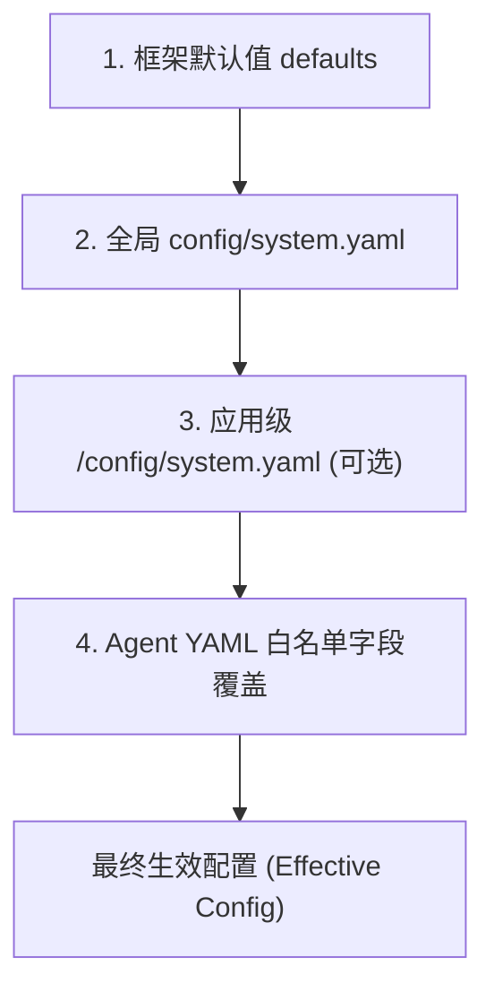

# AgentLoom 配置体系总览

本文档介绍 AgentLoom 框架的配置体系架构，包括配置文件的分类、加载层级、覆盖机制以及 LLM 配置的独立性。

## 1. 配置文件分类

AgentLoom 的配置主要分为三大类，分别存放在不同的配置文件中：

| 配置文件 | 默认路径 | 作用与定位 |
|----------|----------|------------|
| `system.yaml` | `config/system.yaml` | **全局系统配置**。控制执行环境、工具列表、工作区路径、代码执行权限等系统级行为。 |
| `llm.yaml` | `config/llm.yaml` | **全局模型配置**。独立管理所有 LLM 模型的参数（`api_key`、`base_url`、温度、超时、重试策略等）以及 Langfuse 观测配置。 |
| `agent_xxx.yaml` | `applications/<app>/workflows/*.yaml` | **Agent 配置**。定义单个智能体的角色、工作流（Workflow）、所用工具、模型类型（`model_type`）等；Worker Agent 还可通过 `concurrency` 字段支持批量并发调用（详见 [Agent 配置文档 3.11 节](agent_config.md#311-concurrency--并发度配置)）。 |
| *应用级系统配置* | `applications/<app>/config/system.yaml` | **可选的应用级覆盖**。用于覆盖特定应用的默认系统行为（例如修改工作区或替换默认工具）。 |

> 详情参考：
> - [Agent YAML 配置参考](agent_config.md)
> - [系统配置参考](system_config.md)
> - [LLM 配置参考](llm_config.md)

## 2. 配置加载与合并层级 (Cascade)

AgentLoom 采用 `LayeredConfigBuilder` 来实现不可变且支持校验的配置深度合并。加载过程从底向上叠加，后一层会覆盖前一层。

### 覆盖与合并规则
1. **字典（Dict）深度合并**：例如 `tool_access_control` 的嵌套字段合并。
2. **标量与列表完全替换**：如果上层定义了列表，会直接替换下层的列表，而不会拼接。
3. **节点校验**：每层合并后都会通过 Pydantic (`RootSettings`) 进行校验。

### 层级一览



#### Level 1: 全局基础配置
系统首先定位项目根目录（`agent_root`），加载 `config/system.yaml` 作为全局地基。

#### Level 2: 应用级覆盖 (App Overlay)
系统在加载 Agent YAML 时，会自动向上查找其所在的 `applications/<app>` 目录。如果该应用目录下存在 `config/system.yaml`，则将其深度合并到全局配置之上。

#### Level 3: Agent 级覆盖
单个 Agent 的 YAML 文件除了定义自身的工作流外，还可以覆盖系统的部分配置。支持覆盖的白名单字段（`_WORKFLOW_OVERLAY_KEYS`）包含：
- `system`, `model_request_headers`, `smart_summary`, `context_engine`, `tool_access_control`, `execution_env`, `code_agent`, `tools`, `prompt`, `shell_settings`, `tools_mapping`, `default_toolsets`, `toolsets`, `mcp_servers`, `self_learning`。

### Runtime 存储归属

`runtime` 与 `logging` 只能写在全局 `config/system.yaml`；Application 级 `config/system.yaml` 和 Agent YAML 不能移动 runtime root 或替换日志策略。这样，一个进程只有一套任务发现与保留边界。

隔离子进程可用 `AGENTLOOM_RUNTIME_ROOT` 覆盖整套 runtime home；该覆盖不会只移动 self-learning。

```yaml
runtime:
  root_dir: ".agentloom"
  successful_run_retention_days: 7
  failed_run_retention_days: 30
  artifact_retention_days: 3
  cleanup_interval_hours: 24

logging:
  level: "INFO"
  console_enabled: true
  file_enabled: true
  max_file_bytes: 26214400
  backup_count: 3
```

每次 attempt 写入 `.agentloom/runs/<application_id>/<run_id>/{manifest.json,logs,audit,artifacts}`。Resume 会创建新的 `run_id`，但保持逻辑任务的 `task_id` 和 `.agentloom/checkpoints/<application_id>/<task_id>/` 不变。Agent 可见的 `.runtime/` 工作区与 Application 自有 `output_dir` 属于独立存储域。

文件日志由 `logging.file_enabled` 控制，并按大小和备份数有界轮转。`loom run --no-file-log` 只关闭本次 attempt 的文件日志，不会关闭 checkpoint 或 Shell audit。`loom clean-runtime` 应用 run retention；`loom migrate-runtime --dry-run|--apply` 用于一次性迁移旧 `.logs`。

## 3. LLM 配置的完全隔离

在 AgentLoom 中，**LLM 配置（`llm.yaml`）与系统配置（`system.yaml`）是物理隔离的**。

### 为什么隔离？
- **防止泄漏**：确保敏感的 `api_key` 不会被意外写入业务 Agent 的配置中。
- **职责单一**：Agent 只需要关心自己要做什么，不需要关心模型底层的网络请求参数。
- **Schema 独立**：系统配置使用 `RootSettings` 校验，而模型使用 `LLMConfig` 校验。

### 隔离机制
1. **拦截写入**：在加载 `system.yaml` 或 Agent YAML 时，系统会主动过滤掉 `model`, `llm`, `langfuse` 这三个顶级字段，并打印警告。
2. **通过 `model_type` 关联**：Agent 在配置中只指定 `model_type: "powerful"`（模型分类标签）。
3. **参数读取链**：
   当 `model_type` 已经解析完成后，参数查找顺序为：
   `models[model_type].参数` → `代码内置默认值`。
   如果 Agent YAML 和 `model.default_model_type` 都没有提供模型类型，模型调用会直接以 `ValueError` 失败。

## 4. 全局 C 单例 (Unified Access)

无论配置如何合并，开发者和框架底层都通过唯一的 `C` 单例对象来访问配置。`C` 封装了复杂的合并逻辑，提供了极其简洁的 API。

```python
from src.lib.config import C

# 1. 访问系统配置
tools_list = C.get_nested("tools", "default", default=[])
is_summary_enabled = C.get("smart_summary")

# 2. 访问 LLM 配置
api_key = C.llm_api_key                # 读取默认模型类型的 api_key
temp = C.get_model_config("powerful", "temperature")  # 获取 specific 模型的参数

# 3. 访问原始合并字典
full_dict = C.raw
```

**工作原理**：
1. **懒加载 (Lazy Load)**：首次访问 `C` 时，触发从根目录寻找并合并所有层级的配置文件。
2. **全局缓存**：解析结果被缓存在 `_ACTIVE_CONFIG` 中，保证全生命周期配置一致。
3. **双轨存储**：`UnifiedConfig` 对象内部同时维护了合并后的 `_raw` 字典以及独立的 `_llm_config` (Pydantic 对象)。
