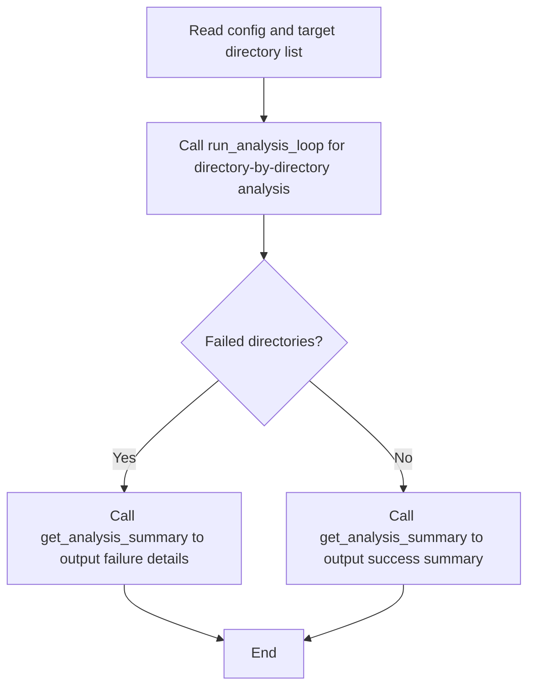

# AgentLoom Agent YAML Configuration Complete Reference

**Backend configuration:** Only `runtime_options` is interpreted. Historical top-level `max_steps`, `planning_interval`, `smart_summary`, `todo`, `prompt`, and `max_consecutive_parse_errors` are silently ignored without conversion or rejection. Keep smol options out of Pi definitions.


> **Document scope**: This document details **every** configuration parameter in Agent YAML.
> For override relationships between configuration files, see [Configuration System Overview](config-overview.md).
> For `config/system.yaml`, see [System Configuration Reference](system_config.md).
> For `config/llm.yaml`, see [LLM Configuration Reference](llm_config.md).

Agent YAML is the configuration file in the AgentLoom framework that **defines the behavior of a single Agent**, controlling the Agent's role description, runtime, workflow instructions, available tools, model selection, skill packages, and more. Agents are divided into two roles: **Supervisor** (multi-Agent orchestrator) and **Worker** (specific task executor).
The required `agent_runtime` field selects the Agent runtime; registered values
are `smolagents` and `pi`. All Tools are invoked through native structured
tool calls.

Both roles support `.yaml`, `.yml`, and `.md` definitions. Markdown uses a fenced
`yaml` configuration block; nonempty text outside that block becomes `workflow`.
Application Studio, its catalog/details, validation, and schedule targets discover
Markdown Supervisors in top-level or nested Application/workflow directories using
the same definition reader as execution. Worker definitions stay under their
Supervisor's references, and malformed Markdown or duplicate YAML keys produce
the same validation diagnostics. Reading these views does not start a Run or model.

> ⚠️ **LLM Configuration Isolation**: `model`/`llm`/`langfuse` in Agent YAML are automatically filtered with a warning. LLM parameters can only be defined in `config/llm.yaml`; Agents select which predefined model type to use via the `model_type` field.

---

## Table of Contents

- [1. Two Agent Roles](#1-two-agent-roles)
- [2. Quick Reference: Complete YAML Templates](#2-quick-reference-complete-yaml-templates)
- [3. Field Reference Manual](#3-field-reference-manual)
  - [3.1 Required Fields](#31-required-fields)
  - [3.2 Optional Common Fields](#32-optional-common-fields)
  - [3.3 Supervisor-Specific Fields](#33-supervisor-specific-fields)
  - [3.4 Worker-Specific Fields](#34-worker-specific-fields)
  - [3.5 agent_runtime — Agent Runtime](#35-agent_runtime--agent-runtime)
  - [3.6 Structured Tool Calls](#36-structured-tool-calls)
  - [3.7 model_type — Model Selection](#37-model_type--model-selection)
  - [3.8 skills — Skill Package Configuration](#38-skills--skill-package-configuration)
  - [3.9 runtime_options.prompt_template_path — Custom Prompt](#39-runtime_optionsprompt_template_path--custom-prompt)
  - [3.10 runtime_options.planning_interval — Planning Interval](#310-runtime_optionsplanning_interval--planning-interval)
  - [3.11 runtime_options.todo_mode — Task Tracking](#311-runtime_optionstodo_mode--task-tracking)
  - [3.11 concurrency — Concurrency Configuration](#311-concurrency--concurrency-configuration)
- [4. Tool Configuration Details](#4-tool-configuration-details)
  - [4.4 Advanced Pattern: Wrapping Agent as a Python Tool Function](#44-advanced-pattern-wrapping-agent-as-a-python-tool-function)
- [5. Worker Export as Callable Tool](#5-worker-export-as-callable-tool)
- [6. worker_agents Path Resolution Rules](#6-worker_agents-path-resolution-rules)
- [7. Common Errors and Troubleshooting](#7-common-errors-and-troubleshooting)
- [8. Complete Practical Examples](#8-complete-practical-examples)
- [9. Configuration Override Relationships](#9-configuration-override-relationships)
- [Appendix: Field Quick Reference Table](#appendix-field-quick-reference-table)

---

## 1. Two Agent Roles

| Role | Purpose | File Location | Core Characteristic |
|------|------|----------|----------|
| **Supervisor** | Multi-Agent collaboration orchestrator | `applications/<app>/workflows/<name>.yaml` | Has `worker_agents` field, schedules multiple Workers |
| **Worker** | Specific task executor | `applications/<app>/workflows/worker_agents/<name>.yaml` | Becomes a Tool only when explicitly selected by a Supervisor's `worker_agents` |

```
Supervisor (Main Agent)
  ├── Calls Worker A (project_scan)
  ├── Calls Worker B (data_analysis)
  └── Calls Worker C (report_generation)
```

> **Single Agent Mode**: If only one Agent is needed to work independently, just write a Worker YAML — no Supervisor required.

---

## 2. Quick Reference: Complete YAML Templates

### 2.1 Supervisor Complete Template

```yaml
# ============================================================
# Supervisor Agent Configuration Template
# File location: applications/<app>/workflows/<agent_name>.yaml
# ============================================================

# ---- Required Fields (4) ----
name: "my_check_agent"
agent_runtime: "smolagents"
description: |
  As the code review supervisor agent, your core responsibility is...
workflow: |
  # My Check Workflow
  ## Steps
  1. Call get_module_context to retrieve context
  2. Call project_scan for preparation
  3. Output the final report

# ---- Optional Fields ----
tools:
  - name: "get_module_context"
    module: "applications.my_app.agent_tools.module_context"
    function: "get_module_context"

model_type: "powerful"                   # Options: "powerful", "fast", "summary", or custom key

# ---- Supervisor-Specific ----
worker_agents:
  - path: "applications/my_app/workflows/worker_agents/project_scan.yaml"
  - path: "applications/my_app/workflows/worker_agents/data_analysis.yaml"

runtime_options:
  prompt_template_path: "applications/my_app/sysprompt/agent_prompt.yaml"

skills:
  paths:
    - "shared/skills"                    # Optional extra discovery root
```

### 2.2 Worker Complete Template

```yaml
# ============================================================
# Worker Agent Configuration Template
# File location: applications/<app>/workflows/worker_agents/<name>.yaml
# ============================================================

# ---- Required Fields (4) ----
name: "project_scan"
agent_runtime: "smolagents"
description: "Project structure scanning agent"
workflow: |
  You are a senior engineer responsible for...
  ## Output Requirements
  - A. File inventory and role classification
  - B. Dependency graph

# ---- Optional Fields ----
tools:
  - name: "read_file"
  - name: "write_file"
  - name: "get_module_context"
    module: "applications.my_app.agent_tools.module_context"
    function: "get_module_context"

model_type: "powerful"
runtime_options:
  max_steps: 40                            # Maximum execution steps (default: 80)
  planning_interval: 3                     # Force re-planning every N steps
  todo_mode: "auto"                     # auto | on | off

# ---- Optional Worker Input Contract ----
input_schema:
  type: object
  properties:
    target_path:
      type: string
      description: "Path to analyze"
    include_tests:
      type: boolean
  required: [target_path]
  additionalProperties: false

# ---- Optional Agent Output Contract ----
output_schema:
  type: object
  properties:
    summary:
      type: string
    files:
      type: array
      items:
        type: string
  required: [summary, files]
  additionalProperties: false
```

---

## 3. Field Reference Manual

### 3.1 Required Fields

Supervisor and Worker share 4 required fields:

| Field | Type | Validation Rule | Description |
|------|------|----------|------|
| `name` | `str` | Non-empty string | Agent unique identifier. In Worker, also serves as the exported tool function name |
| `agent_runtime` | `str` | Must be registered: `smolagents` / `pi` | Selects the complete Agent runtime. Missing and unknown values fail during preflight |
| `description` | `str` | Non-empty string | Agent capability metadata; it becomes the Subagent Tool description and is never used as invocation input |
| `workflow` | `str` | Non-empty string | Agent system instructions. Markdown and Mermaid are ordinary text. See [Writing Guidelines](#workflow-writing-guidelines-and-recommendations) below |

#### Division of `description` and `workflow`

| Field | Responsibility | What to Write | What NOT to Write |
|------|------|--------|----------|
| `description` | **Role positioning** (one or two sentences) | "As XX agent, your core responsibility is YY" | Don't write detailed processes or specific steps |
| `workflow` | **Complete execution instructions** | Background, responsibilities, flowchart, stage descriptions, output requirements | Don't repeat the role positioning from description |

`workflow` is sent once through the Runtime instructions channel. A supplied task
is a separate user message; when no task is supplied, AgentLoom does not invent
one from `description`. Express multi-stage behavior inside the instruction text
or explicit orchestration. A YAML list is invalid and does not control run count.

#### Goal Mode (Supervisor only)

```yaml
goal:
  enabled: true
```

`goal: true` and `goal: false` are also accepted. Mapping form requires a boolean
`enabled`. Legacy `token_budget` is silently ignored. Worker YAML must not contain
any `goal` key.

When enabled, Goal Mode still uses the single workflow string as instructions and
keeps the runtime task separate. Normal final answers and `max_steps` end only one
continuation segment; the root Supervisor must call `update_goal(complete,
evidence)`. Ordinary model usage remains in runtime audit records. See [Goal Mode](goal_mode.md)
for lifecycle, resume, persistence, CLI, Studio, and schedule behavior.

#### Workflow Writing Guidelines and Recommendations

`workflow` is the Agent's reusable system instruction. The current task remains a
separate user input. A well-structured workflow can significantly improve Agent
execution quality.

**Recommended Structure (Five-Part)**:

```
① Background & Role        ← Establish professional context
② Core Responsibilities & Constraints ← Define what must/must not be done
③ Execution Flow (Mermaid) ← Define steps and branches (framework special handling)
④ Detailed Step Descriptions ← Expand each flow node
⑤ Output Requirements      ← Constrain final deliverable format
```

**① Background & Role**

Establish professional context at the beginning of the workflow to let the LLM "get into character". The more specific the role, the more professional the output.

**Example**:

```markdown
You are a **senior code repository architecture analysis engineer**, skilled in code structure organization, module dependency analysis, and architecture documentation.
Your current task is to perform **directory-by-directory architecture analysis** on the target code repository, generating readable architecture documentation.
```

> **Key points**: State the professional background, current task objectives, and what is being analyzed.
> Reference Anthropic best practices: "Give Claude a role — Even a single sentence makes a difference."

**② Core Responsibilities & Constraints**

Use **numbered lists** to clearly define the Agent's mandatory responsibilities and prohibited behaviors. The more specific, the better — don't expect the LLM to infer your intent.

**Example**:

```markdown
### Core Responsibilities (Must Fulfill)
1. **Directory-by-directory analysis**: Call analysis tools for each target directory to generate architecture documentation
2. **Checkpoint resume**: Skip completed directories, only process incomplete or failed ones
3. **Result aggregation**: Output summary report after analysis (success/failure statistics + deliverable paths)

### Constraints (Prohibited Behaviors)
- ❌ Do not skip reporting failed directories
- ❌ Do not modify source code files
- ✅ All analysis conclusions must be based on actual code content, no speculation allowed
```

> **Key points**: Use numbered lists to ensure step completeness; use **bold** for critical rules; stating "do X" is more effective than "don't forget to do X" (e.g., "must call X first" is better than "don't forget to call X").

**③ Execution Flow (Mermaid Flowchart)**

Use Mermaid to define the core execution flow.

Mermaid blocks are ordinary instruction text. AgentLoom does not extract, validate,
wrap, or strengthen them; use Mermaid only when it makes the instructions clearer
to readers and the model.

**Example**:

````markdown

````

> **Key points**:
> - The flowchart should only show **main flow and key branches**; don't cram every detail into it
> - Node names should be clear, use descriptive text rather than coded abbreviations
> - Branch conditions use `{condition?}`, e.g., `C{Failed items?} -- Yes --> D[Retry]`
> - Check Mermaid syntax in your documentation tooling if rendering matters; the Runtime forwards it unchanged

**④ Detailed Step Descriptions**

Expand on each key node from the Mermaid flowchart. Recommended unified sub-structure:

**Example**:

```markdown
### Step 1: Directory-by-Directory Architecture Analysis

**Objective**: Complete LLM architecture analysis for all target directories.

**Input**:
- Output directory specified by environment variable `REPO_MAP_OUTPUT_DIR`

**Actions**:
1. Call the `run_analysis_loop` tool
2. The tool internally calls sub-Agents per directory in rank priority order
3. Completed directories are automatically skipped (checkpoint resume)

**Success Criteria**:
- All directories analyzed, or failed directories recorded to progress file

**Failure Handling**:
- Single directory failure → Record error, continue to next directory
- Tool throws exception → Stop immediately and report error
```

> **Key points**: Each step should have clear **success criteria** and **failure handling** to prevent the LLM from improvising when encountering exceptions.

**⑤ Output Requirements**

Clearly define the format, required content, and prohibitions for final deliverables.

**Example**:

```markdown
## Output Requirements
- Format: Markdown summary report
- Must include: Number of completed directories, failed directories, deliverable paths
- Failed directories must list failure reasons
- Do not omit any failure information
```

> **Key points**: If there are specific format requirements (e.g., JSON, Markdown tables, specific section structure), constrain them here.

#### Comprehensive Template

````yaml
workflow: |
  # [Task Name]

  ## Background
  You are a **[professional role]**. Your current task is [one sentence describing the task objective].

  ## Core Responsibilities
  1. **[Responsibility 1]**: [specific description]
  2. **[Responsibility 2]**: [specific description]
  3. **[Responsibility 3]**: [specific description]

  ## Constraints
  - ❌ [Prohibited behavior 1]
  - ❌ [Prohibited behavior 2]
  - ✅ [Recommended practice]

  ## Execution Flow

  ```mermaid
  flowchart TD
    A[Step 1: Get input] --> B[Step 2: Core processing]
    B --> C{All successful?}
    C -- Yes --> D[Step 3: Output success report]
    C -- No --> E[Step 3: Output failure details]
    D --> F[End]
    E --> F
  ```

  ## Step Details

  ### Step 1: [Name]
  **Objective**: ...
  **Actions**:
  1. ...
  **Success Criteria**: ...
  **Failure Handling**: ...

  ### Step 2: [Name]
  ...

  ## Output Requirements
  - Format: [format]
  - Must include: [content items]
  - Prohibited: [prohibited items]
````

#### Writing Notes

- **YAML format**: use one `workflow: |` scalar to preserve newlines and indentation. Lists are invalid.
- **Avoid hardcoded paths**: Don't hardcode file paths in workflow; get them dynamically via tools (e.g., `get_module_context`)
- **Bold critical rules**: Use `**bold**` to highlight rules the LLM must follow
- **Numbered for ordering**: Use numbered lists (`1. 2. 3.`) for multi-step processes, not unordered lists
- **Mark inferences**: Require the LLM to label uncertain content with 【Inference】 to avoid hallucinations mixing into conclusions
- **Mermaid syntax**: Mermaid is ordinary text; validate it separately if a renderer will consume it

---

### 3.2 Optional Common Fields

| Field | Type | Default | Description |
|------|------|--------|------|
| `tools` | `list[dict]` | `[]` | Tool list. See [Section 4](#4-tool-configuration-details) |
| `model_type` | `str` | Configured global `default_model_type` | Model selection. See [3.7](#37-model_type--model-selection) |
| `runtime_options.prompt_template_path` | `str` | Not set | Smol template path, string only |
| `runtime_options.planning_interval` | `int` | Not set | Force re-planning every N steps. See [3.10](#310-runtime_optionsplanning_interval--planning-interval) |
| `runtime_options.todo_mode` | `str` | "auto" | Smol task tracking; quote "on" / "off" |
| `concurrency` | `int`/`str` | Not set | Concurrency level when this Agent is batch-invoked. See [3.11](#311-concurrency--concurrency-configuration) |
| `skills` | `list`/`dict`/`str` | Not set | Private skill package configuration. See [3.8](#38-skills--skill-package-configuration) |
| `hooks` | `dict` | Not set | Independent direct Hooks and explicit Hook Bundles. See [Hooks](hooks.md) |
| `runtime_options.max_steps` | `int` | `80` | Maximum execution steps. Agent is forcefully terminated when exceeded |

---

The `runtime_options.*` fields above belong to smol. `smart_summary` accepts a bool and defaults to `true`; `max_consecutive_model_errors` accepts a positive integer and defaults to `5`. Pi has its own option schema.

### 3.3 Supervisor-Specific Fields

| Field | Type | Default | Description |
|------|------|--------|------|
| `worker_agents` | `list[dict]` | `[]` | Worker Agent path list. Each item must have a `path` field; **`name` field is prohibited**. See [Section 6](#6-worker_agents-path-resolution-rules) |

---

### 3.4 Worker-Specific Fields

| Field | Type | Default | Description |
|------|------|--------|------|
| `input_schema` | Draft 2020-12 object schema | `{task: string}` | Worker Tool arguments. See [Section 5](#5-worker-export-as-callable-tool) |
| `output_schema` | Draft 2020-12 schema | Text output | Optional executable Agent result contract; any JSON root type is allowed |

> ⚠️ **Worker config isolation**: A Worker's effective configuration is resolved from global/app config plus the **Worker YAML itself**. It does **not** inherit permission overrides from the Supervisor that called it. If a Worker needs extra filesystem or shell permissions, repeat the relevant whitelisted overrides (for example `tool_access_control.path_validation`) in the Worker YAML.

---

### 3.5 `agent_runtime` — Agent Runtime

Every Supervisor and Worker declares:

```yaml
agent_runtime: "smolagents"
```

Registered values are `smolagents` and `pi`; install the selected backend. A missing value,
`langgraph`, or any unknown value fails during Application preflight; AgentLoom
does not select or fall back to another runtime. This field is independent from
the global `runtime` mapping in `config/system.yaml`, which controls storage.

### 3.6 Structured Tool Calls

AgentLoom exposes one Tool execution protocol: the model returns a provider-native
structured tool call, AgentLoom validates its arguments against the schema, and
executes a registered Tool. It does not infer tool calls from prose, XML, or JSON
text. A provider or model without structured-tool support fails directly.

---

### 3.7 `model_type` — Model Selection

Agent YAML cannot directly modify LLM parameters, but can **select** which model type defined in `config/llm.yaml` to use via `model_type`.

| Predefined Type | Use Case | Description |
|-----------|----------|------|
| `"powerful"` | Supervisor orchestration, complex reasoning, code generation | Strong model, higher cost |
| `"fast"` | Simple classification, routing, lightweight Worker | Fast response, lower cost |
| `"summary"` | Text summarization, information extraction | Medium capability |

Custom type names from `llm.yaml` are also supported (e.g., `"code_review"`).

**Resolution logic**:
1. Agent YAML specifies `model_type` → Uses that value; if the type doesn't exist, **raises an error (`ValueError`) directly, no silent fallback**.
2. Not specified → Uses the global `config/llm.yaml` `model.default_model_type`. If `default_model_type` is omitted or the resolved type does not exist, **also raises an error directly**.

---

### 3.8 `skills` — Skill Package Configuration

AgentLoom automatically discovers project `skills/` and Application `skills/`
directories. Agent YAML can add paths relative to the Application root:

```yaml
skills:
  paths:
    - shared/skills
```

`paths` is the only supported field. The system prompt contains only the
resolved `name` and `description` catalogue; the model calls `skill(name)` to
add one selected body to the conversation. There is no configurable loading
mode. Skill activation does not grant tools, script, network, or Hook authority.
See [Skills](skills_config.md) for discovery and precedence details.

---

### 3.9 `runtime_options.prompt_template_path` — Custom Prompt

Configure a non-empty string path for the smol System Prompt template. A `{path: ...}` mapping is not accepted:

```yaml
runtime_options:
  prompt_template_path: "applications/my_app/sysprompt/agent_prompt.yaml"
```

Relative paths resolve from the project root; absolute paths are used directly. The file must contain a YAML mapping. An explicit path takes precedence. Otherwise the smol adapter selects an activated model-family template, a local template under `src/runtimes/smolagents/prompts/`, then the built-in smolagents template. `.example.yaml` files are reference assets.

---

### 3.10 `runtime_options.planning_interval` — Planning Interval

Smol only. A positive integer requests planning every N steps; omission or `null` disables periodic planning. Strings, booleans, zero and negative values are rejected.

```yaml
runtime_options:
  planning_interval: 3
```

Planning is independent from `runtime_options.todo_mode`.

---

### 3.11 `runtime_options.todo_mode` — Task Tracking

Todo tracks the current Agent's progress for the current task. It is not a
long-term project manager and is independent from `planning_interval` and the
Agent's explicit `tools` list.

```yaml
runtime_options:
  todo_mode: "auto"  # auto | on | off; quote on/off for YAML 1.1 loaders
```

| Mode | Behavior |
|------|----------|
| `auto` | Default. `todo_write` is available and the model decides whether a multi-step task benefits from tracking. |
| `on` | `todo_write` is available. For a non-trivial multi-step task whose scope is already clear, the model is strongly instructed to make a standalone `todo_write` its first tool call. Minimal read-only discovery may happen first only when needed to ground the list. |
| `off` | The tool, Todo prompt policy, and current Todo snapshot are hidden from the model. |

`runtime_options` merges through configuration layers. For mixed applications, set `todo_mode` on each smol Agent. Only the strings `"auto"`, `"on"`, and `"off"` are accepted; quote `on` and `off`.

`todo_write` replaces the complete list atomically. Each item contains
`content` and one of `pending`, `in_progress`, `completed`, or `cancelled`.
There may be at most one `in_progress` item. `cancelled` requires a
`cancel_reason` and means the Agent has determined that the item is no longer
needed; failure or lack of time is not cancellation. Passing an empty list
clears the snapshot.

With checkpointing enabled, state is stored in the task checkpoint directory
as `todos.json`, isolated by Agent path and managed by the checkpoint resume,
locking, and cleanup lifecycle. With checkpointing disabled it lives only in
the current run's memory. A malformed file is quarantined with a warning and
execution continues with an empty snapshot. The current canonical snapshot is
re-injected as a system message on each model call; Todo does not add a separate
model call and does not block the final answer.

---

### 3.12 `concurrency` — Concurrency Configuration

Controls the maximum concurrency when this Agent is batch-invoked. Typically used for Worker Agents — when the application layer needs to batch-invoke the same Worker on multiple inputs (e.g., multiple directories, multiple files), this field determines how many Agent instances run simultaneously.

**Type**: `int` (positive integer) or `str` (`"auto"`)
**Default**: Not set (equivalent to `"auto"`)

**Possible values**:

| Value | Meaning |
|------|------|
| `auto` | Auto-calculated: `min(RPM, 10)`, actual request pacing controlled by rate limiter (`interval = 60/RPM`) |
| `1` | Explicit sequential execution, one at a time |
| `N` (positive int) | Fixed concurrency, at most N instances simultaneously |
| Not set / `null` | Equivalent to `auto` |

> In `auto` mode, RPM is read from the corresponding `model_type`'s `requests_per_minute` in `config/llm.yaml`. Thread count = `min(RPM, 10)`, the rate limiter paces actual requests at `60/RPM` second intervals.

**Thread safety**: The framework creates an **independent Agent instance** for each concurrent call (sharing Model and Config, but Agent's `memory`, `state`, and other stateful properties are fully isolated). This follows the design patterns of Cline's `new SubagentRunner()` and LangGraph's `Send()`.

**Examples**:

```yaml
# Worker Agent: directory analysis (supports concurrent batch invocation)
name: "dir_architecture_analysis"
agent_runtime: "smolagents"
model_type: "powerful"
concurrency: auto          # Auto-calculate concurrency

workflow: |
  ...
```

```yaml
# Worker Agent: fixed concurrency of 6
name: "file_processor"
agent_runtime: "smolagents"
model_type: "fast"
concurrency: 6
```

**Application-layer usage — `tool.batch()`**:

After a Worker Agent with `concurrency` configured is loaded via `create_agent_as_tool()`, the returned tool function has a `.batch()` method for one-line parallel execution:

```python
# Load Worker Agent as tool (returns single Callable, with built-in cache)
tool = YamlAgentFactory.create_agent_as_tool("worker.yaml")

# Build task list
tasks = [
    {"dir_path": "src/api", "index_content": "..."},
    {"dir_path": "src/app/imports", "index_content": "..."},
    {"dir_path": "src/core", "index_content": "..."},
]

# One-line parallel execution — auto-reads concurrency from YAML
results = tool.batch(tasks)

# Override YAML config
results = tool.batch(tasks, concurrency=3)

# With progress callback
results = tool.batch(tasks, on_progress=lambda done, total, r: print(f"{done}/{total}"))
```

**Priority chain**: `tool.batch(concurrency=N)` param > YAML `concurrency` field > `auto`

> ⚠️ **Applicable scenarios**: `concurrency` is for batch scenarios where "the same Worker is called multiple times with different inputs" (e.g., analyzing 100 directories, processing 50 files). It does not affect the Supervisor's own execution.

---

## 4. Tool Configuration Details

### 4.1 Two Tool Types

#### Predefined Tools (only need `name`)

```yaml
tools:
  - name: "read_file"
  - name: "shell_tool"
```

#### Fixed Tool Arguments

Use `fixed_args` when an Agent YAML should lock specific tool parameters. Fixed
arguments are bound by the framework, removed from the LLM-visible tool schema,
and cannot be overridden by a tool call.

```yaml
tools:
  - name: "grep_search"
    fixed_args:
      path: "."
      case_insensitive: false
```

#### Predefined Tools + Metadata Override

Agent YAML can override per-tool metadata defined in `config/system.yaml` `tool_metadata` section:

```yaml
tools:
  - name: "grep_search"
    max_result_chars: 10000        # Override default 20000
    disable_type_coercion: true    # Disable auto type coercion for this tool
```

See [system_config.md §10 tool_metadata](system_config.md#10-tool_metadata--tool-metadata-configuration) for available fields.

#### Dynamically Loaded Tools (need `name` + `module` + `function`)

```yaml
tools:
  - name: "get_module_context"
    module: "applications.my_app.agent_tools.module_context"
    function: "get_module_context"
```

> **Important**: Dynamically loaded tools' descriptions are automatically extracted from the Python function's `__doc__` (Docstring). The `description` field in YAML, even if configured, is ignored by the framework. Write your documentation in the Python function directly.

**Validation rules**: `module` and `function` must appear together; specifying only one raises an error.

### 4.2 Complete Predefined Tool List

| Tool Name | Function |
|--------|----------|
| `read_file` | Read file content (supports offset/limit for ranges) |
| `write_file` | Create new file or overwrite existing |
| `edit_file` | Apply one or more unique text edits |
| `list_directory` | List directory structure |
| `grep_search` | Regex search file contents (powered by ripgrep) |
| `glob_search` | Glob pattern file search |
| `loom_retrieve_context` | Retrieve compressed context refs |
| `shell_tool` | Execute shell commands (whitelist-restricted) |
| `check_background_task` | Read background task status and output |
| `kill_background_task` | Terminate a background task |
| `list_background_tasks` | List active and recent background tasks |
| `skill` | Load one selected Skill into the conversation |
| `session_search` | Search redacted records from prior Runs |
| `session_scroll` | Read surrounding events from a prior Run |
| `memory` | Read or propose durable Project/Application facts |
| `skill_manage` | Create or update generated Skill proposals |
| `todo_write` | Update the current task plan when Todo is enabled |

For toolset membership, implementation-loading rules, and the validation
matrix, see [Built-in Tool Catalog](tool_catalog.md).

### 4.3 Tool Loading Priority

1. **Default toolsets**: Toolsets in `default_toolsets` from `config/system.yaml` are auto-loaded
2. **Agent tools**: Tools in the Agent YAML `tools` list
3. **Deduplication rule**: Same-named tools are overridden by later-loaded ones

### 4.4 Advanced Pattern: Wrapping Agent as a Python Tool Function

When a Worker Agent call needs **complex pre/post processing** (e.g., loop orchestration, checkpoint resume, error isolation, progress persistence), you can wrap the Agent in a regular Python tool function, then register it in the Supervisor's `tools` field via `module + function`.

The core idea of this pattern is: **Python control flow + Agent intelligence** — let deterministic operations (read files, write files, loops, error handling) happen at the Python layer, and only delegate LLM reasoning parts to the Agent.

#### 4.4.1 When to Use This Pattern

| Scenario | Recommended Approach | Reason |
|------|----------|------|
| Call Agent once, return result directly | `worker_agents` auto-registration | Simple and direct, YAML declaration only |
| Need to read files/prepare context before calling Agent | **Python wrapper** | Deterministic operations shouldn't waste LLM tokens |
| Need to loop-call Agent (batch processing) | **Python wrapper** | Deterministic Python loops are more reliable |
| Need checkpoint resume / progress persistence | **Python wrapper** | Write back progress file immediately per iteration, crash-safe |
| Need error isolation (single item failure doesn't interrupt) | **Python wrapper** | try-except precise capture, continue processing next item |
| Agent output needs post-processing (write files, format, aggregate) | **Python wrapper** | Deterministic operations at the Python layer |

#### 4.4.2 Three Agent-Tool Paths Comparison

| Dimension | Path A: `worker_agents` Auto-Register | Path B: Dynamic Tool (`module + function`) | Path C: Python-Wrapped Agent Tool |
|----------|--------------------------------|------------------------------------------|-------------------------------|
| **Registration** | Supervisor YAML `worker_agents` field | Supervisor YAML `tools` field (`module + function`) | Same as Path B (`tools` field `module + function`) |
| **Contains Agent** | ✅ Auto-creates Agent | ❌ Plain Python function | ✅ Function internally calls `create_agent_as_tool()` |
| **Requires Python Code** | ❌ Pure YAML declaration | ✅ Need to write tool function | ✅ Need to write wrapper function |
| **Pre/Post Processing** | ❌ None | ✅ Any Python logic | ✅ Any Python logic |
| **Control Flow** | ❌ Single call | ✅ Loops, conditionals, retries | ✅ Loops, conditionals, retries |
| **Error Isolation** | ❌ Failure terminates | ✅ Self-implemented | ✅ try-except per-item isolation |
| **Progress Persistence** | ❌ None | ✅ Self-implemented | ✅ Write back state file per iteration |
| **Use Cases** | Simple "call Agent once, return result" | Non-Agent tool functions (read files, call APIs, etc.) | Batch processing, Pipeline orchestration, checkpoint resume |
| **Config Complexity** | Low (only `path`) | Medium (write function + YAML registration) | High (write wrapper + Worker YAML + YAML registration) |
| **Reference** | [Section 5](#5-worker-export-as-callable-tool) | [4.1 Dynamic Tools](#41-two-tool-types) | This section (4.4) |

> **Difference between Path B and Path C**: Both use the same YAML registration method (`tools` field with `module + function`). The difference is that **Path C's Python function internally loads and calls an Agent via `YamlAgentFactory.create_agent_as_tool()`**, while Path B is a plain tool function without Agent involvement.

#### 4.4.3 Core API: `YamlAgentFactory.create_agent_as_tool()`

```python
from agentloom.app.factory import YamlAgentFactory

tools = YamlAgentFactory.create_agent_as_tool(
    config_path,        # str | Path | dict — Worker YAML path (relative to AGENT_ROOT) or config dict
    agent_class=None,   # Optional, custom Agent class
    model=None,         # Optional, model instance
    logger=None,        # Optional, AgentLogger instance
)
# Returns: one callable Tool whose signature comes from the Worker's input_schema
```

**Return value notes**:
- The Tool is called like a regular Python function with the JSON types declared by
  `input_schema`; without one it accepts a required `task: string` argument.
- Without `output_schema`, the return value is text. With `output_schema`, the
  validated JSON-compatible value is returned without string coercion.
- Every invocation constructs a fresh Worker owner and Runtime while reusing safe
  shared bindings such as model configuration.

#### 4.4.4 Design Principles (Four Best Practices)

| Principle | Description | Example |
|------|------|------|
| **① Lazy singleton** | Agent tool is only initialized on first call, reused afterwards | Global variable `_tool = None` + getter function |
| **② Separate pre/post** | Deterministic operations (read/write files, format validation) at Python layer, don't waste LLM tokens | Read index.md → Agent analysis → Write analysis.md |
| **③ Error isolation** | Each subtask wrapped in try-except; single item failure records error then continues | `entry["error_msg"] = str(e)` |
| **④ Immediate persistence** | Write back progress file immediately after each iteration; resume from checkpoint after crash | `_save_progress()` called at end of each loop |

#### 4.4.5 Generic Template: Minimal Wrapping (Single Call + Pre/Post Processing)

When you only need some deterministic processing before and after the Agent call, use this minimal template:

```python
# applications/<app>/agent_tools/my_agent_tool.py

from __future__ import annotations
from pathlib import Path

from agentloom.execution.logging import get_logger
from agentloom.app.factory import YamlAgentFactory

_AGENT_YAML = "applications/<app>/workflows/worker_agents/<worker>.yaml"


def analyze_with_context(file_path: str) -> str:
    """
    Agent call tool with pre/post processing.

    Pre: Read file content, validate format
    Agent: LLM analysis
    Post: Write analysis results

    Args:
        file_path: Path to the file to analyze

    Returns:
        Analysis result summary
    """
    logger = get_logger(__name__)

    # create_agent_as_tool has built-in cache, same YAML only creates once
    tool = YamlAgentFactory.create_agent_as_tool(_AGENT_YAML)
    if tool is None:
        raise RuntimeError(f"Failed to create agent tool from {_AGENT_YAML}")

    # -- Pre-processing (deterministic, no LLM token cost) --
    source = Path(file_path)
    if not source.exists():
        return f"Error: file not found: {file_path}"
    content = source.read_text(encoding="utf-8")
    if not content.strip():
        return f"Error: file is empty: {file_path}"

    # -- Call Agent (LLM reasoning) --
    logger.info(f"Analyzing {file_path}")
    result = tool(content=content)

    # -- Post-processing (deterministic) --
    output_path = source.with_suffix(".analysis.md")
    output_path.write_text(str(result), encoding="utf-8")

    return f"Analysis saved to {output_path}"
```

#### 4.4.6 Generic Template: Batch Processing + Checkpoint Resume

When you need to loop-call an Agent to process multiple subtasks, use this complete template:

```python
# applications/<app>/agent_tools/batch_agent_tool.py

from __future__ import annotations
import json
import traceback
from pathlib import Path

from agentloom.execution.logging import get_logger
from agentloom.app.factory import YamlAgentFactory

_AGENT_YAML = "applications/<app>/workflows/worker_agents/<worker>.yaml"

def _save_progress(path: Path, data: dict) -> None:
    """Persist immediately after each iteration (crash-safe)"""
    path.write_text(json.dumps(data, ensure_ascii=False, indent=2), encoding="utf-8")


def run_batch_analysis(progress_file: str, retry_failed: bool = False) -> str:
    """
    Batch-call Agent to analyze multiple subtasks with checkpoint resume and error isolation.

    Progress file format (JSON):
    {
      "item_1": {"status": "pending", "input": "..."},
      "item_2": {"status": "completed", "output": "..."},
      "item_3": {"status": "failed", "error_msg": "..."},
    }

    Args:
        progress_file:  Progress file path (JSON format)
        retry_failed:   Whether to retry previously failed items

    Returns:
        Summary string with completed/failed/skipped counts
    """
    pf = Path(progress_file)
    if not pf.exists():
        raise FileNotFoundError(f"Progress file not found: {pf}")
    progress = json.loads(pf.read_text(encoding="utf-8"))

    # -- Checkpoint resume: reset crash-orphaned in_progress --
    for key, entry in progress.items():
        if entry["status"] == "in_progress":
            entry["status"] = "pending"
    # -- Optional: retry failed items --
    if retry_failed:
        for key, entry in progress.items():
            if entry["status"] == "failed":
                entry["status"] = "pending"
                entry.pop("error_msg", None)
    _save_progress(pf, progress)

    logger = get_logger(__name__)

    # create_agent_as_tool has built-in cache, same YAML only creates once
    tool = YamlAgentFactory.create_agent_as_tool(_AGENT_YAML)
    if tool is None:
        raise RuntimeError(f"Failed to create agent tool from {_AGENT_YAML}")

    stats = {"completed": 0, "failed": 0, "skipped": 0}

    for key, entry in progress.items():
        if entry["status"] in ("completed", "failed"):
            stats["skipped"] += 1
            continue

        # -- Pre-processing --
        entry["status"] = "in_progress"
        _save_progress(pf, progress)          # Mark in-progress (crash-safe)

        try:
            # -- Call Agent --
            result = tool(query=entry["input"])

            # -- Post-processing --
            entry["status"] = "completed"
            entry["output"] = str(result)
            entry.pop("error_msg", None)
            stats["completed"] += 1

        except Exception as e:
            # -- Error isolation: record and continue --
            entry["status"] = "failed"
            entry["error_msg"] = str(e)
            entry["error_trace"] = traceback.format_exc()
            stats["failed"] += 1

        _save_progress(pf, progress)          # Write back after each iteration

    return (
        f"Batch complete: {stats['completed']} completed, "
        f"{stats['failed']} failed, {stats['skipped']} skipped."
    )
```

#### 4.4.7 Supervisor YAML Registration

Register the wrapped Python function in the Supervisor's `tools` field:

```yaml
# Supervisor YAML
name: "my_supervisor"
agent_runtime: "smolagents"
description: "Orchestrate multi-step analysis process"
workflow: |
  1. Call run_batch_analysis to batch analyze all subtasks
  2. Based on returned summary, determine if retry is needed

tools:
  # Python tool function wrapping an Agent
  - name: "run_batch_analysis"
    module: "applications.<app>.agent_tools.batch_agent_tool"
    function: "run_batch_analysis"

  # Can also register other regular tools simultaneously
  - name: "read_file"
  - name: "list_directory"
```

> **Tool description auto-extraction**: The framework automatically extracts tool descriptions from the Python function's `__doc__` (Docstring). Ensure good documentation in your functions; the `description` field in YAML is ignored.

#### 4.4.8 Complete Practice: repo_map Architecture Analysis Pipeline

Below is an actual implementation from the `applications/repo_map` project, demonstrating the complete "Agent wrapped as Python tool function" pattern:

**Architecture Overview**:

```
Supervisor (repo_map_agent)
  │
  ├── tools (Python-wrapped Agent):
  │   ├── run_analysis_loop()     ← Python for loop + Agent call
  │   └── get_analysis_summary()  ← Pure Python, reads progress file
  │
  └── worker_agents:
      └── dir_architecture_analysis.yaml  ← Called internally by run_analysis_loop()
```

**Key Design Decisions**:

1. **`dir_architecture_analysis`** is a standard Worker Agent, but is **NOT auto-registered to Supervisor via `worker_agents`**
2. Instead, **`run_analysis_loop()` manually loads and loop-calls it at the Python layer**, passing different directory `index.md` content each time
3. Python layer handles: read index.md (pre) → call Agent (LLM analysis) → write analysis.md (post) → update progress (persistence)
4. Single directory analysis failure doesn't affect other directories; failure info is recorded in `progress.json` for later inspection or retry

**File Organization**:

```
applications/repo_map/
├── workflows/
│   ├── repo_map_agent.yaml                        # Supervisor
│   └── worker_agents/
│       └── dir_architecture_analysis.yaml         # Worker (called by Python wrapper)
├── agent_tools/
│   └── pipeline_agent_tools.py                    # Python wrapper functions
└── repo_map_app.py                                # Application entry point
```

> 💡 **Core Philosophy**: Although `dir_architecture_analysis` is declared in `worker_agents`, the Supervisor actually uses `run_analysis_loop()` from `tools`, which internally loads and loop-calls that Worker Agent via `YamlAgentFactory.create_agent_as_tool()`. This achieves the optimal combination of **Python control flow reliability** and **LLM Agent intelligent reasoning**.

---

## 5. Worker Export as Callable Tool

> 💡 If your Worker Agent needs **pre/post processing** (file read/write, loops,
> error isolation, etc.), see [4.4 Advanced Pattern: Wrapping Agent as Python Tool Function](#44-advanced-pattern-wrapping-agent-as-a-python-tool-function).
> This section covers direct Subagent-as-Tool registration.

### 5.1 Core Mechanism

Each Worker explicitly referenced by a Supervisor's `worker_agents` becomes a
callable Tool. The Worker's top-level `name` is the Tool name and its
`description` is the Tool description. Files merely present in the directory are
not authorized or registered.

```
Supervisor → calls project_scan(task="Check CAN module") → fresh Worker executes → returns text
```

### 5.2 Optional JSON Schema Contracts

Omit both schemas for the concise default: one required `task: string` Tool
argument and a text result. Use Draft 2020-12 schemas when the contract is truly
typed:

```yaml
name: project_scan
description: Analyze one project area.

input_schema:
  type: object
  properties:
    target_path:
      type: string
    include_tests:
      type: boolean
  required: [target_path]
  additionalProperties: false

output_schema:
  type: object
  properties:
    summary:
      type: string
    risks:
      type: array
      items:
        type: string
  required: [summary, risks]
  additionalProperties: false
```

### 5.3 Validation Rules

| Validation Item | Rule | Error Example |
|--------|------|----------|
| `input_schema` root | Must be an object schema because model Tool arguments are objects | `input_schema root type must be object` |
| `input_schema` / `output_schema` | Valid JSON Schema Draft 2020-12 | `... must be valid Draft 2020-12` |
| `$ref` / `$dynamicRef` | Local `#...` references only; remote resolution is rejected | `... contains a remote reference` |
| Tool arguments | Strictly decoded and validated before Worker construction | Validation error; no Worker side effect |
| Structured output support | Runtime and Provider must support semantic enforcement | Preparation fails before model/Tool execution |

Schemas may use standard JSON types, `properties`, `items`, `required`, `enum`,
`additionalProperties`, and local definitions/references. Values keep their JSON
types; integers, booleans, arrays, and objects are not coerced to strings.

### 5.4 Return Value Behavior

- A text Worker returns plain text.
- A structured Worker returns the validated JSON-compatible value.
- Invalid terminal output stays inside the current Agent session for correction
  and consumes the existing execution-step budget. Exhaustion fails the run; it
  is not converted to prose or retried as a transport error.

---

## 6. worker_agents Path Resolution Rules

### 6.1 Directory Structure Constraints (Mandatory)

Agent YAML files **must** follow the directory structure below. The framework validates that the directories exist:

```
applications/{app_name}/
└── workflows/                          ← Supervisor YAML must be placed here
    ├── {app_name}_agent.yaml
    └── worker_agents/                  ← Worker YAML must be placed here
        ├── worker_a.yaml
        ├── worker_b.yaml
        └── analysis/                   ← Subdirectories allowed (no naming restrictions)
            └── deep_scan.yaml
```

- **Supervisor YAML** must be located under `applications/{app_name}/workflows/`
- **Worker YAML** must be located under `applications/{app_name}/workflows/worker_agents/`
- **Subdirectories are allowed** under `worker_agents/` with no naming restrictions, but Workers in subdirectories **cannot use shorthand filenames** — they must be referenced using full relative paths
- The framework automatically infers `{app_name}` (category) from the Supervisor YAML path, then locates the corresponding `worker_agents/` directory
- If `workflows/` or `worker_agents/` directory does not exist, loading will fail with an error

### 6.2 Three Path Forms

| Form | Detection Condition | Resolution | Example |
|------|----------|----------|------|
| **Absolute path** | Starts with `/` | Used directly | `/home/user/project/worker.yaml` |
| **Relative path** | Contains `/` or `\` | Concatenated with `AGENT_ROOT` | `applications/my_app/workflows/worker_agents/step0.yaml` |
| **Shorthand filename** | No directory separators, **must include extension** | Searched under `worker_agents/` | `project_scan.yaml` |

**Supported file extensions**: `.yaml`, `.yml`, `.md`

> **Note**: Shorthand filenames **must include a file extension** (e.g. `.yaml`). Names without extensions (e.g. `project_scan`) will raise an error.

### 6.3 Recommended Usage

```yaml
# ✅ Recommended: shorthand filename (when Worker is under the same app's worker_agents/, most concise)
worker_agents:
  - path: "project_scan.yaml"

# ✅ Full relative path (use when referencing Workers from another app)
worker_agents:
  - path: "applications/other_app/workflows/worker_agents/shared_worker.yaml"

# ✅ Full relative path (use when referencing Workers in a subdirectory of worker_agents/)
worker_agents:
  - path: "applications/my_app/workflows/worker_agents/analysis/deep_scan.yaml"

# ❌ Prohibited: missing file extension
worker_agents:
  - path: "project_scan"               # Error! Must end with .yaml/.yml/.md

# ❌ Prohibited: using name field
worker_agents:
  - name: "project_scan"               # Error! Only path is allowed
```

### 6.4 Pre-check Mechanism

The system performs a full pre-check on **all** entries before loading (directory existence, file existence, extension check, etc.). **If any single entry fails, all Workers are not loaded** (all-or-nothing strategy).

---

## 7. Common Errors and Troubleshooting

### 7.1 Missing Required Fields

| Error Message | Fix |
|----------|------|
| `Configuration is missing required field: name` | Add `name: "xxx"` |
| `Configuration is missing required field: description` | Add `description: "xxx"` |
| `workflow field must be a non-empty string` | Use one non-empty `workflow: \|` scalar |

### 7.2 Tool Configuration Errors

| Error Message | Fix |
|----------|------|
| `Tool configuration must be a dictionary` | Change to `- name: "xxx"` format |
| `Tool configuration is missing required 'name' field` | Add `name` field |
| `must include both 'module' and 'function' fields` | `module`/`function` must both be provided |

### 7.3 Worker Agents Errors

| Error Message | Fix |
|----------|------|
| `worker_agents must be a list` | Change to list format |
| `uses unsupported field 'name'; use 'path' only` | Change to `path` |
| `does not exist` | Check file path spelling |
| `has unsupported extension` | Use `.yaml`/`.yml`/`.md` |

### 7.4 Other Errors

| Error Message | Fix |
|----------|------|
| `missing required 'agent_runtime'` | Add `agent_runtime: smolagents` |
| `agent_runtime must name a registered runtime` | Select installed `smolagents` or `pi` |
| `skills must be a list, dict, or string path` | Use list/dict/string |

---

## 8. Complete Practical Examples

### 8.1 Repo Map Architecture Analysis Project (Supervisor + 1 Worker)

**Supervisor**: `applications/repo_map/workflows/repo_map_agent.yaml`

```yaml
name: "repo_map_agent"
agent_runtime: "smolagents"
description: |
  Repo Map architecture analysis Supervisor.
  Scanning and Markdown generation are handled directly by repo_map_app.py (pure Python, zero LLM).
  This Agent only calls run_analysis_loop for LLM architecture analysis per directory,
  then calls get_analysis_summary for the summary report.

model_type: "powerful"

workflow: |
  # Repo Map Architecture Analysis Workflow

  ## Execution Principles
  - Read output_dir from environment variable `REPO_MAP_OUTPUT_DIR`
  - Call `run_analysis_loop` first, then call `get_analysis_summary` for summary
  - If run_analysis_loop throws an exception, stop immediately and report error

tools:
  - name: "run_analysis_loop"
    module: "applications.repo_map.agent_tools.pipeline_agent_tools"
    function: "run_analysis_loop"
  - name: "get_analysis_summary"
    module: "applications.repo_map.agent_tools.pipeline_agent_tools"
    function: "get_analysis_summary"
  - name: "read_file"
  - name: "list_directory"

worker_agents:
  - path: "applications/repo_map/workflows/worker_agents/dir_architecture_analysis.yaml"
```

**Worker Example**: `dir_architecture_analysis.yaml`

```yaml
name: "dir_architecture_analysis"
agent_runtime: "smolagents"
description: |
  Perform LLM architecture analysis on a single directory.
  Receives dir_path and index_content, returns Markdown-formatted architecture analysis text.

model_type: "powerful"

workflow: |
  # Single Directory Architecture Analysis
  Based on the provided index_content, analyze code structure and return Markdown architecture analysis text.
  ## Analysis Dimensions
  1. Core functionality  2. Key modules  3. Design patterns  4. Dependencies  5. Notes

tools: []

input_schema:
  type: object
  properties:
    dir_path:
      type: string
      description: "Relative directory path to analyze, e.g. src/app/imports"
    index_content:
      type: string
      description: "Complete text content of the directory's index.md"
  required: [dir_path, index_content]
  additionalProperties: false
```

### 8.2 Minimal Configuration

```yaml
name: "simple_reader"
agent_runtime: "smolagents"
description: "A simple Agent that reads and analyzes specified file content"
workflow: |
  1. Read the user-specified file
  2. Analyze the file content
  3. Output the analysis result
tools:
  - name: "read_file"
```

### 8.3 Markdown (.md) Format for Writing Workers

Write configuration in a YAML code block at the beginning of the file; the remaining content automatically becomes the `workflow`:

````markdown
```yaml
name: "project_scan"
agent_runtime: "smolagents"
description: "Project structure scanning agent"
model_type: "powerful"
tools:
  - name: "read_file"
input_schema:
  type: object
  properties:
    param1:                          # Custom parameter name
      type: string
      description: "Task description"
  required: [param1]
  additionalProperties: false
```

# The following content automatically becomes the workflow

## Step 1: Scan Files
...
````

---

## 9. Configuration Override Relationships

> For complete override hierarchy, see [Configuration System Overview](config-overview.md). This section focuses on how Agent YAML overrides system configuration.

### 9.1 Override Mechanism

```
Global system configuration (config/system.yaml)
       ↓ deep merge
Application-level override (applications/<app>/config/system.yaml)
       ↓ deep merge (whitelisted fields only)
Agent YAML whitelisted fields
       ↓
Effective config
```

### 9.2 Overridable Field Whitelist

The following top-level fields in Agent YAML can override system configuration (source: `_WORKFLOW_OVERLAY_KEYS`):

| Field | Type Constraint | Description |
|------|----------|------|
| `system` | `dict` | System metadata (name, version) |
| `runtime_options` | `dict` | Options interpreted by the selected backend; rebuilt per Worker |
| `context_engine` | `dict` | Reversible context compression limits |
| `tool_access_control` | `dict` | Working directory and path filtering |
| `tools` | `list` | Agent tool list and its effective-config overlay |
| `shell_settings` | `any` | Shell safety settings |
| `default_toolsets` / `toolsets` | `any` | Toolset defaults or replacement |
| `mcp_servers` | `str`/`list`/`dict` | MCP server configuration |
| `self_learning` | `dict` | History and optional memory-review policy |

> ⚠️ **Important**: The whitelist above is evaluated **per Agent YAML**, not per call chain. When a Supervisor invokes a Worker, the Worker's `tool_access_control`, `shell_settings`, `runtime_options`, and other whitelisted overrides are rebuilt from the Worker YAML instead of being inherited from the Supervisor.
>
> ```yaml
> # If both Supervisor and Worker access the same external directory,
> # both YAML files must declare the allowlist.
> tool_access_control:
>   path_validation:
>     - tools: ["read_file", "grep_search", "glob_search", "shell_tool"]
>       include_paths:
>         - "/absolute/path/outside/workspace"
> ```

### 9.3 Non-Overridable Fields

The following fields are processed independently as Agent properties and are not merged into system configuration:

| Field | Processing |
|------|----------|
| `name` / `description` / `workflow` | Agent's own properties |
| `tools` (`list[dict]`) | Agent tool list, different from system `tools` (dict) |
| `worker_agents` / `input_schema` / `output_schema` | Role-specific contracts |
| `skills` | Independent three-layer stacking loading (see [3.8](#38-skills--skill-package-configuration)) |
| `agent_runtime` / `model_type` | Agent runtime and model-type selectors |

### 9.4 LLM Configuration Isolation

The following keys in Agent YAML are **automatically filtered** (`_LLM_ONLY_TOP_LEVEL_KEYS`):

| Filtered Key | Only Valid Location |
|-------------|-------------|
| `model` | `config/llm.yaml` |
| `llm` | `config/llm.yaml` |
| `langfuse` | `config/llm.yaml` |

```
WARNING: Ignoring top-level key 'model' in agent config;
         LLM settings must come from config/llm.yaml only.
```

### 9.5 Deep Merge Rules

| Data Type | Merge Behavior |
|----------|----------|
| **Dictionary** | Recursive merge (deep merge per key) |
| **List** | **Complete replacement** (higher priority completely replaces lower priority) |
| **Scalar** | Complete replacement |

> ⚠️ Lists are completely replaced, not appended! Agent YAML `toolsets:` replaces global `default_toolsets`; `toolsets: []` disables built-in tools.

### 9.6 Override Examples

```yaml
# Agent-level disable smart summary
runtime_options:
  smart_summary: false
```

### 9.7 Per-Agent Shell Security Configuration Override

Agent YAML uses **separate top-level keys** for shell security overrides:

- `tools:` — Tool list (list format), declares which tools the agent uses
- `shell_settings:` — Shell security override (dict format), overrides `shell_settings` from `config/system.yaml`

These are independent keys — no nesting required.

#### Scenario 1: Read-Only Audit Agent — Only allow view commands

```yaml
name: "readonly_auditor"
agent_runtime: "smolagents"
description: "Read-only code audit agent"
model_type: "powerful"

tools:
  - name: "shell_tool"
  - name: "read_file"
  - name: "grep_search"

shell_settings:
  allowed_commands:
    - "ls"
    - "cat"
    - "head"
    - "tail"
    - "grep"
    - "find"
    - "wc"
    - "pwd"
    - "file"
    - "stat"
  allowed_operators: ["|", "&&"]
  block_destructive: true

workflow: |
  You are a read-only code audit agent. You can only view file contents, not modify them.
```

#### Scenario 2: Developer Agent — Relax $() and ${} but keep safety baseline

```yaml
name: "developer"
agent_runtime: "smolagents"
description: "Development and testing agent"
model_type: "powerful"

tools:
  - name: "shell_tool"
  - name: "edit_file"

shell_settings:
  allowed_commands: "*"
  allowed_operators: "*"
  security_checks:
    command_substitution: false     # Allow $(), needed for build scripts
    parameter_expansion: false      # Allow ${}, needed for variable handling
    dangerous_shell_prefix: true    # Still block sudo
    destructive_patterns: true      # Still block rm -rf /
  background_tasks:
    stall_threshold_seconds: 30     # Faster stall detection

workflow: |
  You are a development agent. You can write code, run builds and tests.
```

#### Scenario 3: Minimal Permission Agent — No Shell

```yaml
name: "text_analyzer"
agent_runtime: "smolagents"
description: "Pure text analysis agent, no shell needed"
model_type: "fast"

# No shell_tool declared — agent cannot execute any shell commands
# No shell_settings needed
tools:
  - name: "read_file"
  - name: "grep_search"

workflow: |
  You are a text analysis agent. You can only read and search files.
```

#### Security Check Sub-Toggles

The `security_checks` dictionary supports 10 independent toggles. Undeclared keys default to `true` (enabled):

| Sub-Key | Blocks | Recommendation |
|---------|--------|----------------|
| `command_substitution` | `$()` and backticks | Can disable for build scripts |
| `parameter_expansion` | `${}` parameter expansion | Can disable for build scripts |
| `process_substitution` | `<()` / `>()` process substitution | Generally keep enabled |
| `env_injection` | `LD_PRELOAD`, `PATH` injection | ❗ Always keep enabled |
| `control_characters` | Hidden control characters | ❗ Always keep enabled |
| `dangerous_shell_prefix` | `sudo`, `bash -c`, `env` etc. | ❗ Always keep enabled |
| `zsh_dangerous_commands` | `zmodload`, `ztcp` etc. | Generally keep enabled |
| `incomplete_commands` | Incomplete command fragments | Can disable for build scripts |
| `ifs_injection` | IFS variable manipulation | ❗ Always keep enabled |
| `destructive_patterns` | `rm -rf /`, `mkfs` etc. | ❗ Always keep enabled |

> See [system_config.md §8 Shell Security Configuration](system_config.md#8-shell--shell-tool-security-configuration) for full details.

#### Shell Security Audit Log

When an agent executes shell commands, security-related events (blocks, path violations, stall detection, timeouts, etc.) are automatically written to a dedicated audit log file:

**File location**: `.agentloom/runs/<application_id>/<run_id>/audit/shell.jsonl`

The same attempt's manifest and main log are `manifest.json` and `logs/runtime.log`. The audit file rotates at 10 MiB with two backups and remains available even when this run uses `--no-file-log`.

Configuration (in `config/system.yaml` or agent YAML `shell_settings`):

```yaml
shell_settings:
  audit_log:
    enabled: true         # Master switch (default: true)
    log_success: false    # Also log successful executions (default: false)
```

Each line is one JSON object with a timestamp, event type, agent name, command, details, and an **actionable suggestion** that tells you exactly which YAML setting to change:

```json
{"timestamp":"2026-04-08T13:41:46+00:00","event_type":"SECURITY_BLOCK","agent":"code_reviewer","command":"$(cat /etc/passwd)","check_id":"command_substitution","message":"Blocked: $() command substitution detected","suggestion":"Review shell_settings.security_checks.command_substitution"}
```

When troubleshooting shell permission issues, checking the audit log is much more efficient than searching through the main application log:

```bash
# Find all run manifests and audit logs
find .agentloom/runs -name manifest.json -o -name shell.jsonl

# Read the latest attempt's identity and audit
manifest=$(find .agentloom/runs -name manifest.json -type f -print | sort | tail -1)
run_dir=$(dirname "$manifest")
sed -n '1,160p' "$manifest"
tail -n 100 "$run_dir/audit/shell.jsonl"

# Search by event type
rg 'SECURITY_BLOCK|WHITELIST_REJECT|PATH_VIOLATION' "$run_dir/audit/shell.jsonl"
```

---

## 10. Error Recovery Mechanism

When LLM tool calls fail (format parsing errors, unknown tool names, argument errors, etc.), the system automatically performs progressive error recovery instead of terminating the task.

### 10.1 Progressive Recovery (4 Levels)

| Consecutive Failures | Level | Behavior |
|---|---|---|
| 1 | Level 1 | Standard format guidance: correct JSON example + available tools list |
| 2 | Level 2 | Enhanced diagnosis: error type + output problem + correct format + tool params |
| 3-4 | Level 3 | Approach switch suggestion: try different tool or simplify (intentionally shorter) |
| 5+ | Level 4 | Minimal format template, loops indefinitely (no task termination, `max_steps` is the safety boundary) |

### 10.2 Error Classification (4 Categories)

| Category | Trigger | Feedback Focus |
|----------|---------|----------------|
| `FORMAT_NOT_FOUND` | No recognizable tool call structure | Full format template + tool list |
| `JSON_SYNTAX_ERROR` | JSON-like structure but syntax errors | Specific syntax issue |
| `UNKNOWN_TOOL` | Tool name not in registry | List all available tools |
| `ARGUMENT_ERROR` | Tool name correct but wrong arguments | Tool parameter schema |

### 10.3 Error Message Consolidation

For consecutive errors, the system consolidates historical error messages:
- Only keeps the latest error message in full (with Level 1-4 guidance)
- Older errors compressed to one-line summaries
- Consolidation runs before the compression pipeline

### 10.4 Adaptive Strategy Memory

For Fallback text parsing path (models that don't support native tool calling):
- Records per-model last successful parsing strategy
- Subsequent requests try cached strategy first, skipping ineffective attempts

### 10.5 Compression Pipeline Exemption

Recent error recovery messages are protected from compression:
- Layer 3 and Fallback skip the latest 1 error message during compression
- Ensures the LLM always sees the latest error feedback and format guidance

### 10.6 LLM Output Tolerance Enhancements

The framework provides automatic tolerance for common non-standard LLM outputs:

| Issue | Symptom | Auto-fix |
|-------|---------|----------|
| Whitespace in file paths | `' /tmp/foo.txt'` (leading/trailing spaces) | All file tools auto-`strip()` |
| Stringified parameters | `sections: "[{...}]"` (JSON string instead of array) | Auto `json.loads()` coercion to native type |
| Python dict tool calls | `[{'id':..., 'function':{'name':..., 'arguments':{'query':'...\n...'}}}]` | Nested tool call strategy supports JSON escapes + Python booleans |

These tolerance mechanisms significantly reduce wasted retries caused by LLM output format variations, without compromising security.

---

## Appendix: Field Quick Reference Table

| Field | Required | Supervisor | Worker | Type | Default |
|------|------|-----------|--------|------|--------|
| `name` | ✅ | ✅ | ✅ | `str` | — |
| `agent_runtime` | ✅ | ✅ | ✅ | `str` | None; select `smolagents` / `pi` explicitly |
| `description` | ✅ | ✅ | ✅ | `str` | — |
| `workflow` | ✅ | ✅ | ✅ | `str` | — |
| `goal` | ❌ | ✅ | ❌ | `bool`/`dict` | `false` |
| `tools` | ❌ | ✅ | ✅ | `list[dict]` | `[]` |
| `model_type` | ❌ | ✅ | ✅ | `str` | `model.default_model_type` from `config/llm.yaml`; no implicit default |
| `runtime_options.prompt_template_path` | ❌ | ✅ | ✅ | `str` | Not set |
| `runtime_options.planning_interval` | ❌ | ✅ | ✅ | `int` | Not set |
| `runtime_options.todo_mode` | ❌ | ✅ | ✅ | `str` | `"auto"` |
| `concurrency` | ❌ | ✅ | ✅ | `int`/`str` | Not set (`auto`) |
| `skills` | ❌ | ✅ | ✅ | `list`/`dict`/`str` | Auto-loaded |
| `worker_agents` | ❌ | ✅ | ❌ | `list[dict]` | `[]` |
| `runtime_options.smart_summary` | ❌ | ✅ | ✅ | `bool` | `true` |
| `runtime_options.max_consecutive_model_errors` | ❌ | ✅ | ✅ | `int` | `5` |
| `runtime_options.max_steps` | ❌ | ✅ | ✅ | `int` | `80` |
| `input_schema` | ❌ | ❌ | ✅ | JSON Schema object | Default required `task: string` |
| `output_schema` | ❌ | ✅ | ✅ | JSON Schema | Text output |
