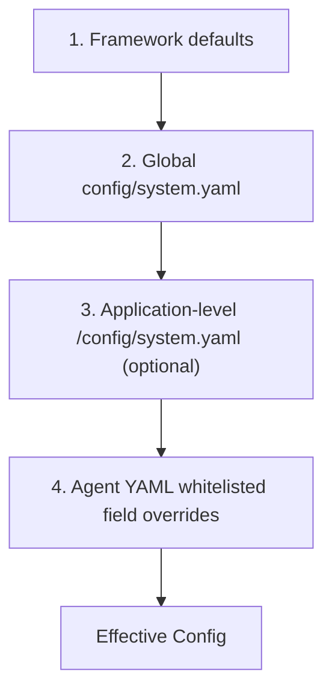

# AgentLoom Configuration System Overview

This document introduces the configuration system architecture of the AgentLoom framework, including configuration file classification, loading hierarchy, override mechanisms, and the independence of LLM configuration.

## 1. Configuration File Classification

The configuration of AgentLoom is primarily divided into three major categories, stored in different configuration files:

| Configuration File | Default Path | Role and Purpose |
|----------|----------|------------|
| `system.yaml` | `config/system.yaml` | **Global system configuration**. Controls execution environment, tool lists, tool access control, code execution permissions and other system-level behaviors. |
| `llm.yaml` | `config/llm.yaml` | **Global model configuration**. Independently manages parameters for all LLM models (`api_key`, `base_url`, temperature, timeout, retry policies, etc.) and Langfuse observability configuration. |
| `agent_xxx.yaml` | `applications/<app>/workflows/*.yaml` | **Agent configuration**. Defines a single agent's role, workflow, tools used, model type (`model_type`), etc. Worker Agents also support batch parallel invocation via the `concurrency` field (see [Agent Config 3.11](agent_config.md#311-concurrency--concurrency-configuration)). |
| *Application-level system configuration* | `applications/<app>/config/system.yaml` | **Optional application-level override**. Used to override default system behaviors for specific applications (e.g., modifying tool access control or replacing default tools). |

> For more information, refer to:
> - [Agent YAML Configuration Reference](agent_config.md)
> - [System Configuration Reference](system_config.md)
> - [LLM Configuration Reference](llm_config.md)

## 2. Configuration Loading and Merging Hierarchy (Cascade)

AgentLoom uses `LayeredConfigBuilder` to implement immutable and validation-supporting deep configuration merging. The loading process accumulates from bottom to top, with each upper layer overriding the previous one.

### Override and Merge Rules
1. **Dictionary (Dict) deep merge**: For example, merging nested `tool_access_control` fields.
2. **Scalar and list complete replacement**: If an upper layer defines a list, it directly replaces the lower layer's list without concatenation.
3. **Node validation**: Each merged layer is validated through Pydantic (`RootSettings`).

### Hierarchy Overview



#### Level 1: Global Base Configuration
The system first locates the project root directory (`agent_root`) and loads `config/system.yaml` as the global foundation.

#### Level 2: Application-level Override (App Overlay)
When loading an Agent YAML, the system automatically searches upward for its parent `applications/<app>` directory. If a `config/system.yaml` exists in that application directory, it is deep-merged on top of the global configuration.

#### Level 3: Agent-level Override
In addition to defining its own workflow, a single Agent's YAML file can override selected system configurations. The whitelisted fields that support override (`_WORKFLOW_OVERLAY_KEYS`) are:
- `system`, `model_request_headers`, `smart_summary`, `context_engine`, `tool_access_control`, `execution_env`, `code_agent`, `tools`, `shell_settings`, `tools_mapping`, `default_toolsets`, `toolsets`, `prompt`, `mcp_servers`, `self_learning`, `hooks`.

`context_engine` is intentionally small. It is enabled by the task runtime and uses the task-scoped checkpoint context store; normal overrides should only tune:

```yaml
context_engine:
  min_chars: 2000
  preview_max_chars: 3000
```

Do not add a second retrieval path or a disable switch around ContextEngine. Large tool/worker output should be restored through `loom_retrieve_context` and `ContextRef`.

### Runtime storage ownership

`runtime` and `logging` are global-only sections in `config/system.yaml`; Application-level `config/system.yaml` files and Agent YAML cannot move the runtime root or replace the logging policy. This preserves one task-discovery and retention boundary per process.

Isolated subprocesses may override the complete runtime home with `AGENTLOOM_RUNTIME_ROOT`; the override never moves self-learning alone.

```yaml
runtime:
  root_dir: ".agentloom"
  successful_run_retention_days: 7
  failed_run_retention_days: 30
  artifact_retention_days: 3
  cleanup_interval_hours: 24

logging:
  level: "INFO"
  console_enabled: true
  file_enabled: true
  max_file_bytes: 26214400
  backup_count: 3
```

Every attempt writes `.agentloom/runs/<application_id>/<run_id>/{manifest.json,logs,audit,artifacts}`. Completed attempts also retain `artifacts/result.txt`, `audit/task_tree.json`, and `audit/task_events.jsonl` when that evidence exists; `manifest.json` records their paths before a successful checkpoint is cleaned up. Resume creates a new `run_id` but keeps the logical task's `task_id`, `.agentloom/checkpoints/<application_id>/<task_id>/`, and `.agentloom/workspaces/agents/<application_id>/<agent_path>/tasks/<task_id>/`. The Agent workspace and Application-owned `output_dir` remain separate storage domains.

File logging follows `logging.file_enabled` and is bounded by size/backup count. `loom run --no-file-log` disables only the current attempt's file log; it does not disable checkpoints or Shell audit. `loom clean-runtime` applies run retention, while `loom migrate-runtime --dry-run|--apply` handles one-time legacy `.logs` migration.

## 3. Complete Isolation of LLM Configuration

In AgentLoom, **LLM configuration (`llm.yaml`) is physically isolated from system configuration (`system.yaml`)**.

### Why Isolation?
- **Prevent leakage**: Ensures sensitive `api_key` values are not accidentally written into business Agent configurations.
- **Single responsibility**: Agents only need to focus on what they should do, not on the model's underlying network request parameters.
- **Independent schema**: System configuration uses `RootSettings` validation, while model configuration uses `LLMConfig` validation.

### Isolation Mechanism
1. **Write interception**: When loading `system.yaml` or Agent YAML, the system actively filters out three top-level fields: `model`, `llm`, `langfuse`, and prints a warning.
2. **Association via `model_type`**: An Agent only specifies `model_type: "powerful"` (model classification label) in its configuration.
3. **Parameter lookup chain**:
   After `model_type` has been resolved, parameter lookup order is:
   `models[model_type].parameter` → `built-in code default values`.
   If neither the Agent YAML nor `model.default_model_type` provides a model type, the model call fails fast with `ValueError`.

## 4. Global C Singleton (Unified Access)

Regardless of how configurations are merged, both developers and the framework's underlying layers access configuration through a unique `C` singleton object. `C` encapsulates complex merging logic and provides a very simple API.

```python
from src.lib.config import C

# 1. Access system configuration
tools_list = C.get_nested("tools", "default", default=[])
is_summary_enabled = C.get("smart_summary")

# 2. Access LLM configuration
api_key = C.llm_api_key                # Reads api_key from the default model type
temp = C.get_model_config("powerful", "temperature")  # Get parameters for specific model

# 3. Access raw merged dictionary
full_dict = C.raw
```

**How it works**:
1. **Lazy loading**: On first access to `C`, it triggers finding and merging all configuration file layers from the root directory.
2. **Global caching**: The parsed results are cached in `_ACTIVE_CONFIG`, ensuring configuration consistency throughout the lifecycle.
3. **Dual storage**: The `UnifiedConfig` object internally maintains both the merged `_raw` dictionary and an independent `_llm_config` (Pydantic object).
