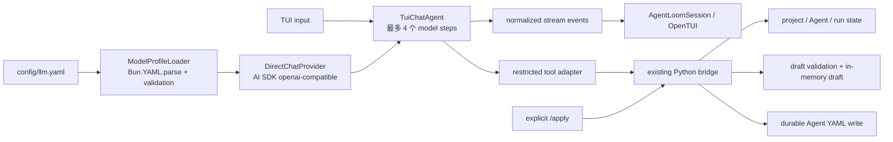

# AgentLoom TUI Chat Provider 参考与实施决策

研究日期：2026-07-18（Asia/Shanghai）

## 实施决策

源码研究最初得到的候选方案是让 TypeScript TUI 直接使用 OpenCode 同款 Vercel AI SDK。结合 AgentLoom 当前实现做完故障复现和信任边界审计后，实际采用更短的 Python sidecar 方案：

- TUI 对话已拆成独立、短回合的 `TuiChatAgent`，直接使用 OpenAI Python SDK 的 OpenAI-compatible transport；不再经过 LiteLLM、smolagents 或 AgentLoom runtime Agent。
- 复用 OpenCode 的 provider / session / 受限 tool dispatch / 有界 retry 分层，以及 Hermes 的 Python Provider Profile 与原生 OpenAI 工具循环思路；不嵌入任一完整 runtime。
- `config/llm.yaml` 仍是唯一模型目录；`openai/ep-*` 在 wire boundary 映射成 `ep-*`，`extra_body` 成员合并到请求顶层。
- 当前实现最多 6 个 provider turn、每次最多 4096 输出 token、单次请求最多 120 秒、整轮最多 300 秒；空流和可重试网络错误只额外尝试一次。这个边界给已实测的慢响应留出余量，也保证第一次超时后仍有完整的一次重试预算。
- API key、base URL 和 provider client 只存在于 Python sidecar。现有 NDJSON、内存 draft、校验、revision fingerprint 和显式 `/apply` 边界保持不变。

选择 Python 而不是下面的 TypeScript 候选，原因不是 SDK 能力差异，而是当前仓库的 Python bridge 已拥有配置、校验和原子写入信任边界。迁到 TypeScript 会让密钥进入 TUI 进程，并新增一套 tool RPC 和会话状态；对当前需求没有增加用户能力。下面保留 TypeScript 候选和上游源码依据，作为后续若彻底移除 Python sidecar 时的替代设计，而不是当前实现说明。

## 研究候选：TypeScript + Vercel AI SDK

若未来彻底移除 Python sidecar，候选方案是一个独立、短回合的 TypeScript Agent：直接使用 Vercel AI SDK 的 OpenAI-compatible provider，运行在现有 `agentloom-tui` 进程内；读取项目的 `config/llm.yaml` 选择模型；通过受限工具调用 bridge 来查看项目、Agent 和运行状态、校验草稿；只有用户执行 `/apply` 才允许落盘。

不要把完整 OpenCode 或 Hermes 当作子进程/服务嵌入，也不要继续让 TUI 对话经过 LiteLLM。最短路径是复用 OpenCode 已验证的底层 SDK 和架构边界，而不是复用其完整 coding-agent 产品。

建议第一版固定依赖：

```json
{
  "ai": "6.0.168",
  "@ai-sdk/openai-compatible": "2.0.41"
}
```

这是本次研究所固定的 OpenCode commit 正在使用的组合，而不是浮动到 latest。OpenCode 在根 catalog 固定 [`ai@6.0.168`](https://github.com/anomalyco/opencode/blob/fab213312927ea64cf968832c527206e8c944f9e/package.json#L60-L68)，并固定 [`@ai-sdk/openai-compatible@2.0.41`](https://github.com/anomalyco/opencode/blob/fab213312927ea64cf968832c527206e8c944f9e/packages/opencode/package.json#L65-L74)。等 TUI 的流式、工具调用和 provider 兼容测试稳定后，再单独评估 AI SDK 7。

## 为什么不能直接嵌入完整 OpenCode 或 Hermes

| 选择 | 能复用什么 | 引入的非需求能力 | 决策 |
|---|---|---|---|
| 完整 OpenCode | Provider、session、流式事件、工具循环 | 编码工具、权限系统、无限会话循环、压缩、服务端、持久化和动态安装 provider | 不嵌入；复用其 provider/stream/session 设计和同一底层 SDK |
| 完整 Hermes | Provider Profile、transport、工具循环、重试与 session | 第二套 Python Agent runtime、默认 90 次工具迭代、复杂 fallback/重试、CLI/gateway 和大量 Python 依赖 | 不嵌入；只借鉴 Provider Profile、归一化事件和有界循环 |
| 小型 TS Agent | 正好覆盖对话、项目观察和 Agent YAML 草稿 | 需要把密钥、配置和工具 RPC 迁入 TUI | 原候选；当前采用更短的 Python sidecar 直连方案 |

这里的“复用 OpenCode”不能理解为安装一个独立 `ChatAgent` 类。OpenCode 官方 JS SDK 的 `createOpencode()` 会先创建 server，再返回连接该 server 的 client，见 [`packages/sdk/js/src/index.ts`](https://github.com/anomalyco/opencode/blob/fab213312927ea64cf968832c527206e8c944f9e/packages/sdk/js/src/index.ts#L1-L21)；创建 server 的实现实际启动的是 `opencode serve` 子进程，见 [`packages/sdk/js/src/server.ts`](https://github.com/anomalyco/opencode/blob/fab213312927ea64cf968832c527206e8c944f9e/packages/sdk/js/src/server.ts#L22-L67)。因此直接用 OpenCode SDK 等于把完整 OpenCode runtime 带进来，并不会比 AgentLoom 所需的四个工具更简单。

OpenCode 的默认执行路径本身就是 `streamText(...)`：传入 model、messages、tools、tool choice、输出上限、abort signal，并把 AI SDK 的 full stream 转成统一事件流，见 [`session/llm.ts`](https://github.com/anomalyco/opencode/blob/fab213312927ea64cf968832c527206e8c944f9e/packages/opencode/src/session/llm.ts#L271-L378)。OpenCode 外层还有持续运行、压缩和工具调用恢复循环，见 [`session/prompt.ts`](https://github.com/anomalyco/opencode/blob/fab213312927ea64cf968832c527206e8c944f9e/packages/opencode/src/session/prompt.ts#L1081-L1135) 和 [`session/prompt.ts`](https://github.com/anomalyco/opencode/blob/fab213312927ea64cf968832c527206e8c944f9e/packages/opencode/src/session/prompt.ts#L1272-L1336)；这些是 coding agent 的能力，不是 AgentLoom TUI 的需求。

Hermes 的 `ProviderProfile` 明确是声明式配置，不负责构造 client、stream 或 retry，见 [`providers/base.py`](https://github.com/NousResearch/hermes-agent/blob/3d9be2789552a495c7adf30148e867e7614a4bdc/providers/base.py#L1-L9)。其完整 conversation loop 则默认执行到文本完成或迭代预算耗尽，见 [`conversation_loop.py`](https://github.com/NousResearch/hermes-agent/blob/3d9be2789552a495c7adf30148e867e7614a4bdc/agent/conversation_loop.py#L570-L596) 和 [`conversation_loop.py`](https://github.com/NousResearch/hermes-agent/blob/3d9be2789552a495c7adf30148e867e7614a4bdc/agent/conversation_loop.py#L684-L698)；`AIAgent` 默认上限是 90 次，见 [`run_agent.py`](https://github.com/NousResearch/hermes-agent/blob/3d9be2789552a495c7adf30148e867e7614a4bdc/run_agent.py#L418-L435)。把它作为 TUI 后端会把一个短对话问题重新变成一套重型 Python Agent 系统。

## 原候选架构（当前未采用）



边界定义：

- `ModelProfileLoader`：每次启动或 `/refresh` 时读取 `<projectRoot>/config/llm.yaml`。Bun 1.3.14 自带 [`Bun.YAML.parse`](https://bun.sh/docs/runtime/yaml)，并支持当前文件使用的 anchor/merge alias，不需要新增 YAML parser。
- `DirectChatProvider`：是唯一能接触 `api_key` 的模块。它用 `createOpenAICompatible({ name, baseURL, apiKey, includeUsage, fetch })` 创建 provider；SDK 原生支持这些设置，见 [`openai-compatible-provider.ts`](https://github.com/vercel/ai/blob/6cd7c74acf0d7ec84dd58a841fc0e20970d6f2e8/packages/openai-compatible/src/openai-compatible-provider.ts#L49-L99) 和 [`openai-compatible-provider.ts`](https://github.com/vercel/ai/blob/6cd7c74acf0d7ec84dd58a841fc0e20970d6f2e8/packages/openai-compatible/src/openai-compatible-provider.ts#L123-L179)。
- `TuiChatAgent`：持有 system prompt、消息历史、工具集合、step limit 和 abort controller；不拥有项目持久化。
- `RestrictedToolAdapter`：把模型工具调用映射到现有 bridge 的窄 RPC；bridge 继续负责 Python 侧项目索引、状态读取、定义校验和最终写入。
- `AgentLoomSession`：只消费经过归一化的事件并更新界面；API key、完整请求体和 provider client 不进入 Solid store。

这不是在 AgentLoom 里再造一个通用 Agent 框架。它是一个“Agent 设计与控制面助手”，能力边界固定为对话、观察和生成草稿。

## `llm.yaml` 直连映射

当前 `llm.yaml` 是为 LiteLLM 设计的，不能原样作为 OpenAI-compatible 请求体。模型类型（例如 `powerful`）是用户选择的 profile id；真正发到 provider 的字段需要经过下表适配。

| `llm.yaml` 字段 | TUI 内部字段/行为 | 规则 |
|---|---|---|
| `model.default_model_type` | `defaultProfileId` | 仅决定默认选择 |
| `model.<type>.base_url` | `baseURL` | 去除末尾 `/`；仅允许 HTTPS，localhost 可例外 |
| `model.<type>.api_key` | `apiKey` | 只留在 provider closure；禁止日志和 DTO |
| `model.<type>.model` | `wireModel` | 不可盲目原样透传，见下文 |
| `temperature` | `temperature` | 有值才传 |
| `max_tokens` | `maxOutputTokens` | TUI 默认上限 16,384；以后可增加 `tui.max_output_tokens` 显式覆盖 |
| `tool_choice` | `toolChoice` | 只允许 `auto`、`none`、`required` |
| `extra_body` | provider-specific options | 合并其成员到 provider 请求扩展，不发送一个字面量 `extra_body` 字段 |
| `timeout` | TUI timeout policy | 当前值单位为秒；只作为上限，不直接继承 300 秒等待体验 |
| `num_retries`、`retry_delay`、`max_retry_delay` | 不继承 | 它们属于后台 Agent/LiteLLM 策略 |
| `requests_per_minute`、`context_cache` | 不发送 | LiteLLM/应用侧字段，不是通用 Chat Completions 参数 |

### 模型 ID 必须解耦

当前已配置 profile 使用 `openai/ep-...`。`openai/` 是 LiteLLM 的路由前缀；火山方舟官方示例直接把实际 model/endpoint id 发给 `https://ark.cn-beijing.volces.com/api/v3`，不带该前缀，见[火山方舟官方调用示例](https://www.volcengine.com/docs/82379/1795150)。因此推荐给 profile 增加明确字段，而不是长期依赖字符串猜测：

```yaml
model:
  powerful:
    transport: openai-compatible
    model: "openai/ep-..."     # 现有后台 Agent/LiteLLM 仍可使用
    wire_model: "ep-..."       # TUI 直连使用
```

为了不要求用户立刻改配置，迁移期可采用严格兼容规则：仅当 `transport == openai-compatible`、没有 `wire_model`、且 `model` 只有一个前导 `openai/` 时，去掉这一个前缀并在诊断信息中标为 legacy mapping。不要泛化为删除任意 provider 前缀；例如 `gemini/...`、OpenRouter model id 可能就是 wire protocol 的一部分。

OpenCode 也区分 UI/config model id 和 provider API model id，并把后者传入实际 provider，见 [`provider.ts`](https://github.com/anomalyco/opencode/blob/fab213312927ea64cf968832c527206e8c944f9e/packages/opencode/src/provider/provider.ts#L1431-L1450)。

### `extra_body` 不能照搬字面结构

LiteLLM 的 `extra_body` 表示“把内部成员附加到 provider 请求”。AI SDK openai-compatible provider 同样允许 provider-specific options，并把未知扩展成员合并进请求 body，见 [`openai-compatible-chat-language-model.ts`](https://github.com/vercel/ai/blob/6cd7c74acf0d7ec84dd58a841fc0e20970d6f2e8/packages/openai-compatible/src/chat/openai-compatible-chat-language-model.ts#L285-L322)。因此当前配置的：

```yaml
extra_body:
  thinking:
    type: enabled
```

应生成顶层请求字段 `thinking: { type: "enabled" }`，而不是 `extra_body: { ... }`。Hermes 也明确区分 provider-specific extra body 与 top-level kwargs，见 [`providers/base.py`](https://github.com/NousResearch/hermes-agent/blob/3d9be2789552a495c7adf30148e867e7614a4bdc/providers/base.py#L119-L146)。所有扩展字段必须有 allowlist 或 schema 校验，避免把 LiteLLM 控制字段误发给模型端点。

## 小型 ReAct/工具循环

第一版只开放以下模型工具：

1. `get_project_overview`：读取项目内 Agent system、当前运行和摘要。
2. `get_agent_detail`：按稳定 ID 查看 Agent 定义和最近状态。
3. `get_run_detail`：查看一次执行的完整状态、步骤和错误。
4. `submit_agent_draft`：提交内存草稿，调用现有 definition validation，返回结构化错误；不写磁盘。

约束：

- 最多 4 个 model steps；在建议固定的 AI SDK 6 中对应 `stopWhen: stepCountIs(4)`。最后一步必须回答或提交草稿。
- 不开放 shell、任意文件读写、代码编辑、网络搜索或启动长任务。
- 模型工具只能读取 bridge 已建立的安全投影，不能接收任意路径。
- `submit_agent_draft` 只改变当前 TUI session 的内存状态。
- `/apply` 是用户命令，不注册为模型工具。只有它可以触发现有原子写入流程。
- 新请求或 Ctrl-C 触发 `AbortController.abort()`，清理未完成的 tool call 并保留可读的中断状态。

Hermes 的可借鉴点是统一内部 message/tool 格式和明确 tool loop：其官方开发文档说明 provider 格式最终汇合到统一消息结构，并在 tool call 后继续循环、文本回答后结束，见 [`agent-loop.md`](https://github.com/NousResearch/hermes-agent/blob/3d9be2789552a495c7adf30148e867e7614a4bdc/website/docs/developer-guide/agent-loop.md#L41-L90)。不要采用 Hermes 默认 90 steps、subagent、memory、fallback provider 等更大能力。

## 流式事件与会话状态

provider 层只向 UI 发布以下联合类型：

```ts
type TuiChatEvent =
  | { type: "status"; state: "thinking" | "tool" | "retry" }
  | { type: "text-delta"; delta: string }
  | { type: "reasoning-delta"; delta: string }
  | { type: "tool-start"; callId: string; name: string }
  | { type: "tool-result"; callId: string; name: string; ok: boolean; summary: string }
  | { type: "finish"; usage?: Usage; finishReason: string }
  | { type: "error"; error: SafeProviderError }
```

这对应 OpenCode 的关键做法：provider full stream 在边界处转成统一事件，而 message/part 更新再发布给 session，见 [`session/llm.ts`](https://github.com/anomalyco/opencode/blob/fab213312927ea64cf968832c527206e8c944f9e/packages/opencode/src/session/llm.ts#L357-L378) 和 [`session/session.ts`](https://github.com/anomalyco/opencode/blob/fab213312927ea64cf968832c527206e8c944f9e/packages/opencode/src/session/session.ts#L631-L645)。

V1 使用现有 TUI session 内存保存消息、tool parts、usage 和 draft 即可，不必为了短会话引入 SQLite。关闭 TUI 后恢复历史不是当前核心需求；若以后需要，再按 Hermes 的 sessions/messages 分离模式增加本地持久化，参考 [`hermes_state.py`](https://github.com/NousResearch/hermes-agent/blob/3d9be2789552a495c7adf30148e867e7614a4bdc/hermes_state.py#L745-L843)。

## 重试、超时与错误可观测性

短对话不能继承 `num_retries: 10000`。推荐策略：

- AI SDK `maxRetries: 0`，由 TUI 外层负责一次可见重试，即总共最多 2 次请求。
- 只重试网络中断、408、429 和 5xx；不重试 400、401、403、404、配置错误、schema/tool 参数错误和上下文溢出。
- 尊重 `Retry-After`，但 TUI 单次等待最多 10 秒；超过就直接给出可操作错误。
- 不在 TUI 外层按“无文本输出”计时中止 turn；tool、permission、question、retry 与子 Agent 都可能长时间没有文本 token。由 OpenCode Session 的 status/retry/permission/question 生命周期负责运行状态与恢复，用户用 Esc 显式中断。
- UI 在重试等待期间显示 attempt、原因和下一次时间，不能表现成冻结。

Hermes 在外层控制复杂 retry 时会显式关闭 OpenAI SDK 自带 retry，防止内外重试相乘，见 [`run_agent.py`](https://github.com/NousResearch/hermes-agent/blob/3d9be2789552a495c7adf30148e867e7614a4bdc/run_agent.py#L4197-L4223)。OpenCode 同样把 AI SDK retry 设为外部传入或 0，并在 processor 层发布 retry 状态，见 [`session/llm.ts`](https://github.com/anomalyco/opencode/blob/fab213312927ea64cf968832c527206e8c944f9e/packages/opencode/src/session/llm.ts#L313-L324) 和 [`session/processor.ts`](https://github.com/anomalyco/opencode/blob/fab213312927ea64cf968832c527206e8c944f9e/packages/opencode/src/session/processor.ts#L635-L676)。其重试分类会跳过 context overflow、重试 transient/5xx 并读取 `Retry-After`，见 [`session/retry.ts`](https://github.com/anomalyco/opencode/blob/fab213312927ea64cf968832c527206e8c944f9e/packages/opencode/src/session/retry.ts#L26-L75)。

当前界面只显示 `Builder model call failed`，丢失了定位根因所需的信息。新的 `SafeProviderError` 至少包含：

```ts
type SafeProviderError = {
  profileId: string
  wireModel: string
  endpoint: string       // 只保留 protocol + host + path，删除 query/userinfo
  status?: number
  code?: string
  requestId?: string
  attempt: number
  retryable: boolean
  message: string        // 清洗后的 provider 摘要
}
```

禁止进入错误、日志、DTO 或测试 snapshot 的内容：API key、Authorization header、完整请求 body、环境变量值和 provider client 配置对象。配置加载时应先检查缺失/占位 `base_url`、`api_key`、`model`，把配置错误和远端调用错误分开显示。

## 推荐落地顺序

1. 在 `agentloom-tui` 增加纯函数 `ModelProfileLoader` 及 fixture tests；验证 YAML anchor、默认 profile、legacy `openai/` mapping、secret redaction 和占位配置。
2. 增加 `DirectChatProvider`，先用 mock fetch 验证 URL、wire model、extra body、abort、stream event、HTTP error 和一次重试。
3. 增加 `TuiChatAgent` 和 4-step stop condition；工具全部走窄 bridge adapter。
4. 把当前 UI 的 `assistant.send` 从 Python `src/tui_bridge/builder.py` 切到本地 `TuiChatAgent.send()`；Python bridge 只保留 project/runtime/validation/draft/apply RPC。
5. 用当前 `powerful` profile 做一条真实 smoke test：普通问答、项目观察、生成有效 Agent YAML、取消请求、401、429 和 5xx。
6. 完成等价测试后，让 TUI 不再引用 Python builder/LiteLLM 路径；是否删除旧 builder 另开清理变更，避免和迁移混在一起。

验收标准不是“能返回一句话”，而是：模型选择来自同一个 `llm.yaml`；普通对话和 Agent YAML 草稿都可用；项目/Agent/运行状态工具可点击追踪；任何失败都显示已清洗的 provider 根因；模型永远不能绕过 `/apply` 写盘。

## 许可证与复用边界

- OpenCode 固定 commit：[`fab213312927ea64cf968832c527206e8c944f9e`](https://github.com/anomalyco/opencode/tree/fab213312927ea64cf968832c527206e8c944f9e)，许可证为 [MIT](https://github.com/anomalyco/opencode/blob/fab213312927ea64cf968832c527206e8c944f9e/LICENSE)。可以复制、修改和分发，但复制其代码时必须保留版权与许可声明。
- Hermes 固定 commit：[`3d9be2789552a495c7adf30148e867e7614a4bdc`](https://github.com/NousResearch/hermes-agent/tree/3d9be2789552a495c7adf30148e867e7614a4bdc)，许可证为 [MIT](https://github.com/NousResearch/hermes-agent/blob/3d9be2789552a495c7adf30148e867e7614a4bdc/LICENSE)。其 runtime 要求 Python 3.11–3.13，并直接依赖 OpenAI SDK、httpx、tenacity、PyYAML 等，见 [`pyproject.toml`](https://github.com/NousResearch/hermes-agent/blob/3d9be2789552a495c7adf30148e867e7614a4bdc/pyproject.toml#L8-L53)；这也是不把完整 Hermes 嵌入 TS TUI 的实际原因。
- Vercel AI SDK 固定研究 commit：[`6cd7c74acf0d7ec84dd58a841fc0e20970d6f2e8`](https://github.com/vercel/ai/tree/6cd7c74acf0d7ec84dd58a841fc0e20970d6f2e8)，许可证为 [Apache-2.0](https://github.com/vercel/ai/blob/6cd7c74acf0d7ec84dd58a841fc0e20970d6f2e8/LICENSE)。作为依赖使用即可；若复制或修改其源码，保留许可证、实际随包分发的 NOTICE，并在修改文件中标记变更。

推荐“依赖 AI SDK + 自己写薄 adapter”，而不是复制 OpenCode/Hermes 大段源码。这样开源复用最充分，同时升级、许可证归属和 AgentLoom 的产品边界最清楚。
