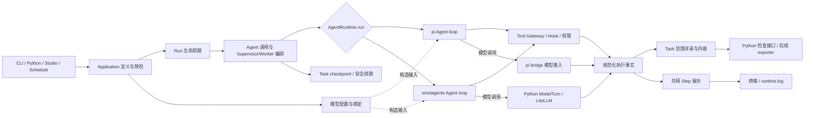

# AgentLoom 能力架构与开发顺序

状态：架构分析稿。本文描述职责和开发顺序，不作为实现进度报告。Step、执行详录和大工具结果的行为约束以 [统一 Step 观测 Spec](unified-step-observability-and-large-tool-results.md) 为准；YAML 任务与连续会话以 [Agent 任务 Spec](native-agent-prompts-and-structured-subagents.md) 为准。

## 1. 从用户任务出发

AgentLoom 要让用户**定义一个多 Agent Application，验证它，安全地运行它，看清每一步，并在中断后继续同一个 Task**。CLI、Python、Studio 和定时任务只是进入或查看这一过程的方式；pi、smolagents 是运行 Agent loop 的两种实现。项目的主干不应由界面或底层框架决定。

构造时先解析模型配置，再把模型绑定和工具入口交给具体 Agent runtime；运行时由 Agent loop 决定何时调用模型或工具。这是两种方向，放在同一条顺序线会误导：

`app.agent` 负责装配和发起调用；图中的 pi/smolagents Agent loop 才是实际决定下一轮模型请求和工具调用的 Agent。模型绑定在构造时进入 Agent；模型请求在执行时从 Agent 发出。Hook 和 Tool Gateway 决定能否执行；checkpoint 决定从何处继续；执行详录证明实际发生了什么。日志与 Studio 是证据的投影。

## 2. 统一对象与寿命

| 对象 | 含义及关系 | 所有权与寿命 |
| --- | --- | --- |
| Project / Application | Project 包含 Application；YAML 定义包含 Supervisor、Worker、各自任务、模型、工具、Skill、Hook 和权限 | `config` + `app.definition`；一个 Task 的续跑固定定义修订版 |
| Task | 一次逻辑任务，可跨多次运行尝试 | Task ID 在续跑时不变；checkpoint、#79 内容引用和详录按 Task 关联 |
| Run | 一次执行尝试 | 每次新建 Run ID；`app.lifecycle` 最终结算；manifest、日志和本次审计属 Run |
| Agent invocation | Supervisor 或 Worker 的一次调用，形成父子树；YAML 任务列表在该 Agent 会话中逐项执行 | `app.invocation` 创建身份与上下文；每个调用有自己的局部 Step 序列及任务项进度 |
| Step / Model turn / Tool call | 一次模型轮次及其工具批次为一个 Step；Run 内展示编号连续，Agent 本地轮次用于 Hook/checkpoint 关联；并行工具以 call ID 区分，传输重试为 attempt | runtime adapter 报告事实，#79 的共用观测模块规范化并存储 |
| Tool result / payload reference | 工具原结果、模型可见结果及其关联；大结果通过不透明引用读取 | Tool Gateway 治理最终调用；#79 Task 范围内容存储保存完整内容，不借用 ContextStore |

## 3. 先定能力，再定模块

| 能力与用户可见结果 | 当前负责模块和已有接口 | 需要怎样开发或收敛 |
| --- | --- | --- |
| **定义、发现、预检**：同一份定义在所有入口解释一致，错误发生在 Run 分配前 | `config` 负责配置分层；`app.definition` / `app.validation` 负责定义快照、拓扑和能力验证 | 保留统一预检入口；Studio、CLI、Schedule 只调用它，不复制 YAML 规则。继续验证只读检查不会创建 Run、启动 MCP 或调用模型。 |
| **Run 生命周期**：拿到 Task/Run ID、状态、结果和可靠的失败原因 | `app.runner.execute_app`、`app.lifecycle`、`app.run`；`execution.context` 负责路径和存储上下文 | `app.lifecycle` 继续是唯一终态提交者。新证据写入必须纳入成功判定；CLI、Studio、Schedule 只消费同一 Run receipt。 |
| **Agent 编排**：Supervisor 调 Worker，输入/输出契约和父子身份一致 | `app.agent`、`app.factory`、`app.invocation`；Worker 被注册为 Tool；`execution.checkpoint.coordinator` 跟踪 Worker 调用 | 编排只决定调用关系和契约；不复制 runtime loop。把身份、父子关系、Step 所属调用写入共用事实模型。当前几个大文件按责任逐步收敛，不先做全仓搬迁。 |
| **Agent loop 与模型**：选择 pi 或 smolagents 执行相同的 Application 能力 | `execution.agent_runtime` 的 Definition/Request/Result/Capabilities；`app.agent` 构造时传入模型绑定；`runtimes/pi`、`runtimes/smolagents` 各自运行 loop；模型出口分别位于 pi bridge 与 Python ModelTurn/LiteLLM | 保持完整 Agent 调用的 runtime 接口。模型配置在构造阶段注入；执行阶段由 loop 发起模型调用。两个 adapter 在各自实际模型请求边界采集输入/回复并转换为同一种事实；能力差异在预检时明确拒绝。 |
| **工具、Hook 与权限**：只有授权后的参数产生副作用，结果可关联到 call ID | `tools` 负责目录与选择；`integrations/mcp` 连接外部工具；`execution.tool_gateway`、`execution.hooks`、`execution.permissions`、原生工具宿主负责执行治理 | Tool Gateway 仍是平台工具的最终提交点。Hook 保持变换、授权、观察和 Stop 决策；记录其结果，但不新增 Step Hook，也不把 Hook 记录当成完整审计。pi 原生工具需同样给出已提交结果。 |
| **上下文与大结果**：模型不会被超长工具输出淹没，仍能按需取回全文 | `execution.context_engine` 现在做压缩与有限缓存；`loom_retrieve_context` 提供现有取回能力 | #79 新增独立 Task 范围、不可变的全文存储与引用；先写成功再把预览和引用发给模型。模型可见投影由上下文预算和 bridge 字节预算决定；复用受限读取入口，按字节分页/搜索。ContextStore 继续做可淘汰的上下文缓存。 |
| **观测与检查**：两个 runtime 的 Step 文本一致，能查到模型实收内容和工具原文 | 现有 `RuntimeEvent`、`execution.logging`、smolagents logger、pi session 事件、Run 审计；目前分散且粒度不足 | #79 在 `execution` 下设置一个共用观测 owner：版本化执行事实、必需的本地 recorder、内容索引、Python 检查接口、smolagents 风格 presenter。adapter 仅翻译事实；终端和 runtime.log 消费同一展示；未来 exporter 消费事实与引用。现有用户 event sink 仍是可失败而不阻断的观察者，不能充当必需 recorder。 |
| **checkpoint 与恢复**：从最近安全状态继续，不重复已提交副作用 | `execution.checkpoint`、`runtimes/*` 的状态编解码；Run 与 Task 分离 | 运行态仍由 checkpoint 保存，不能从审计文本重建 Agent。#79 的引用跨 Run 有效；恢复前校验内容完整性与已提交 Tool 记录。历史 Step 可查看，但不承诺任意 Step 重跑或外部模型确定性复现。 |
| **Goal 与长期记忆**：显式完成目标，经验需要审核后入库 | `execution.goal`、`self_learning`；后者现通过 Hook 记录部分事件并独立审核 | 这些是可选能力，继续复用 Run、Tool、checkpoint 身份。自学习的审核与提升保持独立；未来若消费 #79 事实，只作受控投影，不成为第二套执行真相。 |
| **交付入口与自动化**：人和机器看到同一状态 | `app.cli`、`app.studio`、Studio adapter、`schedules` | text 模式可展示完整的小工具结果及大结果预览；JSON/JSONL stdout 保持原有机器协议。Schedule 通过规范 Run 入口执行，Studio 读同一证据；#79 首轮不增加 Studio trace 页或新 CLI 命令。 |

模块依赖方向应是：`app` 组合 `config` 与 `execution` 的接口；`runtimes/*`、`integrations/*`、`tools` 在明确接口处提供实现；CLI、Studio、Schedule 消费 `app` 的公开结果。`execution` 不能为了通用 Step 展示而依赖 smolagents。这里的“共用观测 owner”是拟设职责，不表示当前已有完整实现或要求立刻改目录。

### AgentRuntime 与现有 Hook 的分工

| 时点 | 现有机制 | 可以改变什么 |
| --- | --- | --- |
| 工具执行前 | `PreToolUse` → 严格校验 → CoreToolGuard | Hook 可以变更输入或阻止调用；最终参数经再次校验，受框架权限约束。 |
| 工具成功后 | 生成 `ToolCallRecord(completed)` → `PostToolUse` | Hook 可以观察、发下一轮 Agent 上下文或用户消息；不能改写已完成的结果。 |
| 工具执行或输出校验失败后 | 生成 `ToolCallRecord(error)` → `PostToolUseFailure` | Hook 可以观察并给下一轮 Agent 上下文；不能把失败改成成功、替换结果或自动重试。 |
| 调用在执行前被阻止 | `ToolCallRecord(blocked)` | 不产生工具副作用，也不触发 `PostToolUseFailure`；可作为独立结果交还 Agent。 |
| Agent 提出最终答案时 | `Stop`；失败时可有 `StopFailure` 观察 | `Stop` 可以拒绝结束，让 runtime 继续；观察事件不结算 Run。 |

`AgentRuntime` 仍负责 Agent loop：组装每轮模型上下文、调用模型、解析/并行调度工具、把成功或错误投影给模型、处理模型重试与输出纠错、维护 Step/用量、保存 runtime checkpoint，以及向 Application 报告终态。pi 平台工具经 Tool Gateway；pi 原生文件/Shell 工具经 `NativeToolHost`，两条路径均调用现有 Hook 并产生 `ToolCallRecord`。smolagents 的工具调用经 Tool Gateway。提交状态不确定的工具不能凭 `PostToolUseFailure` 自动重试。

因此 #79 复用 Hook 的决策及结果，也读取 runtime 的模型/Step 事实；完整执行详录必须有独立的必需记录通道。现有 Hook 没有实际模型请求事件；Post observer 允许失败后继续，HookRun 的结果快照也有容量上限，不能承担“成功 Run 必有完整 trace”的保证。

### #79 的最小 Hook 适配

现有接线继续使用：smolagents 已选工具 → `ToolGateway`；pi 已选平台工具 → `ToolGateway`；pi 已选原生文件/Shell 工具 → `NativeToolHost`。三个路径都使用当前调用的 `HookRun`，并产生终态 `ToolCallRecord`。pi bridge 的 `tool_call` / `message_end` 适配只负责在 SDK 执行前拿到最终授权参数；成功和失败后的 Hook 由 Python 执行边界派发，避免两边各派发一次。两个 runtime 的 Stop 继续调用同一个 Hook 规则。未选工具、模型故障和 bridge 协议故障属于 runtime 错误，不伪装成工具执行失败 Hook。

新增工作限定在三处：

1. 在 `ToolGateway` / `NativeToolHost` 已有的终态出口取 `ToolCallRecord`，在 Pre/Stop 调用处取有效决策，交给 #79 的必需 recorder。录入调用必须位于 Post observer 的失败忽略区之外，让本地写入故障真正使 Run 失败；不把持久写入塞进 `HookRun.dispatch` 或有界诊断快照。Tool 被 `blocked` 时记为独立结果，不伪装成 `PostToolUseFailure`。
2. 从 pi session 的模型轮次和 smolagents 已有 Step callback 取得 Step 身份，把 Tool call ID 关联到 Step。pi 当前没有更新 `HookRun.step_number`（默认是 0）；如果 Hook 上下文声明提供真实 Step 编号，只补这一处同步并验证并行调用与续跑，不新增 Step Hook。
3. 实际模型请求/回复仍在各自模型出口采集。Hook 没有模型请求事件，不通过模拟一个 `ModelUse` Hook 来补。

验收沿用 Application 级测试：同一工具调用的 Pre、成功/失败 Post 各最多一次；修改后的参数才执行；阻止调用没有副作用也没有失败 Post；pi 与 smolagents 的 Stop 续跑一致；观察 Hook 失败不覆盖原工具错误；必需 recorder 失败按 #79 使 Run 失败。无需新 Hook 配置字段、通用 SDK Hook 转发层或第二套工具失败策略。

## 4. 为什么现在看着乱

1. **一次执行被多种记录分别描述。** `RuntimeEvent` 目前只有宽泛的 `run/model/tool/...` 类别和自由 `details`，无法直接表达稳定的 Step、attempt、父子身份及实际模型请求；Run/Task 事件、Hook outcome、runtime.log 又各有用途。需要定义一个可信的执行事实源，再派生视图。
2. **运行展示与 runtime 绑在一起。** smolagents 的 `EnhancedAgentLogger` 继承上游 logger；pi bridge 另发 session 事件。共用展示不能依靠复制两套 logger 代码，应在 adapter 翻译后统一渲染，沿用 smolagents 的视觉格式。
3. **可恢复状态、上下文缓存、审计内容寿命不同。** 成功时 checkpoint 可删除；ContextStore 有条数淘汰/可过期；runtime.log 会轮转。它们都不能作为大结果全文的唯一保存位置。
4. **运行 owner 太分散。** `app.agent`、`factory`、`invocation`、`runner`、`lifecycle` 各自体量较大。先确定预检、构造、调用、终态这四种责任及其接口，再逐块整理；仅重命名或移动目录不会消除重叠决策。
5. **模型接入的实际路径不同。** smolagents 使用 Python 模型 binding/LiteLLM；pi 使用 Node bridge 的模型会话。#79 要求的“实际请求”必须分别在真实出口采集，然后归一；不能仅记录上层计划请求。

## 5. 开发顺序与统一验收

| 顺序 | 交付内容 | 对外可验证的完成条件 |
| --- | --- | --- |
| 0. 固定契约 | 明确对象身份、Step 语义、Tool 原文/模型投影、写入失败及保密规则；现有预检和 Run receipt 不变 | 同一 Application 可用两个 runtime 预检；失败不分配 Run；Run/Task ID 及终态只有一个解释。 |
| 1. 建立执行事实与持久内容 | #79 的版本化事实、必需 recorder、Task 范围索引和不可变 payload；与 best-effort event sink 分离 | 用同一 call ID 查到最终参数、原结果、模型可见结果、所属 Step/Run；写失败使 Run 失败；无新 DB。 |
| 2. 接入工具与模型边界 | 在 Tool Gateway/原生工具结果处完成落盘和投影；pi/smolagents 在各自真实模型出口采集请求与回复；提供有界取回 | 普通结果完整进入模型；超大多行和单行结果均能分页复原；pi bridge 不传回无上限原文；已提交工具只执行一次。 |
| 3. 统一展示和检查 | 共用 smolagents 风格 presenter、Python Step 检查接口；CLI text 和 runtime.log 读取同一事实 | 两 runtime 与 Worker 均展示 New run、Step、Tool arguments、Observations、耗时/token、错误；每个已完成任务项的实际最终答案至多展示一次，不合成缺失回复。Observations 与模型可见结果按脱敏规则一致；JSON/JSONL 不混入人读文本。 |
| 4. 续跑与故障验证 | 将内容引用和已提交效果校验接进最近安全 checkpoint 恢复 | 新 Run ID 沿用 Task ID 和引用；缺失/损坏引用明确失败；中断与续跑不重复已提交副作用；成功清理 checkpoint 后仍可检查历史内容。 |
| 5. 按证据整理代码 | 在上述接口稳定后收敛 `app` 内预检/构造/调用/终态的重叠、移除仅转发的层；预留 exporter adapter | 相同外部行为与验证继续通过；新增 runtime 或 exporter 不要求改 CLI、Studio 或 Hook 决策逻辑。 |

第 1–4 步属于 [#79](https://github.com/linora-u/AgentLoom/issues/79) 的实现范围；第 5 步是架构整理，需按实际重复责任分拆小变更，避免把整个项目重写绑到 #79 上。Langfuse 等远端 exporter 只预留接口，首轮不接入；远端失败不得阻断 Run。

## 6. 尚须在实现时明确的接口细节

- **脱敏与“完全一致”的含义**：先按统一规则脱敏，再形成唯一的模型可见文本；详录保存该文本，Observations 原样显示，不在打印时二次摘要或遮盖。未按长度截断的脱敏结果单独保存，其检查权限与脱敏范围进入内容接口测试。
- **提交顺序**：工具有副作用时，“工具已提交、payload 写失败”必须有明确失败和恢复记录；不得生成悬空引用，也不得因下一次 Run 重复执行该工具。
- **并发顺序**：并行工具、Worker 和重试需要稳定的全局序号与局部 Step 编号；不能用日志到达顺序推断父子或因果关系。

## 7. 现状核对入口

- Application 预检、Run 结算和调用链：[definition.py](../../src/app/definition.py)、[runner.py](../../src/app/runner.py)、[lifecycle.py](../../src/app/lifecycle.py)、[invocation.py](../../src/app/invocation.py)。
- runtime 接口和两套实现：[agent_runtime.py](../../src/execution/agent_runtime.py)、[pi/runtime.py](../../src/runtimes/pi/runtime.py)、[smolagents/runtime_adapter.py](../../src/runtimes/smolagents/runtime_adapter.py)。
- 工具决策与当前有限记录：[tool_gateway.py](../../src/execution/tool_gateway.py)、[hooks/runtime.py](../../src/execution/hooks/runtime.py)、[context_engine/store.py](../../src/execution/context_engine/store.py)。
- 现有状态和寿命：[Checkpoint 文档](../en/checkpoint.md)、[Run 可观测性文档](../en/run_observability.md)、[架构迁移清单](architecture-migration-inventory.md)。
