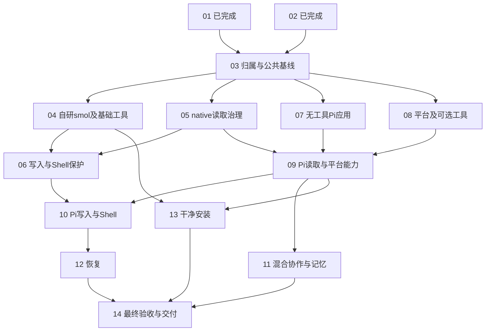

# Pi 接入：票据、串行门禁与并行 worktree

更新：2026-09-20。来源：[核心规格](../../specs/agent-runtime-pi-integration.md)、维护者最新确认的 [工具与基座归属](tool-ownership.md)。文件所有权与交付流程见 [worktree 计划](worktree-plan.md)。

## 当前状态与开发边界

**先看当前进度，再看依赖图。** 01–05、07 已有本票完成记录；08 在已有 worktree 开发，06、09–14 尚待执行。04、05、07 已合入同一 integration，06 的前置已满足；09 仍等待 08。14 项都是完整交付的必做项，“可并行”不表示可省略。

- 01、02、03 已完成；保留 [01/02 集成验收](01-02-integration.md) 和 [03 实现与验收](03-implementation.md)，本轮不重做。03 记录的回归结果为 4225 passed、1 skipped，真实 Pi SDK 13 passed；这是历史基线结果，不是本次文档修改重新运行的结果。
- 本次核对时，03 冻结引用为 `9e19d18285f2d2ea8e7b7d11c26e315760d153a3`；main HEAD 为 `9d5a88915efbd402d0f2697318125933fc1500e0`。两个提交之间只增加研究文档；当前 main 另有未提交源码和文档 Changes，不能把 HEAD 与工作目录混为一谈。
- 05、07 已交付 main Changes，t05、t07 worktree 已清理。07 固定引用 `refs/agentloom/ticket07-frozen` 为 `eca311eeca103dc6cd64eef959428e8b01eb22b2`；集成提交 `0b5c4f4ed32244ef97b107361dcb45dbe2be149e` 包含 05+07。07 在 main 上与 04/05 组合的 97 项测试及 1 个真实 Application 均通过，见 [07 交接](07-implementation.md)。
- 04 已完成集成交付，t04 worktree 已清理；6 个阶段提交保留。`refs/agentloom/ticket04-05-integrated` 提供包含 04/05/07 与最新票据的冻结入口，见 [集成交付](04-05-integration.md)。08 继续已有工作区。

| 当前下一步 | 能否开新实现 session | 放行条件 |
| --- | --- | --- |
| 06：公共写入/Shell 保护 | 现在可新开 worktree，与 08 并行 | 从 `refs/agentloom/ticket04-05-integrated` 解析 SHA，接收 04 保护调用点与 05 接口 |
| 08：平台与可选工具解耦 | 继续已有 session/worktree | 本票开发中，不另开重复实现 |
| 09：Pi 工具调用 | 现在不启动实现 | 等 05+07+08 集成验收；随后可与 06 并行 |
| 10–14 | 按各票前置依次解锁 | 不提前建一批停在旧基线上的工作区 |

职责按下面的表落实，完整约束见 [工具归属](tool-ownership.md)：

| 谁负责 | 内容 | 实施票据 |
| --- | --- | --- |
| AgentLoom | YAML、Application/Supervisor/Worker、Run、Goal、长期记忆、历史与证据、公共权限与 Hook | 05/06、08、11 |
| 自研 smol Agent | 单 Agent 循环、模型调用、规划/压缩、Todo、基础文件/搜索/Shell 工具及私有状态 | 04，收入 `src/adapters/smolagents/` |
| Pi 基座 | 自身循环、会话、压缩和官方基础工具 | 07/09/10/12 接入，基础工具不复用 smol 实现 |
| adapter | 参数与工具定义转换、平台能力注册、事件映射、取消/关闭、原生状态关联 | smol 的 04；Pi 的 07/09/10/12 |
| 可选扩展 | AST/LSP、大纲、Markdown、业务工具；MCP 负责外部工具接入 | 08，按选择加载 |

**不是“Pi 用官方基础工具，其余仓库工具全部变成平台工具”。** 现有工具中属于自研 Agent 的基础实现随 04 收拢；真正跨基座的能力由 08 暴露。记忆沿用已有默认规则，不新增必填 YAML；不开发 Studio。

**技术上的首个并行窗口是 04、05、07、08。** 其中已完成的票不重做。它们使用包含 03 的已验证基线；允许已核对的后继提交，不要求退回旧 SHA。具体文件修改权见 [文件交接](03-file-ownership.md)。

| 开工窗口 | 开哪些 session / worktree | 串行约束 |
| --- | --- | --- |
| 已完成的串行前置 | 03 | 公共合同与兼容基线已通过验收 |
| 03 之后的首个窗口 | 04、05、07、08 分别开发；目前只剩 08 未完成本票验收 | 基线包含 03；四路不共改公共入口 |
| 各自前置完成 | 06 与 09 可并行 | 06 等 04+05；09 等 05+07+08 |
| 09 完成后 | 11 可启动；10、13 按各自前置启动 | 10 还等 06；13 还等 04；三者可并行 |
| 10 完成 | Pi session 继续做 12 | 可与仍在进行的 11、13 并行 |
| 全部分支完成 | 协调 session 做 14 | 等 11+12+13，验收后交付 main Changes 并清理 worktree |

这是开工窗口，不是要求整批等待的阶段。每张票的 **Blocked by** 定义任务依赖，03–14 的 **Unlocks** 列出它完成后推进的直接下游；下游的其他前置仍需满足。

## 1. 每票交付与前置条件

| 任务 | 交付结果 | 前置任务 | 执行安排 |
| --- | --- | --- | --- |
| [01](01-pi-sdk-compatibility.md) | 发布版 Pi SDK Hook/恢复验证 | 无；已完成 | 不重开 |
| [02](02-runtime-compatible-expansion.md) | 公共运行契约兼容扩展 | 无；已完成 | 不重开 |
| [03](03-freeze-integration-contracts.md) | 工具归属、兼容装配、公共合同及可并行基线 | 01、02；已完成 | 已验收并固定交接引用 |
| [04](04-smol-native-boundary.md) | 收拢完整自研 smol Agent、基础工具与资源状态 | 03 | 独立 worktree；可与 05、07、08 并行 |
| [05](05-governed-native-read.md) | native 读取经公共治理、执行和持久结算 | 03 | 独立 worktree；可与 04、07、08 并行 |
| [06](06-write-shell-governance.md) | 提取/接入公共写入和 Shell 保护 | 04、05 | 治理链串行；可与 07、08、09 并行 |
| [07](07-pi-application-no-tools.md) | 真实无工具 Pi Application、原生模型与取消 | 03 | 独立 worktree；可与 04、05、08 并行 |
| [08](08-portable-platform-tools.md) | 平台工具、可选专业工具及 MCP 脱离 smol 构造 | 03 | 独立 worktree；可与 04、05、07 并行 |
| [09](09-pi-read-and-platform-tools.md) | Pi 原生读取、平台/可选工具回调与 Goal | 05、07、08 | Pi 链串行；可与 06 并行 |
| [10](10-pi-write-shell-artifacts.md) | Pi 官方写入/Shell 的保护、产物和证据 | 06、09 | Pi 链串行；可与 11、13 并行 |
| [11](11-mixed-agents-memory.md) | 双向混合基座、多 Worker 隔离与长期记忆复用 | 09 | 独立 worktree；可与 10、12、13 并行 |
| [12](12-pi-recovery-journal.md) | 原生会话与工具双日志恢复 | 10 | Pi 链串行；可与 11、13 并行 |
| [13](13-clean-install-profiles.md) | Pi-only/smol 干净安装、发行资源和失败路径 | 04、09 | 独立 worktree；可与 10、11、12 并行 |
| [14](14-final-integration-main.md) | 清理过渡接口、最终验收、交付 main Changes | 11、12、13 | 最后串行收口 |

完成前置意味着已合入同一 integration 基线且通过验证，不只是另一个 session 说“写完了”。每票自己的公开入口接线和验收必须当票完成，不能拖到 14。

## 2. 怎样开 session

### 03 已完成，使用冻结版本开工

03 的实现验收 revision 为 `9f08aa09ce3784d9c55eb82b01571256ded36ecf`；固定引用 `refs/agentloom/ticket03-frozen` 还包含完成状态和交接记录。`codex/pi-integration` 已继续纳入 05，不再等于 03 的冻结版本。旧 8d63be5f 只保留 01/02，不能用作后续基线；main 或其他后继提交是否可用，要检查它包含的依赖及额外差异，不能仅凭分支名判断。

公共兼容装配、依赖拆分、行为测试和审查均已有记录；剩余类型检查基线错误及真实 provider 未运行范围见实现报告。03 的完成不表示生产 Pi 或后续 native 治理已经交付。

### 03 完成后，四路可以并行

| worktree/session | 先做什么 | 后续承接 |
| --- | --- | --- |
| smol | 04：基础工具、Agent 私有实现和生命周期迁移 | 完成后可转 11，需等待 09 |
| 治理 | 05：只读 native 治理 | 等 04、05 都合入后做 06 |
| Pi | 07：无工具 Pi Application | 等 05、08 合入后做 09；再等 06 做 10；之后做 12 |
| 平台工具 | 08：平台/专业工具、MCP 和 Skill 入口 | 完成后可转 13，需等待 04、09 |

上表解释职责链，不要求重开已完成的 04/05/07。08 已有人开发；后续可由空闲实现者在前置集成后领取 06、11 或 13。人员安排不增加技术依赖。

### 后续的并行窗口

- 04、05 完成后解锁 06；05、07、08 完成后解锁 09。06 与 09 可以并行。
- 09 完成后即可做 11；04 也完成后即可做 13；06 也完成后即可做 10。
- 10 完成后做 12，可与尚未完成的 11、13 并行。
- 11、12、13 全部完成后，协调者串行做 14；其传递依赖覆盖全部前票。

11 不必等 04 的物理搬迁：03/04/08 各阶段都要保持 smol 兼容可用。11 使用 09 已支持的只读基础工具和平台记忆能力验收，不把 Pi 写入/Shell 或恢复作为前提；这些分别由 10、12 验收。13 必须等 04，因为无 smol 安装验证需要实际依赖收口。

## 3. 必须遵守的依赖图

四路基线必须包含 03。06 仍须等 04 的迁移和 05 的治理集成，不能先在旧工具目录提取策略再合大范围搬迁。后续每票从包含全部已验收前置的 integration 提交开始，不从另一路未完成分支复制代码。

“串行”有两种：**同一职责链按依赖串行**，例如 07→09→10→12；**公共文件和合入操作由协调者串行处理**。这不要求整个项目按 04→05→06 的票号顺序开发。

## 4. 并行不冲突的条件

- 03 划定基座、平台、专业工具的注册分区和具体文件所有权；04 和 08 不共同编辑一张全量 catalog。
- 04 独占自研 smol 基础工具与 Todo；08 独占平台 Goal、记忆/历史/ContextRef/Skill、可选专业工具和 MCP。
- 05→06 独占公共 Gateway、native 治理、journal 与保护接线；06 在 04 完成后接收列明的保护调用点。
- 07→09→10→12 独占 Pi adapter/bridge 及 Node manifest/lock；13 不改这份锁文件。
- 公共运行契约、配置、catalog 聚合、registry/readiness、Application 接线由协调者串行落地。它们属于提出需求的票据验收责任，不构成“以后再接”的理由。
- 11 主要维护混合应用与独立 oracle；13 独占 Python packaging/lock/安装与 CI。两者不与 Pi 链共改 bridge。

一个 worktree 同时只有一个修改者。各 worktree 独立虚拟环境、Node 安装、runtime 目录、memory 测试库和 checkpoint；先核对实际源码导入路径，避免 editable install 指向其他 checkout。

## 5. 新 session 启动模板

> 实现 NN 号票据。先读本目录 README、tool-ownership、03-contracts、03-file-ownership、worktree-plan 和本票。核对所有 Blocked by 任务已集成且验证通过，并取得最新票据修订。先检查该票是否已有 session/worktree；已有则在确认单一修改者后接续，没有才从已验证 SHA 建立独立 codex/ 分支和 worktree。只改本票拥有的文件；共享入口补丁由协调者串行处理并在本票验收前集成。完成后交付提交 SHA、测试命令/结果、实际工具副作用与产物证据、未完成项。不要自动做下一票，不发布 issue、不推送、不自行提交 main。交付采用 main Changes 与 worktree 清理流程，按协调者安排执行。

交接四项：票号、起始基线 SHA、本票提交 SHA、验收证据。合同版本、Node/Pi 版本及能力声明变更也要记录。

协调 session 负责合并、共享入口和依赖解锁；实现 session 负责单票。新 session 不必对应新编号体系，也不用一次创建全部 worktree。后续票只有在自己的前置完成后才创建，避免长期停留在过期基线上。

## 6. 验收责任

| Spec 验收 | 主要实现/验证票 | 最终复验 |
| --- | --- | --- |
| A01 旧 smol | 02、04，13 验安装 | 14 |
| A02 Pi Application | 07 | 14 |
| A03 混合与隔离 | 11 | 14 |
| A04 基础/平台工具 | 04、08、09、10 | 14 |
| A05 治理 | 05、06；09、10 真 Pi 复验 | 14 |
| A06 文件保护/产物 | 06、10 | 14 |
| A07 记忆复用 | 11 | 14 |
| A08 证据完整性 | 05、10、11 | 14 |
| A09 Goal/Stop | 07 基础 Stop；09 Goal；11 多 Agent | 14 |
| A10 恢复 | 12 | 14 |
| A11 取消与故障 | 07 模型；09 回调；10 工具；12 恢复 | 14 |
| A12 不确定副作用 | 12 | 14 |
| A13 preflight/资源发现 | 02、03、07、08、09、13 | 14 |
| A14 发行/CLI | 13 初验 | 14 最终发行物复验 |

工具归属的新边界由 03/04/08 定向验证，13 验证安装隔离，14 在最终树复验。01 的 SDK PoC、05/06 的 executor fixture 不能替代 09/10 的真实生产链路。无凭证的 live 检查是 NOT-RUN；实际失败不能用“可选”掩盖。

## 7. 集成与交付

各票提交先串行合入 integration，并验证受影响行为。按维护者最新要求，交付时把已验证内容放入主工作区 main 的未提交、未暂存 Changes；main 不自动新增提交，不推送。记录候选 SHA 与交付内容的对应关系，保留既有用户改动。

只有确认提交已集成、未提交成果已保全后才删除本次创建的 worktree；保留验收证据。01/02 已按此完成清理；03 历史交接记录保留。此次票据修订的分发方式见 worktree 计划，已有工作区不会自动收到 main 的未提交修改。
